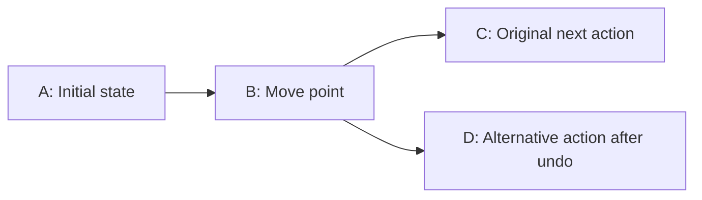

# Object identity and transactional history proposal

Status: design proposal; not implemented. This document proposes an optional
history module built on Serializer's existing codecs. Names such as
`history_store`, `begin_transaction`, and `history_mode` below are illustrative
APIs, not currently available headers, schema keywords, or runtime functions.
The proposed `history`, `no_history`, and `transient` annotations below are also
unimplemented; the current compiler does not accept them.

The schema and behavior contracts are language independent and intended for all
supported output languages. C++ examples illustrate one possible API; an initial
C++ implementation would not establish support in other backends. Each backend
needs its own generated accessors, transaction runtime, and verification. Tracked
mutable binary views need a separate design. Current integration is documented in the
[usage guide](usage.md) and [integration skill](../.agents/skills/serializer-integration/SKILL.md).

## Goals and boundaries

- Support ordinary linear undo/redo and branching history through runtime configuration.
- Keep a top-level collection, such as an `accounting` object, as the application's root.
- Identify logical objects consistently across edits, history branches, and saved sessions.
- Group changes to several fields or objects into one atomic undo step.
- Preserve existing codecs, generated classes, schema syntax, and wire formats for
  applications that do not opt into history.
- Allow an initial snapshot implementation to evolve toward changed-object records
  without changing the application's transaction boundaries.

The history module would depend on Serializer; the serialization core would not
depend on the history module. Existing callers would acquire no history metadata,
setter hooks, registry lookups, or extra serialization work. Applications using the
module would pay for identity management, staging, and retained history explicitly.

Branch merging, collaborative editing, distributed transactions, and reversal of
external effects such as file writes or network requests are outside the initial
scope. A data collection hierarchy and a history tree describe different things:
one organizes current objects; the other organizes alternative revisions.

## Root collection and ownership

A proposed `history_store<accounting>` would coordinate these responsibilities:

| Component | Responsibility |
| --- | --- |
| `accounting` | Own current application data, including one or more typed collections. |
| Object registry | Allocate IDs, resolve references, and validate membership and uniqueness. |
| Transaction | Stage edits and validate their combined result before publication. |
| History manager | Retain revisions, select branches, and perform undo/redo. |
| Serializer codecs | Encode/decode snapshots and history records. |

Composition avoids requiring every generated type to inherit a history-aware base
class. An ID can be a collection key or belong to a wrapper around an existing
generated value. It need not be inserted into every existing payload schema.
History data lives outside the application root, so a root snapshot does not
recursively contain its own history.

Only independently addressable entities require object IDs. An embedded point can
remain part of its owning shape; changing that point then changes the shape's
snapshot. A separately shared point needs its own ID and references from its users.
Independently registered children should be represented by ID in parent records,
so one transaction does not restore overlapping copies of the same entity.
For changed-object history, a root/owner record covers its ordinary fields and
collection membership metadata, while managed entity records cover their payloads.
A whole-root checkpoint can include the entire collection; the initial snapshot
implementation does not also replay duplicate per-entity snapshots for that revision.

The store exposes committed objects for reading and provides scoped access to
transaction candidates for writing. Callers must not retain mutable references,
pointers, iterators, or mutable views obtained during an edit callback. After a
commit or history navigation, callers resolve IDs again rather than relying on
object addresses or container positions remaining unchanged.

## Keyword choice and declaration context

Use the bare keyword `history` on both classes and members. Its declaration
context determines its role; explicit root/entity arguments add no information
to these two uses. Its meaning covers transactions, undo/redo, and branching
revisions. The generated `tracked_` class prefix describes how callers access managed state;
the schema keyword describes the feature they are configuring.

| Candidate keyword | Design tradeoff |
| --- | --- |
| `history` | Recommended: directly describes the retained revisions and navigation exposed by this module. |
| `tracked` | A reasonable alternative, but can suggest only change detection or observation without retained revisions. |
| `versioned` | Can be confused with schema versioning and compatibility, which this repository already treats separately. |
| `undo` | Emphasizes one operation rather than the complete revision and identity model. |

Class and member declarations give the keyword distinct, unambiguous roles.
Plain value membership is the default and needs no annotation:

| Proposed annotation | Meaning |
| --- | --- |
| `history` on a class | Generate the root companion and store integration. |
| `history` on a member | In the tracked parent representation, give that occurrence independent identity; on a supported collection, apply this to its entries. |
| No member annotation | Use the ordinary value representation; a tracked owner records and restores its history-participating fields. |

The same `history` spelling applies to a singleton class member and a
supported collection of class values. On a collection it identifies each entry,
not the container itself. The owning object records collection structure changes.
No singular/plural keyword distinction is needed.

The member annotation always has the same role for single objects and collection
entries. The class annotation selects a document root. Neither use changes the
meaning of the numeric field ID after a member name.

Unannotated members use plain values, including when their owner is tracked.
Only explicitly marked entity edges propagate the tracked representation.
A separate value annotation is unnecessary. Runtime `history_mode::disabled`
controls recording for a store and is a separate decision; it does not strip
identities from managed objects or change the plain payload's wire format.

## Saving state independently of history

Serialization, history participation, and independent entity identity are separate
decisions. A field can need persistence without belonging to the user's undo stack.
Use `no_history` for that case, and `transient` for runtime-only data that can be
discarded and rebuilt. These are proposed schema modifiers, not host-language
keywords or currently supported Serializer syntax.

| Member policy | Saved by ordinary codecs | Restored by undo/redo | Independent entity ID in a tracked parent |
| --- | --- | --- | --- |
| No annotation | Yes | Yes, through its owner, except explicitly excluded descendants | No |
| `history` | Yes | Yes, with entity lifecycle and ownership | Yes, for the object or each supported collection entry |
| `no_history` | Yes | No; preserve the latest committed value | No |
| `transient` | No | No; invalidate/recompute when dependencies change | No |

`!history` is technically possible as new grammar, but it is a weaker name for
this contract. It looks like negating entity opt-in, whereas an unmarked member
already has no independent identity and still participates in its owner's history.
`no_history` explicitly excludes recording and restoration while retaining normal
serialization. Prefer it to the compressed spelling `nohistory`. `transient`
expresses a different persistence contract and must not be an alias for either.

Apply each exclusion to the declared member subtree: `no_history` excludes history;
`transient` excludes both history and persistence. These exclusions compose, so a
transient descendant of a `no_history` member is still omitted from persistence. Nested
`history` annotations within that occurrence remain dormant, just as they do
under an ordinary untracked occurrence. Reject combinations of `history`,
`no_history`, and `transient` on the same member. Excluding a child value does not
make its owning entity immortal: if undo removes the owner, the child is no longer
visible either. Its behavior on restoration is specified below.

### Saved state that does not belong in undo

Selection, viewport position, expanded panels, and editor preferences can be saved
without making navigation or preference changes into undo steps. For example:

```text
class project stable_ids history {
  public history map(uint64) task tasks (1);
  public no_history uint64 selected_task_id (2);
  public no_history double scroll_offset (3);
  public transient uint64 cached_completed_count;
  public transient bool completed_count_valid;
}
```

The task definition is given in the project example below. Both plain and tracked
representations save `selected_task_id` and `scroll_offset`. Only the tracked
representation has an undo mechanism, and that mechanism excludes these fields.
The cache fields exist in memory in both representations and are omitted from all
persistent encodings. A saved selection is an application reference, not an
instruction for the generator to allocate an entity ID. The application must
validate it when the selected task disappears, including on history navigation.
Treat this selection as a soft reference: an unresolved ID can display no selection.
The application can explicitly clear it in a later transaction. A field excluded
from history must not be the only source of an invariant that requires its value
to rewind with an undoable field.

An alternative with the current serializer is to keep a separate ordinary
`session_state` alongside the document and put only document edits into an
application-managed undo system. A recovery envelope can save both. Use this
composition when UI state is per window or per user rather than part of a shared
document. The proposed modifier is useful when the two kinds of state naturally
belong in one model; it does not require all UI state to be embedded there.

### History projection and current saved state

Ignoring a setter notification is insufficient: a later whole-object undo snapshot
would otherwise overwrite excluded fields. The runtime needs two projections:

- **Persistence projection:** all serialized fields, including `no_history`, plus
  identity and optional history metadata in the recovery envelope.
- **History projection:** only undoable values, entity identities, and ownership.
  Exclude both `no_history` and `transient` from snapshots, deltas, equality used
  to detect history no-ops, and history checkpoints.

Ordinary codecs retain the persistence projection. History must use generated
projection descriptors or dedicated record schemas; it cannot blindly replay an
ordinary full serialization over the live object. For an edit from title A to B,
followed by a scroll from 10 to 50, undo restores title A and keeps scroll 50.
Reloading the saved session restores both values as last saved. A tree checkout
also keeps the latest excluded state; `no_history` is not branch-local state.

Stage `no_history` changes in the same transaction candidate as other writes.
Abort discards both kinds; commit publishes them atomically. A transaction that
changes only `no_history` fields creates no revision and preserves redo branches,
but it is still a persistent-state change and must notify observers and autosave.
Distinguish a history no-op from a persistence no-op. Maintain a save generation
separate from the history revision ID: excluded changes and history navigation
can make the document need saving. An asynchronous save acknowledges only the
captured generation, not newer edits made while it was writing.

One implementation can keep excluded state in a current-state overlay addressed
by document ID, owner entity ID, and stable schema field path. Navigation restores
the history projection and then attaches the latest overlay. If an owner is
deleted, retain its excluded state while any retained revision can restore that
owner; undo/redo can then reattach the latest value without recording its edits.
The history envelope must persist this retained overlay too. Discard unreachable
entries when history is pruned and no live state needs them. Plain current-root
saves do not preserve this hidden state or a resumable undo graph.

For the first overlay implementation, support fields under the root or an
identified owner reached through fixed member paths. A `no_history` collection
can be excluded as a whole. Excluded fields inside a history-owned variable
collection require stable entry addressing; a list index is not sufficient.
Reject unsupported paths until their lifecycle binding is defined. Do not silently
attach one item's saved state to a different item after insertion or reordering.
Newly inserted or duplicated entities receive copies of supplied persistent
excluded values under their new IDs; explicit replacement may update them.
History navigation never restores an older excluded value for the same ID.

References to object snapshots and restoration elsewhere in this document mean
the history projection when undo/redo is involved. Whole-root storage still needs
these exclusion rules; a backend must reject unsupported policies rather than
silently capturing excluded fields.

### Temporary calculation caches

Use `transient` for recomputable values, not authoritative document state. It has
no wire ID or wire name and consumes no implicit field slot. This is a proposed
extension to `stable_ids`: explicit IDs remain required for serialized fields and
parents, including `no_history` fields. Reject explicit wire metadata on transient
members. Adding a transient member must not renumber existing serialized fields.

Generated runtime storage initializes transient fields to their declared defaults;
codecs omit them on output and do not accept them as serialized input fields.
Fresh decoding, insertion, duplication, replacement, and `clone_value()` initialize
them to defaults. Value cloning copies persistent data, including `no_history`,
and starts with fresh caches. Native object-copy behavior can differ; applications
using ordinary public fields remain responsible for their own cache validity.

Invalidate caches when their dependencies change, during candidate editing as
well as after undo, redo, checkout, or load. Field names do not reveal dependencies:
use application-declared dependencies or a conservative mutation epoch. A history
revision ID alone is insufficient because several candidate writes occur before
commit. Private candidate caches must not leak into committed objects on abort.
Cache-only writes create no history revision or persistent dirty state and must
not discard redo. They still obey the store's synchronization and access rules.

Changing an existing serialized field to `transient` is a schema migration, not
just a performance annotation: reserve retired IDs/names and handle saved data
compatibility. Changing a field's history policy also requires a decision for
already-retained history records.

### Android restoration example

Android activity recreation and system-initiated process death can require saved
UI state even when the user has made no undoable edit. Small values such as a
selection ID or scroll position fit saved-state mechanisms; larger document data
belongs in local persistence. `ViewModel` alone does not survive process death.
Restore the data needed to reconstruct the application, rather than serializing
every live runtime object. See the official
[Android state-saving guidance](https://developer.android.com/topic/libraries/architecture/saving-states).

For this proposal, save the document's current persistent fields and identities,
the latest `no_history` state, and optionally the retained undo graph and overlay.
Use Android saved-state APIs for small restoration keys and application storage
for a substantial document/history envelope. Reload persistent state, restore the
optional history cursor, and invalidate transient caches. Storage scheduling and
platform lifecycle integration belong to the application; committing a history
transaction does not itself persist data. Android's informal phrase "transient UI
state" can describe state worth saving; it does not imply our schema's `transient`
modifier, which explicitly excludes serialization.

## Contract across generated languages

The three modifiers belong to the `.serializer` language and must keep the same
meaning across C++, Java, JavaScript/TypeScript, Go, C#, Rust, Python, Swift, Kotlin,
and C. Do not derive their behavior from a native language's similarly named
modifier or a reflection library's default. Serializer-generated metadata and
codecs define inclusion, identity, and restoration consistently.

Keep identity participation, persistence inclusion, and history inclusion as
separate properties in the compiler's intermediate representation. The supported
combinations are those in the policy table above; runtime history mode is another
independent property. Existing schemas retain their current wire contract.

| Concern | Contract shared by all backends |
| --- | --- |
| Plain construction | Ordinary values, no store or implicit object IDs; persistence exclusions still apply. |
| Managed construction | Store-owned identities; only marked entity edges activate tracked children. |
| Mutation | All managed persistent writes use controlled access or isolated callbacks; direct aliases cannot bypass transaction capture. |
| Transaction boundary | Explicit commit; failure or cancellation leaves both undoable and excluded committed state unchanged. |
| Snapshot and restore | The same persistence/history projections, defaults, overlay lifetime, and cache invalidation rules. |
| IDs and wire formats | Stable encoded identities and field numbers; use each backend's lossless integer representation, never a lossy numeric conversion. |
| Notifications | Publish a complete state transition before notifying; excluded-only changes can notify without a new revision. |

Generated API spelling and cleanup mechanisms can be idiomatic. C++ can use RAII,
Rust ownership and drop guards, Java/Kotlin/C# scoped cleanup, Python context
managers, Go deferred cleanup, JavaScript/TypeScript `try/finally`, and C explicit
abort/release functions. These are possible API designs, not implemented bindings.
Garbage collection or finalizers must not be relied upon to close a transaction:
require deterministic scoped cleanup or explicit abort and reject conflicting
operations until the active transaction closes.

Platform restoration (Android, desktop, web, or server restart) changes where and
when data is saved, not which fields undo restores. Specify a portable versioned
envelope before claiming cross-language history-file interoperability. Test
writer/reader pairs, exact IDs including large `uint64` values, excluded fields,
cache defaults, and equivalent undo/redo behavior for each supported backend.
Do not advertise support merely because a backend can parse the new modifiers.

## Proposed schema opt-in and generated code

The initial library can work through explicit adapters without new schema syntax.
For a later generator integration, use a specific `history` class attribute
to request the history facade. Mark the owning collection with `history`
when its entries need independent identities. Identity belongs to an object's
registered occurrence, not to its reusable payload class. These are proposed
spellings, not accepted schema syntax today:

```text
serializer version 1;

class point stable_ids {
  public double x (1);
  public double y (2);
}

class point_document stable_ids history {
  public history map(uint64) point points (1);
  public point origin (2);
}
```

| Declaration | Proposed meaning |
| --- | --- |
| `history` on `point_document` | Generate the root editing facade and metadata needed to instantiate a history store. |
| `history` on `points` | Treat this collection's entries as independently identified objects and generate its managed collection editor. |
| `points` map key | Persist the point's object number; allocate it through the store and keep it immutable during ordinary edits. |
| Plain `point` class | Remain reusable as coordinates, as an embedded value, or as a managed collection payload. |
| `origin` member | Track its value through the root's history without allocating it a separate object ID. |
| `stable_ids` | Keep field numbers explicit for locating collections and nested members; it still does not allocate object IDs. |

For this initial generation profile, `history` applies to direct
`map(uint64)` members of the root with serializable owning class values.
All such collections share the store's document-wide object-number allocator.
An unannotated map is not automatically an identity registry. Existing input must
pass identity validation before the store adopts it; keys are never silently
renumbered. Entity membership is established by the annotated owning collection,
not by the value type or by finding a field named `id`. The same payload class may
appear in several managed collections and in ordinary fields without ambiguity.

At the C++ API boundary, insertion returns a typed identifier such as
`entity_id<point>`, carrying the document identity and object number. The map
persists the number; the outer envelope persists the document identity. A generic
`transaction.update` uses this typed identifier or an explicitly selected payload
type, so its callback has a known type. A raw integer alone does not tell a generic
callback which class to edit. The store validates document, collection membership,
and payload type before resolving an identifier.

Other container/key types and nested managed collections need explicit binding
rules before being supported. Reject unsupported uses of a modifier rather than
guessing identity or ownership. By default, nested class members, including the
very same `point` type, are ordinary values. Their nearest tracked owner captures
changes through a scoped value-edit boundary. Marking a member makes it an
independent entity only in the tracked parent representation. Shared entities
are referenced by IDs rather than owned at several locations.

Require explicit serialized field and parent IDs on the root and types reached by
generated editors; transient fields have no wire IDs. Adding these annotations
must preserve previously emitted field numbers and names. The root annotation requests generation support;
it does not automatically create a global store or begin recording on every
standalone instance of the root type.

Generate two layers:

- **Payload layer:** existing owning root and `point` classes, with their
  normal codecs and unchanged payload layout. A standalone value remains usable
  without history. No history pointer or hidden ID field is inserted into it.
- **History companion:** an additional generated header, for example
  `point_document_history.hpp`, containing `tracked_point_document`, `tracked_point`,
  collection editors, and a `history_traits<point_document>` specialization. Traits describe
  collection field IDs, payload types, ID access, and snapshot/restore adapters.

Generate tracked companions for the root and types reached along explicitly
marked entity edges. All ordinary payload classes are still generated. The
payload class itself needs no history annotation. A `tracked_point` bound to a
managed entry tracks that point's ID. The unmarked `origin` remains an ordinary
point, edited through a root callback that captures the root before changing it.

The traits bind an object number to a typed collection lookup; they do not use a
memory address, RTTI name, or compiler-generated type hash as persistent identity.
Persistent records identify the application schema version and collection/type
mapping so the correct decoder can be selected after a reload.

The optional library would expose a generic `history_store<Root>`, transaction
support, typed edit handles, revision storage, and change subscriptions. A future
CMake target such as `Serializer::serializer_history` could provide that runtime;
it is a proposed target, not an existing build dependency. Only the companion
header and opting-in consumers would depend on it.

Runtime options select linear or tree history, independently of the schema
annotation. Several stores can use the same root type, each with its own state,
allocator, active transaction, and history. A requested backend without history
generation support must diagnose that limitation rather than silently promise it.

## Creating normal and tracked objects: project tasks

A project with tasks and checklist items illustrates identity and construction
more directly than geometric parameters. The project is the history root. Each
managed task and explicitly marked checklist entry is independently identified;
task details remain a value owned by the task.

The following is a separate proposed schema example:

```text
serializer version 1;

class task_details stable_ids {
  public string description (1);
  public uint32 priority (2);
}

class checklist_item stable_ids {
  public string label (1);
  public bool completed (2);
}

class task stable_ids {
  public string title (1);
  public task_details details (2);
  public history map(uint64) checklist_item checklist (3);
}

class project stable_ids history {
  public history map(uint64) task tasks (1);
}
```

Ordinary construction uses only ordinary generated classes:

```cpp
// A detached task template has no store, allocated entity ID, or transaction.
task draft{};
draft.title = "Prepare release";
draft.details.description = "Review documentation and examples";
draft.details.priority = 2;
```

`draft.checklist` is an ordinary map containing ordinary `checklist_item` values.
The annotation does not change that type, contact a history store, or allocate
identities when `draft` is constructed. Integer keys explicitly present in this
payload are plain map data until a managed import interprets them under a declared
identity policy.

Managed construction uses a transaction factory:

```cpp
// Proposed APIs: one project store owns all entity identities and revisions.
history_store<project> project_store{
  project{}, history_options{.mode = history_mode::tree}};

auto transaction = project_store.begin_transaction("Create release task");
const auto task_id = transaction.root().tasks().insert(draft);
{
  tracked_task editor = transaction.root().tasks().edit(task_id);
  editor.set_title("Prepare version 2 release");
  editor.edit_details([](task_details& details) {
    details.priority = 1;
  });

  checklist_item item{};
  item.label = "Review usage guide";
  const auto item_id = editor.checklist().insert(item);
  tracked_checklist_item check = editor.checklist().edit(item_id);
  check.set_completed(true);
}
const auto created_revision = transaction.commit();

project_store.undo();
project_store.redo(created_revision);
```

The task and checklist item are created as one user action. Undo removes both;
redo restores their recorded IDs and values. The task details have no independent
ID, and all edits to them belong to the task. A later transaction can edit the
task or checklist item through their retained IDs without creating new entities.
Nested entity collections in this example require the additional ownership
backend described in this proposal; these calls are not available today.

`insert(draft)` copies the supplied value into private transaction state and
returns `entity_id<task>`. `edit(task_id)` returns a scoped `tracked_task` facade
over that candidate. The history-aware object is created by the store; the facade
does not create another copy or another identity. Do not provide an unbound public
default constructor for `tracked_task`: it requires an owning store, an identity,
and a valid context. Retain the ID across transactions and obtain a fresh facade
when editing again.

The corresponding cylinder operations are ordinary `cylinder value{};` versus
`transaction.root().cylinders().insert(value)` followed by `.edit(cylinder_id)`.
If position is marked as an entity, managed insertion allocates its child identity;
ordinary cylinder construction always makes an ordinary point.

Export committed geometry or other values explicitly:

```cpp
// Proposed API: obtain a deep, independent ordinary value for normal code.
task detached = project_store.clone_value(task_id);
```

Changes to `draft` or `detached` do not modify the managed task. Inserting a
detached value creates a new entity; replacing at an existing ID preserves that
identity under the replacement policy. Explicit payload data, including integer
map keys, is preserved by value cloning. Those keys must not be mistaken for a
complete transferable entity identity without the document and ownership metadata.

Inserting a nonempty detached entity subtree needs generated import rules: assign
new entity IDs, remap keys of marked entity collections to their new numbers, and
remap declared internal references. Unmarked maps keep their keys as ordinary
data. Unsupported reference mappings must fail rather than infer identity from
arbitrary integers. The empty-template example above avoids that reconciliation
by inserting its checklist entries directly through the managed factory.

## Cylinder representations and member identity policy

Generate parallel APIs from one schema: the ordinary owning value keeps its
existing name, and the history-aware companion uses the `tracked_` prefix.
For example, generate `cylinder` and `tracked_cylinder`, and `point` and
`tracked_point`. This is composition, not inheritance from the payload class.
The tracked class is a facade over store-owned candidate state and metadata; it
does not require two permanent copies of every live payload. Undo snapshots and
private transaction candidates have their own explicit storage costs.

Using the previously declared point type, a cylinder-focused root could be:

```text
class cylinder stable_ids {
  public double height (1);
  public double diameter (2);
  public history point position (3);
}

class accounting stable_ids history {
  public history map(uint64) cylinder cylinders (1);
}
```

This example uses the two-dimensional point from the earlier schema to focus on
identity. A production coordinate model can include a third coordinate and
orientation as ordinary schema fields; those do not change the identity policy.
The point-only examples elsewhere use `point_document`, a separate root type.

`history` requests the root companion and companions reached along marked
entity edges. In the tracked form of this example, accounting owns identified
cylinders and each cylinder owns an identified point. An ordinary `cylinder`,
including one created outside any store, still contains an ordinary `point`.
The schema author chooses these identity boundaries. Serializer validates and
implements the declared policy; it does not infer identity from the point type.

| Member declaration in the proposed schema | Access from the tracked parent | Separate persistent ID? | History owner |
| --- | --- | --- | --- |
| `public double height (1);` | Scalar getter/setter | No | Cylinder |
| `public double diameter (2);` | Scalar getter/setter | No | Cylinder |
| `public point position (3);` | Plain `point` read access and scoped edit callback by default | No | Cylinder |
| `public history point position (3);` | `tracked_point` bound to its own entity record | Yes | Point, within the same root transaction |

The two `position` declarations are alternatives, not simultaneous fields.
On a supported collection, `history` selects independent identity for
each entry. Scalars keep field IDs but do not become separate entities. These
annotations govern only the tracked representation; the plain `cylinder` always
has an ordinary point-valued `position`, including when the annotation is present.

An unmarked class member is a boundary to an entirely plain value subtree.
Annotations declared inside its type remain valid metadata but are inactive in
that occurrence. The same type can use those annotations when reached through a
marked entity edge elsewhere. Do not reject nested annotations merely because
one parent uses the type as a plain value, and do not promote those nested members
through the plain boundary. This rule also applies to ordinary collections.

Mark position when it needs an independent lifecycle or referenceable identity.
Leave it unmarked when the cylinder ID plus its member path is sufficient.
Sharing still requires explicit reference/ownership rules; the annotation alone
does not create shared ownership. Plain membership means that the owner captures
the value's changes, not that those changes are excluded from history.

Neither plain child access nor deep conversion may expose a lasting mutable alias
to committed state. A proposed edit of the marked cylinder above would be:

```cpp
// Group changes to the cylinder and its identified point into one undo step.
auto transaction = store.begin_transaction("Resize and move cylinder");
{
  auto editor = transaction.root().cylinders().edit(cylinder_id);
  editor.set_height(120);
  editor.set_diameter(40);
  auto position = editor.position();
  position.set_x(10);
  position.set_y(20);
}
transaction.commit();
```

The cylinder and point contribute separate object changes to one revision. The
point does not acquire its own history manager, undo stack, or transaction.
If `position` is unmarked instead, its API is a scoped plain-value edit:

```cpp
// Alternative unmarked position: the cylinder captures the complete point value.
editor.edit_position([](point& position) {
  position.x = 10;
  position.y = 20;
});
```

That version records one changed cylinder, without a point ID or point record.

Independent singleton child identity requires additional store metadata. A
snapshot implementation can persist a mapping from owner ID/member slot to child
ID alongside the plain value tree. A changed-object implementation must preserve
that ownership link and record the child payload once, rather than embedding a
second independently restorable copy in the parent record. The ordinary cylinder
codec still encodes a point value; identity is in the explicit history envelope.
Replacing a child's coordinates preserves its ID, while replacing the child as
an entity is a separate operation with a new ID. Undo restores the original link
and IDs. Changes to these ownership policies require history-format migration.

Nested entity identity is an extension beyond the initial managed root-map
profile. It needs allocation, deletion, restoration, and persistence tests before
being enabled. A limited first implementation should reject `history`
on singleton child members while retaining support for managed root maps, rather
than claim nested identity support through setter generation alone.

### How the generator selects normal and tracked members

Resolve representation from the current occurrence, not from a global flag on
its payload type:

```text
child_is_entity = parent_is_tracked && member_has_history
```

| Parent representation | Member annotation | Effective child |
| --- | --- | --- |
| Plain `cylinder` | None | Plain `point`, without ID |
| Plain `cylinder` | `history` | Plain `point`, without ID |
| `tracked_cylinder` | None | Plain `point`, restored through the cylinder |
| `tracked_cylinder` | `history` | `tracked_point`, with its own persistent ID |

Use two generation passes over the same parsed schema:

1. **Ordinary pass:** emit the existing owning classes and codecs. Every class
   member uses its ordinary type, and collections hold ordinary values. Preserve
   history annotations in compiler metadata, but do not emit history IDs, context,
   or allocation calls into this representation. Serialize `no_history` normally;
   emit opted-in transient storage but omit it from codecs and wire numbering.
2. **Tracked companion pass:** start at a requested root. Emit scalar accessors,
   plain-value read/scoped-edit access for unmarked members, and entity accessors
   plus ownership descriptors for marked members. Follow only marked edges when
   determining which child companions must be generated. A companion generated
   for one usage must not change unmarked usages of the same payload type. Emit
   separate projection metadata for excluded fields and controlled cache access.

The parser stores a root capability flag on class declarations and independent
identity/persistence/history properties on members as described above. The current
representation and the member policy determine the generated access type. Do not
reuse the existing C++ `storage_mode` values for this purpose: owning objects and
binary views already have a separate public contract. Separate companion types
preserve existing normal class names, layouts, and call sites without adding a
runtime branch to every ordinary field access.

Construct ordinary objects directly, such as `cylinder ordinary{};`. Construct a
managed entity through its transaction and owning collection, for example
`transaction.root().cylinders().insert(ordinary)`. That factory consults the
generated descriptors, allocates a cylinder ID, and recursively allocates IDs
only for active marked children. In this example it also allocates a point ID.
With an unmarked position it copies a plain point and allocates no child ID.
An unmarked cylinder inside a tracked root remains plain all the way down, even
if the cylinder schema marks position. To activate both identities, both the
root-to-cylinder and cylinder-to-point edges must be marked.

The factory prepares the payload, ownership links, and identities inside one
transaction. A failure publishes none of them; consumed IDs still are not reused.
Restore from a saved history envelope reinstates recorded IDs instead of calling
the new-entity allocation path. `clone_value()` walks the inverse projection and
returns ordinary values at every level, with history metadata omitted, persistent
excluded values copied, and transient caches initialized to defaults.

In a normalized history backend, the cylinder's record can store a child ID and
expose `tracked_point` through a generated accessor; it need not physically embed
a second tracked object with another manager pointer. A snapshot backend can use
the ordinary tree plus the identity sidecar described above. Both implementations
must expose the same representation and transaction semantics. Normal codecs
continue to serialize normal geometry, while history save/load handles explicit
identity metadata and ownership links.

Existing value-only callbacks remain useful, but their edit boundary must match
identity ownership. `transaction.update(point_id, callback)` can supply a plain
point candidate. A parent callback exposing a whole ordinary cylinder with active
entity descendants needs generated reconciliation that preserves child IDs and
records every affected child. Until that exists, restrict whole-value updates to
value-owned subtrees and require entity editors for parents with active entity
children. Capturing only the parent while a callback changes an identified child
would lose correct change records and notifications.

### Naming value conversion and entity duplication

Use method names that distinguish copying geometric values from creating another
identified design element:

| Proposed operation | Result and identity behavior |
| --- | --- |
| `tracked_cylinder::clone_value()` | Return a deep, detached `cylinder` containing the selected candidate's values without entity metadata or context; explicitly declared payload fields remain data. |
| `store.clone_value(cylinder_id)` | Return a deep, detached `cylinder` from the committed state. |
| `transaction.root().cylinders().insert(value)` | Create a managed cylinder from a plain value and allocate its identity. |
| `editor.replace_value(value)` | Replace the existing cylinder's payload while preserving its cylinder ID. |
| `transaction.root().cylinders().duplicate(cylinder_id)` | Create another cylinder with a new ID and new IDs for any independently identified owned descendants. |

`clone_value()` makes the cost and ownership clear. Do not use an ambiguous
`clone()` for both value extraction and entity duplication. Ordinary copies of a
tracked facade remain handles to the same entity; they are not deep clones.
Allocation or conversion failure must not modify committed state.

Deep value extraction recursively copies persistent strings, arrays, maps, and
nested values, including `no_history` fields; transient fields start at defaults.
With independently identified owned children, it materializes their values and
drops separate identity metadata. Application-declared payload ID fields and
integer map keys remain ordinary data and are not silently stripped. A bare point
or cylinder has no generated ID field; a cloned explicitly keyed collection still
has its declared keys. Reimport as new entities must apply the allocation and
remapping rules rather than adopt those numbers as existing identities. The first conversion
contract covers uniquely owned acyclic value trees. Shared references, cycles,
or external entities require an explicit export policy before conversion support;
the generator must not guess which integer fields represent references.

For a cylinder with a value-owned position, `replace_value` can preserve its ID
and replace the complete geometric value in one transaction. With independently
identified children, matching existing singleton slots can retain their IDs;
changes to variable identified collections require explicit reconciliation by ID
or a replacement policy. A plain value does not encode enough information to
guess that policy from coordinate equality. Entity duplication remaps declared
internal references to the newly allocated descendants and needs an explicit
policy for external references. Restoring history, which preserves recorded IDs,
remains a separate internal operation.

Tracked facades keep the scoped context/lifetime rules described below. They do
not own a second history manager. For long-lived references across transactions,
retain `entity_id<cylinder>` and obtain a fresh facade when editing. Exporting a
plain cylinder and later inserting it creates another entity unless the caller
explicitly targets an existing ID through a replacement operation.

## Using one value type with and without identity

Use the same owning `point` class everywhere. Normal code can create it, pass it
by value or reference, and serialize only its `x` and `y` fields. The point contains
no ID, history pointer, transaction flag, or extra base class.

An identified occurrence is conceptually an object ID paired with a `point` value.
In the proposed map representation, the key already supplies the numeric ID, so
there is no need to repeat it inside the value. The document envelope supplies
the remaining identity namespace. A separate wrapper could provide the same
separation for other ownership models if those are introduced later.

| Use of `point` | Identity and history behavior |
| --- | --- |
| Local variable or ordinary function parameter | Coordinates only; no history participation. |
| Standalone serialized point | Encode only the point schema's coordinate fields, using the selected codec's normal framing. |
| `origin` embedded in the history root | Coordinates only in the payload; edits participate in the root's revision. |
| Entry in the managed `points` collection | Collection key supplies identity; edits target that entity through a transaction. |
| Copied value read from a managed entry | Ordinary detached coordinates; the ID is not implicitly copied into the value. |

For example, an existing value-only operation can be reused in either context:

```cpp
// Translate coordinates without depending on identity or the history library.
void translate(point& value, double dx, double dy) {
  value.x += dx;
  value.y += dy;
}

// Ordinary use needs only the existing generated point type.
point local{};
translate(local, 1, 2);

// Proposed history API: copy the coordinates into a newly identified entry.
auto creation = store.begin_transaction("Add point");
const auto point_id = creation.root().points().insert(local);
creation.commit();

// The same value-only operation edits a private candidate in one undo step.
auto transaction = store.begin_transaction("Translate point");
transaction.update(point_id, [](point& candidate) {
  translate(candidate, 3, 4);
});
transaction.commit();
```

The explicit update boundary captures the owning entity before passing its
candidate to the existing function. That function need not accept an edit handle
or history manager, but it must not retain the supplied reference or mutate other
objects outside the transaction. Generated setter handles remain another editing
option when callers want scoped setters and nested or collection navigation.

Insertion of an lvalue copies its value; it does not attach history to the original
variable. Subsequent changes to `local` do not change the managed entry. Two
insertions of identical coordinates allocate two distinct IDs. Value equality
does not imply entity identity.

Reading a managed entry for an ordinary algorithm can borrow its `const point&`
while the relevant committed state remains valid, or copy a detached `point`.
To retain the association with the managed entity, keep its typed `entity_id<point>`
separately. Replacing the value at that ID through a transaction preserves identity;
inserting the detached value again creates a new identity. A detached value alone
cannot recover its original entity ID, especially when several entities have
identical coordinates.

Serialize a plain `point` for a value-only message, and serialize the managed
collection or history envelope when identity must survive transmission or saving.
Do not make the point's codec conditionally include an ID based on ambient history
state. Its wire contract is the same in both contexts; identity is explicit outer
data. Persistence of an ID and retention of undo records are also independent:
disabling history recording does not strip IDs from an already managed collection.

## Proposed editing API and context lifetime

With the optional generated editors, ordinary application use could look like:

```cpp
// Proposed API: create an independently owned document with branching history.
history_store<point_document> store{
  point_document{}, history_options{.mode = history_mode::tree}};

// Insert one entity; the managed collection allocates its persistent ID.
auto creation = store.begin_transaction("Add point");
const auto point_id = creation.root().points().insert(point{});
creation.commit();

// Both setters contribute to one transaction and one undo step.
auto transaction = store.begin_transaction("Move point");
{
  auto editor = transaction.root().points().edit(point_id);
  editor.set_x(10);
  editor.set_y(20);
}
const auto moved_revision = transaction.commit();

store.undo();
store.redo(moved_revision);
```

The creation and move are two explicit actions. Undoing the move preserves the
point's existence and ID while restoring both coordinates. The generated typed
collection editor knows that its keys address `point` values, so the caller does
not have to identify the payload class on each setter call.

Application helpers receive an edit handle when they need to join an existing
transaction. For example, this proposed helper receives no separate history
manager argument:

```cpp
// Change both coordinates through the caller's existing transaction.
void move_point(tracked_point editor, double x, double y) {
  editor.set_x(x);
  editor.set_y(y);
}
```

An edit handle carries a non-owning transaction context, its owning object ID,
and a typed locator or member path. It is a temporary capability to edit that
transaction's candidate, not an owning pointer to the history manager. Copies
passed to helpers retain the same transaction context.

The context is bound once when the handle is obtained. A setter uses it internally
to locate the candidate and report a write; the caller need not pass it again.
The plain serialized object carries no context. There is no global or thread-local
"current history" whose meaning changes when another document is opened.

Handles and references must remain within the transaction's lifetime. Operations
after commit or abort are rejected while the transaction context is still alive;
using a non-owning handle after its context is destroyed is invalid. This design
does not claim that a raw dangling context pointer can be safely validated.
Supporting handles that escape that lifetime would require a separate lifetime
token or other ownership mechanism and its associated cost.

The store exposes committed data only through read access. Writing a standalone
payload object outside the store is untracked. There is no way to observe all
arbitrary C++ field writes automatically while also keeping those objects and
their direct mutable aliases unchanged.

## Identifying and routing a write

Capture the changed object instance, not just its class. There can be thousands
of points, and a notification saying only "point changed" cannot select the
correct before-image or UI element.

For `editor.set_x(10)`, the generated editor would perform this logical sequence:

1. Check that its transaction is active and that its ID still belongs to the
   expected managed collection in the candidate.
2. Resolve the owning entity. On its first write, prepare its before-image and
   candidate storage before modifying any value. With initial whole-root staging,
   these can already be represented by the retained root and its private clone.
3. Register the owner ID in the transaction's touched-object set.
4. Assign the candidate's `x` field. Optional detail can identify field ID `1`
   within the generated point descriptor.
5. At commit, validate and retain the final object state once, alongside any other
   changed objects. Failed writes abort under the transaction's failure contract.

`set_y` follows the same route but finds the point already touched. It does not
capture another original point or append another history revision. Whole-object
tracking does not require a field-by-field diff; field paths are optional detail.

A scoped edit of a nested plain value captures its nearest tracked owner before
passing the ordinary value to the callback. For example, changing an unmarked
position inside an identified shape snapshots the shape. If position is marked
as an entity in the tracked shape, its accessor resolves the point's own ID and
captures that entity instead. Nested field IDs are scoped by their complete path
and declaring descriptor; a bare numeric field ID is not globally unique.

Collection editors route insertion, erasure, and replacement through the same
context. They preserve membership and ordering changes as well as object values.
For custom application methods that need ordinary mutable fields, the explicit
`transaction.update(object_id, callback)` form captures a value-owned subtree
before handing the callback its candidate. Parents with active entity descendants
require the reconciliation or restricted editor access described above. Calling
`notify_changed` only after an uncontrolled mutation is insufficient: the original
value may already have been lost.

## Application change notifications

Internal write capture and public change notifications serve different purposes.
The setter informs the transaction before mutation. After a successful commit,
the store delivers one change batch to its subscribers, containing:

- The reason: user commit, undo, redo, or branch checkout.
- The previous and resulting revision IDs when history is enabled.
- Each affected object ID and its generated type/collection descriptor.
- Whether it was inserted, updated, or erased, with optional changed member paths.

Transactions that change only `no_history` fields also publish a change batch,
with unchanged history revision IDs and the new save generation. Transient cache
updates are not persistent changes; any cache-specific observation is separate.

This lets the UI refresh a particular point, invalidate a dependent shape, or
update a collection after the entire state transition is visible. A class-level
refresh can be derived by grouping the changed objects by their descriptors.
Deletion events identify the removed entity without requiring a pointer to a
destroyed object. Undo swaps the effective insertion/deletion direction; checkout
must cover all objects changed by the transition, not only the target node's edit.

The proposed subscription form is `store.subscribe_changes(callback)`, returning
an RAII connection that disconnects when destroyed. Deliver callbacks after the
new state and history cursor have been published, outside the mutation step, on
the store's designated execution thread. Observers can read committed state but
must queue further edits instead of reentering commit or history navigation.
Notification failures are reported separately and cannot roll back an already
committed transaction or make its outcome ambiguous.

Aborted transactions send no committed-change event. Read-only previews during a
drag are a separate optional channel, explicitly marked provisional, and do not
publish revisions. In disabled mode, successful changes can still notify
subscribers even though they produce no history revision IDs. Root-owned value
changes identify the document root as their owner.

## Setters detect writes; transactions define history entries

Do not make every `set_x` or `set_y` call immediately append a history entry.
A setter cannot know whether a field update completes the user's action. Moving
a point, for example, can require both coordinates to change together.

The first implementation should use explicit transaction operations around
ordinary generated owning objects. This works with today's public fields and
application methods without changing the generator:

```cpp
// Proposed API: move a point as one user action, using a private candidate.
auto transaction = store.begin_transaction("Move point");

transaction.update(point_id, [](auto& value) {
  value.x = 10;
});

transaction.update(point_id, [](auto& value) {
  value.y = 20;
});

transaction.commit();
```

Both callbacks edit the same transaction candidate. The second callback sees the
first callback's change. Ordinary readers of the store continue to see the
previous committed state until commit succeeds.

For an original point `(1, 2)`, the observable result is:

| Operation | Candidate point | Published history |
| --- | --- | --- |
| Begin transaction | `(1, 2)` | Unchanged |
| Change `x` | `(10, 2)` | Unchanged |
| Change `y` | `(10, 20)` | Unchanged |
| Commit | `(10, 20)` | One revision: `(1, 2)` to `(10, 20)` |
| Undo | Discarded; committed point becomes `(1, 2)` | Cursor moves to parent |
| Redo | Discarded; committed point becomes `(10, 20)` | Cursor moves to child |

The intermediate point `(10, 2)` is not a separately navigable revision. Two
different transactions would deliberately produce two history entries.

### Optional setter integration

An opt-in tracked adapter or future generation mode could eventually let callers
use `set_x` and `set_y` within the same transaction. Such setters would:

1. Require an active transaction bound to the correct store and candidate object.
2. Notify the transaction before the first write to that object.
3. Preserve its original value once, then mutate the candidate.
4. Leave creation of a history revision to the outer transaction's commit.

The transaction maintains the set of touched object IDs. A second setter call on
the same object does not replace the original before-image or create another
revision. Internal field deltas, if introduced later, retain the first old value
and final new value per field while remaining inside one transaction record.

Hooks on setters alone cannot observe direct public-field assignments, changes
through aliases, container mutation, nested mutable access, or replacement through
deserialization. A tracked facade must route all such writes through its edit
boundary. Existing mutable binary view setters alter borrowed storage, which can
also have other aliases; they cannot provide transaction isolation without private
buffer ownership or copying. See [view lifetime requirements](views.md).

Do not modify all current setters or hand-edit generated output for the initial
implementation. A future generator option would need its own compatibility and
performance review. Serialization, loading, rollback, and history replay must use
an internal restoration path that does not record new user edits.

## Whole-object changes and change coalescing

The logical change unit is an identified object, and the undo unit is a committed
transaction. A transaction can contain several object changes while contributing
only one node to the history tree.

For an implementation storing changed-object records, the first edit preserves a
deep before-image of the object's serialized state. Later edits reuse the candidate.
Commit captures its final after-image. Editing both coordinates, an embedded
member, or an entire array therefore produces one before/after pair for that object.
Replacing the complete value through a proposed `replace(object_id, value)`
operation preserves the ID; duplicating an entity allocates a new ID.

Snapshots must own their data. Retaining a pointer to a mutable object is not a
snapshot. Undo restores only the history projection of persistent state; saved
`no_history` values stay current and transient caches must be rebuilt as needed.

| Changes inside one transaction | Retained logical change |
| --- | --- |
| Update an object repeatedly | Original value and final value. |
| Insert, then update | One insertion with the final value. |
| Insert, then delete | No object change; allocated IDs remain consumed. |
| Update, then delete | One deletion with the original value. |
| Update, then restore the original value | No change if contract-defined equality confirms it. |
| Change several objects | Several object changes inside one history revision. |

Deletion records must preserve enough information to restore ownership, ordering,
and references as well as the deleted value. Final-state validation checks dangling
references and duplicate IDs across the complete candidate. User-level insertion
does not reuse a deleted ID; undo restoration is an internal operation that may
restore that original identity.

Do not compare native object memory to detect no-ops: padding, pointers, and
containers make that invalid. Use explicit model equality or a documented stable
encoding for the supported types and protocol. Floating-point NaNs and signed
zero need an intentional equality policy. Without a trustworthy comparison,
retaining an extra revision is safer than discarding a real change.

## Transaction lifecycle and failure behavior

The initial design permits one active writer transaction per store. It is not a
general concurrent or multi-store transaction system. Publication and reading
require a defined synchronization policy; other threads must not access mutable
state without it.

1. **Begin:** retain the current revision and create a private candidate. The first
   implementation can clone the whole serialized root; later implementations can
   copy only touched objects while preserving isolation.
2. **Edit:** change candidate values and membership. An update callback failure
   marks the transaction aborted, even if the caller catches the exception.
3. **Prepare:** validate the final candidate, build snapshots/change records, and
   prepare history links and all required allocations. No-op transactions create
   no revision and do not discard any redo branches. A history no-op may still
   publish changed `no_history` fields and advance the save generation.
4. **Commit:** publish the candidate root and its new history cursor together using
   a prepared, non-throwing state transition. A partially updated root must never
   become visible with an old history cursor.
5. **Abort:** discard the candidate. Explicit cancellation, failed preparation, or
   destruction of an uncommitted transaction leaves committed data and history
   unchanged. The ID allocator may still have advanced.

RAII destruction aborts; it does not implicitly commit. Abort should discard
private state rather than require allocating memory or decoding an undo record
from a destructor. Application validation can run at commit so temporary candidate
states, such as updating only one coordinate, need not satisfy every object-level
invariant. Individual writes still enforce their own type and bounds requirements.

Helper functions should receive the current transaction to join a larger action.
Opening a second transaction on the same store is rejected in the initial version.
Nested savepoints can be designed separately; they must not silently publish inner
commits that survive an outer rollback. Undo, redo, mode changes, and history saves
are rejected while a transaction is active.

For a drag operation, the application can keep one transaction open from press to
release, rendering a read-only candidate preview as it changes. Release commits
one revision; cancellation discards it. Other readers retain committed state.
Automatic grouping by elapsed time or merging already committed actions is a
separate convenience policy, not the transaction's correctness mechanism.

Undo, redo, and branch checkout also prepare and validate a candidate before
publication. Existing [fresh exact decoding](usage.md#decode-one-exact-message-into-a-fresh-value)
helps prevent partial decode results from escaping, but does not make a later
assignment, history update, or disk write atomic. Those guarantees belong to the
new module.

## Linear and branching history at runtime

| Proposed mode | Policy |
| --- | --- |
| `disabled` | Apply transactions without retaining undo records. |
| `linear` | Keep one active path; a new undoable commit after undo discards its redo path. |
| `tree` | Keep alternative futures; a new undoable commit after undo adds another child. |



Each committed revision has a revision ID, one parent except at the root, a label,
and either a snapshot or a change set. Child indexes can be reconstructed from
parent links. The manager retains a current revision cursor.

- Undo moves to the parent and restores its history projection, preserving the
  latest `no_history` state and invalidating affected transient caches.
- Redo selects a child. If there is more than one, the caller supplies the child
  revision ID instead of relying on an ambiguous default.
- Checkout can restore a checkpoint and replay the path to a chosen revision.
- Replay uses stored values, not callbacks that might depend on the current clock,
  random generators, or external services.

Choose the mode at store creation or at a committed boundary. Changing from linear
to tree preserves surviving revisions but cannot recover discarded branches.
Changing from tree to linear needs an explicit retained path and pruning policy;
it must not silently delete alternatives. An edit made with history disabled
that changes undoable fields starts a new baseline before recording resumes, so
stale undo records cannot be applied to unrecorded state. Excluded-only changes
do not require a new history baseline.

Memory and disk budgets must account for all branches and checkpoints. Pruning
must preserve the current state and the checkpoints needed by retained revisions.
If capacity cannot be made available within policy, a recorded commit fails before
publication rather than silently losing its undo data. Keeping branches does not
provide branch merging or conflict resolution.

## Stable object identity across sessions

| Identifier | Meaning |
| --- | --- |
| Schema field ID | Identifies a member within a schema; enforced explicitly by `stable_ids`. |
| Object ID | Identifies one logical entity through edits, reloads, and history navigation. |
| Revision ID | Identifies one committed history node. |
| Document ID | Namespaces a saved document's entities and revision history. |

The existing [`stable_ids` contract](../README.md#explicit-field-ids-with-stable_ids)
does not allocate object IDs. For one coordinated writer, a persisted document UUID
and a monotonic `uint64` object number provide a practical identity. Independent
writers or independently edited document copies need distinct allocation namespaces
or object UUIDs, plus duplicate-ID validation when importing or combining data.

Allocate an object ID once and persist it as ordinary data or in the store's
envelope. Never derive it from a memory address, array position, display name,
mutable content, or schema field number. References use IDs and resolve through
the registry.

- Edits, moves, save/reload, and undo restoration preserve identity.
- Duplication allocates new IDs and remaps references within the duplicated group.
- An object inherited by two branches keeps its ID; its value depends on the revision.
- New objects on different branches receive different IDs.
- Deleted, aborted, and pruned objects' IDs are not reused by ordinary insertion.
- Counter allocation checks exhaustion and fails instead of wrapping.

The allocator's high-water mark is outside undoable state. Undoing to an older
snapshot must not rewind it. Save it with the document and ensure load validates it
against every retained revision's IDs, not just currently live objects. Revision
ID allocation follows the same non-reuse principle. Restoring an old file backup
or forking a file for independent editing requires an explicit allocation-namespace
policy if identities from the different copies might later meet.

## Persistence and schema evolution

A separate versioned envelope should store the document ID, allocation metadata,
codec and application-schema versions, history mode, current revision, and retained
nodes with their required checkpoints or changes, plus current persistent state
and the retained `no_history` overlay. History checkpoints exclude that overlay
and all transient fields. Saving only the current root preserves its declared
identity keys but cannot resume its undo history or recover identities stored
only in the envelope. In-memory records may
use efficient native representations; persistent history stores serializable data,
not function pointers, closures, or process addresses.

The first durable operation can save one coherent committed envelope through a
temporary file and platform-appropriate replacement. Atomic visibility and survival
of a crash or power loss are separate guarantees: durability requires the necessary
flush and filesystem handling before acknowledging a durable save. Journaled commits
can follow later with framing, integrity checks, and explicit recovery rules.
An in-memory transaction commit does not imply that it has been saved to disk.

Load and replay enforce bounded input, node counts, depth, and expanded storage;
validate unique revision IDs, parent existence, acyclic ancestry, the selected
cursor, object identities, and references before publishing state. Corrupt or
unsupported history must not partially replace the open document.

Existing native keyed readers reject unknown fields, while positional binary
requires matching field order and types. Adding an ID to an existing payload is
therefore not automatically compatible. An outer identity wrapper can preserve
the inner payload, but the containing file is still a new application format that
older applications cannot read without support.

History migration must address all retained snapshots and changes, not only the
current root. Retain a decoder/migration path for each supported application-schema
version or explicitly decline to resume incompatible history. Schema language
`version 1` and `stable_ids` do not identify the version of these saved messages.
See [schema evolution](schema_evolution.md) and the [wire contract](wire_format.md#schema-evolution).

## Implementation stages and required verification

1. Add an optional C++ module with the root store, ID allocation, explicit
   transactions, whole-root snapshots, and runtime linear/tree policies. Cloning
   and retaining full roots costs work and storage proportional to root size per
   transaction/revision; measure this honestly.
2. Implement the separate persistence/history projections, excluded-state overlay,
   and cache invalidation before accepting `no_history` or `transient`. Add versioned
   save/load and coherent recovery of the selected revision and excluded state.
3. Add before/after records for touched objects and periodic checkpoints. Confirm
   that candidate construction, validation, and publication also avoid whole-root
   copying before claiming work proportional only to changed objects.
4. Implement the shared language-independent contract in each generated backend
   with explicit support status and interoperability checks. C++ examples do not
   require other backends to copy C++ lifetime or API conventions.
5. Consider field deltas, compression, tracked setters, and private-buffer views
   after measuring a need and specifying their contracts.
   Companion generation can first support root collections and owner-tracked child
   values; independent child identities require the additional ownership and
   conversion contracts above.

Implementation acceptance should cover:

- Separate `x` and `y` edits in one transaction produce one undo step; separate
  transactions produce two. Undo never exposes a partially restored point.
- Multiple objects, embedded changes, replacement, insertion, deletion, ordering,
  and references are restored together.
- Callback, validation, allocation, encoding, and decoding failures leave the
  committed state and history consistent; an uncommitted scope aborts safely.
- Empty transactions and changes confirmed as reverted by the configured equality
  policy do not create nodes or destroy redo branches.
- Nested transaction rejection and helper reuse follow the stated contract.
- Generated editors route repeated setters, nested value changes, and collection
  changes to the correct entity and store; passing a handle to a helper retains
  the transaction, and handles cannot edit after commit/abort while their context
  remains alive. No safe use of a handle after context destruction is promised.
- Schema opt-in preserves ordinary payload codecs and rejects unsupported entity
  ownership shapes rather than assigning ambiguous identities.
- The same payload class works as a standalone value, embedded value, and managed
  entity. Plain serialization contains no implicit identity metadata; copied values
  are detached, replacement preserves IDs, and repeated insertion allocates new IDs.
- Value-only functions called through an update callback record the managed owner
  without requiring history parameters or a second payload class.
- Cylinder and point companions deep-copy values without history metadata or
  shared mutable storage. Unmarked children are ordinary values restored through
  their owner, and marked children acquire identity only in a tracked parent.
- The same annotated cylinder has a normal point in its ordinary representation
  and an identified point in its tracked representation. An unmarked ancestor
  keeps all descendants plain without rejecting their inactive annotations.
- Generation for a type used along a marked path does not promote its ordinary
  occurrences. Whole-parent callbacks either reconcile active entity descendants
  correctly or are rejected; they never silently omit child changes.
- Normal task construction creates only ordinary children. Managed factories
  allocate the task and marked checklist entries in one transaction; undo/redo
  removes/restores them together. Deep copies are detached, and importing a
  nonempty copy allocates/remaps entity IDs without rewriting unmarked map keys.
- Where implemented, independently identified children retain their IDs across
  reload and undo; duplication allocates new owned descendant IDs, replacement
  follows explicit identity rules, and unsupported graph conversion fails clearly.
- Subscribers receive one committed batch with the correct IDs after commit,
  undo, redo, and checkout, and none after abort; observer failure does not undo
  publication or trigger reentrant mutation.
- Linear edits prune the intended future; tree edits preserve and select siblings.
- IDs survive save/load, delete/undo, and branch creation; aborted transactions and
  old snapshots never rewind the allocator or cause ID reuse.
- No-op comparison handles the documented floating-point and encoding policies.
- Bare `history` is interpreted by class/member position with identical policy
  semantics across backends; conflicting member annotations are rejected.
- `no_history` values round-trip through ordinary codecs and recovery saves but
  survive undo, redo, and branch checkout at their latest committed values.
  Excluded-only commits notify and dirty persistence without a revision or loss
  of redo; abort discards excluded writes along with undoable writes.
- Owner deletion/restoration, pruning, save/reload, and new entity duplication
  preserve the documented overlay lifetime; unsupported nested paths are rejected.
- Transient fields have no wire identifiers, consume no implicit field slots, and
  are absent from every codec and history record. Logical clones initialize them
  to defaults. Cache-only writes do not dirty persistence or create revisions.
- Cache validity is maintained during candidate edits and navigation; aborted
  candidates leak no caches. Existing schema field numbers remain unchanged.
- Cross-language fixtures preserve exact IDs, field policies, and recovery state;
  each backend verifies deterministic transaction cleanup and isolated mutation.
- Mode transitions, resource limits, pruning, corrupt histories, incompatible
  schemas, and interrupted saves follow explicit failure policies.
- Benchmarks compare disabled, snapshot, and changed-object operation as applicable;
  ordinary Serializer users retain their existing bytes and codec behavior.

This documentation change implements none of these APIs. The examples have not
been compiled, and no history tests, durability qualification, or performance
benchmarks have been run. Future implementation must update the usage guide and
integration skill to distinguish newly available functionality from remaining proposals.

## Related public designs

These references describe related capabilities, not interchangeable implementations
of the complete proposal:

| Library or framework | Relevant distinction |
| --- | --- |
| [Boost.Serialization](https://www.boost.org/doc/libs/latest/libs/serialization/doc/special.html) | Archive object tracking preserves shared references; application identity and transactional history require additional design. |
| [Qt Undo Framework](https://doc.qt.io/qt-6/qundostack.html) | Commands, macros, and compression group undo actions; a new command after undo discards the linear redo future. |
| [Open CASCADE OCAF](https://occt3d.com/dev/doc/overview/html/occt_user_guides__ocaf.html) | Combines document ownership, persistent reference keys, transactions, undo/redo, and persistence. Its data hierarchy is distinct from a branching history tree. |
| [Automerge](https://automerge.org/automerge/automerge/struct.Automerge.html) | Supports document changes, historical forks, merging, and binary persistence through its own document model. |
