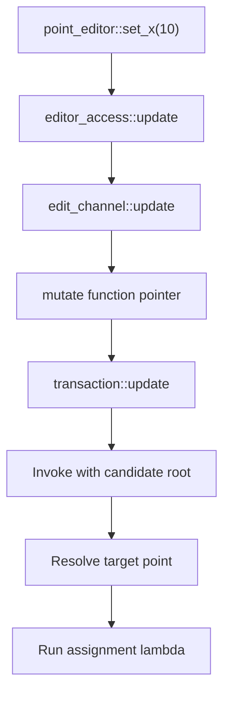
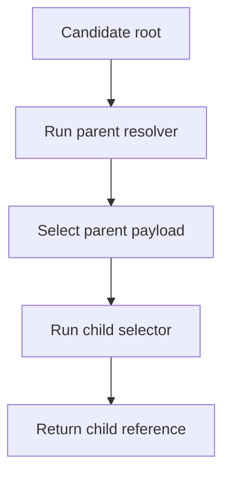

# How managed editors work

This walkthrough explains the implemented
[managed_editor.hpp](../../include/rohit/managed_editor.hpp).
Start with the [point example](../../example/managed/plain_point/main.cpp)
and the [transaction walkthrough](managed_transactions.md) if the store and
candidate are unfamiliar.

The central distinction is:

- The transaction owns the editable candidate.
- An editor remembers how to reach a part of that candidate.
- The channel connects the editor to the currently active transaction.

The editor does not store another point, commit a transaction, or record history.
The committed point remains in `model_store::current_`; the candidate remains
in `transaction::candidate_`, both defined in
[managed.hpp](../../include/rohit/managed.hpp).

Read the [point setter trace](#follow-one-point-setter) first. The
[collection editors](#map_editor-select-a-map-entry-by-id) sections explain
the additional machinery needed by larger schemas.

## What is defined in this header?

All these helpers live in `rohit::managed::detail`.

| Helper | Responsibility |
| --- | --- |
| `make_editor<Plain>(access)` | Ask generated model traits to construct the appropriate editor. |
| `edit_channel<Root, Id>` | Check editor lifetime and forward operations to the transaction. |
| `editor_value<Node, Managed>` | Determine the payload type selected by an access handle. |
| `editor_access<Root, Node, Managed, Resolve>` | Remember the channel and a function that locates the target. |
| `map_editor<Access, Plain>` | Insert, select, and erase managed map entries. |
| `array_editor<Access, Plain>` | Append, select, and erase managed array elements. |

The schema-specific `point_editor`, including `set_x` and `set_y`, is
**generated into point.hpp**. It is not declared in this runtime header.
Its generator is [cpp_managed_writer.hpp](../../src/cpp_managed_writer.hpp).

## Follow one point setter

Inside the real transaction callback:

```cpp
auto editor = transaction.root();
editor.set_x(10);
```

The generated setter contains this assignment callback:

```cpp
access_.update([&](auto& target) { target.x = ::std::move(value); });
```

`value` is the setter argument, 10. The lambda captures it by reference because
the callback runs synchronously, before the setter returns. The runtime supplies
`target`; it is the candidate point, not the committed point.



The steps below explain each layer. This is one synchronous call chain; the
diagram does not represent separate threads or queued events.

## edit_channel: a shared connection to the transaction

A transaction creates a channel on the first call to `root()`. Every editor
derived from that transaction shares it.

Its fields are:

| Field | Meaning |
| --- | --- |
| `owner` | Borrowed transaction pointer, stored as void*. Null means the transaction has closed. |
| `mutate` | Function pointer that forwards an operation to transaction::update. |
| `allocate` | Function pointer that forwards ID allocation to transaction::create_id. |
| `fail` | Function pointer that records a failure on the transaction. |

These are function pointers, not methods implemented elsewhere with the same
name. `transaction::root()` in managed.hpp assigns their implementations.

### Where mutate is assigned

This source excerpt installs the mutation bridge:

```cpp
channel_->mutate = [](void* owner, void* callable,
                      void (*invoke)(void*, storage_type&)) {
  static_cast<transaction*>(owner)->update(
      [&](storage_type& value) { invoke(callable, value); });
};
```

The arguments have different roles:

1. `owner` identifies the real transaction.
2. `callable` points to a callback object.
3. `invoke` knows how to call that callback object with a candidate root.

The lambda converts owner back to the transaction type and calls its update
method. That method supplies `*candidate_` and handles transaction state and
mutation exceptions. The bridge does not access the committed point.

### What channel.update does

The channel receives a concrete callback type through its function template:

```cpp
template <typename Callable>
void update(Callable&& callback) const {
  require_active();
  mutate(owner, std::addressof(callback), [](void* function, Root& root) {
    (*static_cast<std::remove_reference_t<Callable>*>(function))(root);
  });
}
```

`require_active()` checks that owner is not null. The transaction performs the
additional thread and operation-state checks when the bridge reaches update.

Each C++ lambda has its own compiler-generated type. A single function-pointer
field cannot have a different signature for every lambda type. This code uses
**type erasure**: pass the callback's address as void*, together with a small
function that knows its actual type.

In the inner lambda:

- `std::remove_reference_t<Callable>` removes the reference from the deduced type.
- `static_cast<...*>(function)` restores the callback pointer's type.
- `(*pointer)(root)` calls that callback with the root.

The captureless inner lambda can convert to the required function pointer.
`std::addressof` obtains the actual callback object's address.

The callback is borrowed, not retained or queued. All these calls must finish
before the callback object goes out of scope. This avoids constructing an owning
std::function for each mutation; creating and sharing the channel itself still
has allocation/reference-counting costs.

## editor_access: the target and how to find it

An access handle contains only these two data members:

```cpp
std::shared_ptr<channel_type> channel_;
Resolve resolve_;
```

It does not contain a point pointer or a reference to an element of a vector.
`resolve_` is a callable that starts at the candidate root and returns the
selected node by reference.

The template parameters describe that selection:

| Parameter | Meaning for an access handle |
| --- | --- |
| `Root` | The transaction's generated storage root. |
| `Node` | The selected node's storage type; it can be a class or collection. |
| `Managed` | Whether this occurrence has its own active managed identity. |
| `Resolve` | The concrete type of the callable which finds that node. |

For the default root point, Root and Node are both point, Managed is true,
and the resolver simply returns the root argument.

Managed describes an **occurrence**, not whether a C++ type can ever be managed.
An ordinary child can use a managed-capable class without having an independent
active identity in that location. Collection access is also ordinary access;
individual selected managed elements use Managed=true.

### editor_value and payload

`editor_value` is a compile-time type helper. It creates no runtime object.

- For Managed=false, its type is Node.
- For Managed=true, its type is the value returned by
  `model_traits<Node>::payload(...)`, with the reference removed.

The expression involving `std::declval<Node&>()` asks the compiler about a
type; it does not construct a Node or execute a payload lookup at runtime.

`editor_access::payload` follows the same distinction when the program runs.
With default direct storage, the generated traits return the node itself.
With optional separate-values storage, traits return the node's ordinary value
payload. This lets the editor code work with both representations.

Identity protection comes from the generated interface, which has no
persistent_id setter. In the default representation, payload itself is still
the point containing the ID; it is not a separate ID-free allocation.

### update resolves the recipient

The implementation is:

```cpp
channel_->update(
    [&](Root& root) { std::forward<Callable>(callback)(payload(resolve_(root))); });
```

Read the inner expression from the inside out:

1. `resolve_(root)` locates the selected node.
2. `payload(...)` selects its application payload representation.
3. `callback(...)` invokes the setter's assignment lambda on that payload.

This is where the original setter callback receives its target. For a point-root
editor, the result is the candidate point itself. For a nested editor, it is
a child within that candidate.

`std::forward` preserves how the callable was passed; it does not schedule or
parallelize anything. The method's const qualifier means the access handle is
not reassigned. It does not make the transaction candidate const.

## Why getters also use update

Despite its name, the access update operation is also a checked way to read
the candidate. Generated getters use it with a callback taking a const reference
and copying the selected field.

The header's `copy()` similarly constructs a copy of the selected payload inside
an optional, then returns that copy. Optional provides initially empty storage
for the result until the synchronous callback fills it.

Consequently:

- `editor.get_x()` reads the current candidate x value.
- `store.read()->x` reads the committed x value.
- A copying getter does not expose a writable alias into the candidate.
- The checked callback path still rejects closed or invalid editor handles.

Reading through update does not itself create a revision. Commit compares the
encoded candidate with the committed snapshot to determine whether it changed.

## id, create_id, and guard

`id()` is available only when Managed is true, through the
`requires Managed` constraint. It resolves the node and reads its persistent_id,
without going through the ordinary payload selector.

`create_id()` calls the channel's allocate function. ID allocation belongs to
the store through the transaction, not to the editor. Allocation runs outside
the candidate mutation callback. The store's counter is deliberately not undone
when an edit fails or is canceled.

`guard(callback)` covers operations which can fail **before** they enter an
actual candidate update, such as converting an inserted value and allocating
its IDs. Its callback takes no root argument. It runs immediately; if it throws,
guard calls the channel's fail function while the owner is still active,
then rethrows.

This matters for map insert and array append: preparation failure must prevent
earlier changes in the same transaction from committing. If a nested update
already closed the transaction, owner is null, so guard does not call fail again.
The `decltype(auto)` return preserves the guarded callable's return type,
including an inserted ID or a newly constructed editor.

## select and member build a path

`select<ChildManaged>(selector)` constructs another access handle. It shares
the same channel and stores a new resolver combining the parent resolver and
the child selector:

```cpp
auto resolve = [parent = resolve_, select = std::move(select)]
               (Root& root) -> child_type& {
  return select(payload(parent(root)));
};
```

This stores how to find the child. It does not store the child's current address.
The chained resolver executes again whenever the child editor is used.



`member(pointer)` is a convenient specialization of select for a class field.
The unusual syntax `Field value_type::*` means a **pointer to a data member**,
such as &payload_type::position. It describes which field to select from an
object; it is not a pointer to one particular object's field.

The selector's `value.*pointer` applies that member pointer to the currently
resolved parent. Generated child accessors use member to extend their path.

Re-resolving a path prevents using an old element address after a vector grows.
It does not, by itself, establish collection identity. The collection editors
below add the persistent-ID checks.

## make_editor connects runtime access to generated code

The small helper at the top of the header returns:

```cpp
model_traits<Plain>::make_editor(std::move(access))
```

It delegates to the generated trait specialization after the concrete access
type is known. The template also defers lookup until that generated specialization
is available. Generated child accessors call this helper; map and array editors
call their traits' make_editor directly.

Plain is the schema model type. The name does not imply that it lacks an ID:
under default direct storage, that generated model class contains persistent_id.

## How this avoids dangling element pointers

An access handle is not empty: it stores a shared channel and a resolver object.
The resolver's C++ type is a template parameter because different paths have
different lambda types. The lookup code is in that lambda's call operator;
captured values such as an ID, key, or parent resolver are stored inside it.

For the root point, the resolver really is simple: return the root argument.
The root argument is supplied afresh by the active transaction. For an array
element, array_editor::edit builds a selector which captures its ID and runs
std::find_if against the vector passed to it.

The [generated editor test](../../test/managed_generated_test.cpp) uses this
sequence inside a real transaction:

```cpp
auto paragraphs = transaction.root().notes().paragraphs();
auto first = paragraphs.edit(first_id);
added_id = paragraphs.append({"Third"});
first.set_text("Updated first");
```

Appending can reallocate the vector. The first editor does not retain the
address returned by the initial search. On set_text, it starts at the live
candidate root, resolves paragraphs again, and searches for first_id again.
It therefore obtains a reference to the element at its current location.

| Event | Protection |
| --- | --- |
| Vector reallocates or another element is erased | Resolve the vector and search the ID again on each operation. |
| The selected element is erased | The search fails and throws; no element reference is returned. |
| A map key is reused for a different entity | Check the captured persistent ID as well as the key. |
| Transaction closes | The channel's owner becomes null, so operations reject before accessing the transaction. |
| Active transaction is moved | Update the shared channel's owner to the new transaction address. |

This does not repair an arbitrary dangling pointer. The normal generated editor
path avoids storing a target-element pointer between calls. Any element reference
it obtains is used synchronously inside the transaction callback.

A reference deliberately leaked through the trusted low-level update API is
outside that protection. Internal access helpers are not a general safe-pointer
library, and sharing an editor across threads is not supported.

## map_editor: select a map entry by ID

The [ledger schema](../../example/managed/ledger/ledger.serializer) and
[ledger program](../../example/managed/ledger/managed_example.cpp) exercise this
editor. The application map key and the managed entity ID have different roles.

For example, an entry might be stored under application key 100 and receive
persistent ID 2. You call `entries().edit(entry_id)` with the returned persistent
ID, not with the application's map key.

### edit(id)

1. `key_for(id)` scans entries to find the key whose value has this ID.
2. The new resolver captures both that key and the ID.
3. On each later use, it calls values.find(key).
4. It checks that the key exists and that the value still has the expected ID.
5. It returns the selected storage to the generated entity editor.

Capturing the ID prevents an old editor from accidentally editing a newly
inserted entity which reuses the same application key.

For the current std::map representation, the initial ID-to-key scan is linear
in the collection size. Subsequent selections use logarithmic key lookup plus
an ID check, in addition to resolving any parent path.

### insert(key, value)

Inside guard, insert uses generated traits to convert the supplied model value
to storage, assigns fresh IDs to its managed occurrences, and saves the new
root ID. It then enters access.update and attempts values.emplace.

A duplicate key throws and fails the transaction. IDs may already have been
allocated before that check, so failed insertion can consume IDs. On success,
the method returns the new entity ID; the enclosing transaction still has to
commit before that entity is published.

### erase(id)

Erase resolves the ID to its application key, then removes that entry from the
candidate map through access.update. The operation is guarded. Undo restoration,
if history is enabled, comes from retained store snapshots; this editor does
not keep a separate collection of deleted objects.

## array_editor: select an element by ID

The [wordpad schema](../../example/managed/wordpad/wordpad.serializer) exercises
this editor with an array of managed paragraphs.

An array editor uses persistent IDs rather than vector indexes:

- `edit(id)` constructs a resolver which searches the current vector for that ID.
- It immediately calls selected.id() to check that the element exists.
- Each subsequent operation searches again and throws if the ID is absent.
- `append(value)` prepares storage and fresh IDs under guard, then pushes the
  value through access.update and returns the inserted root ID.
- `erase(id)` searches and erases inside access.update.

Repeated searching allows the same editor to survive vector reallocation or
index changes caused by removing another element. Removing its own entity makes
later use fail, rather than silently retargeting the editor.

Lookup is linear, not constant time. Vector erase can also shift subsequent
elements. This is a correctness-oriented identity mechanism, not an ID index.

## Lifetime and failure rules

The access handle owns a shared reference to the channel. The channel's owner
is only a borrowed pointer to the transaction. Holding an editor therefore keeps
the channel alive, but does not extend the transaction or candidate lifetime.

When the transaction closes, it sets channel_->owner to null before releasing
its remaining candidate. A retained editor's next checked operation throws
"Managed editor transaction is closed" instead of using a dangling transaction
pointer. When an active transaction is move-constructed, the channel's owner is
updated to the destination transaction, preserving existing editor handles.

An exception during target resolution or a mutation passes through
transaction::update and marks the transaction failed. Catching such an exception
in application code does not make earlier candidate edits eligible to commit.
Guard extends this failure handling to preparation performed by the operations
which wrap themselves in guard.

The helpers are not a multithreading mechanism. Sharing a channel does not make
concurrent setters safe. The store and transaction enforce the current
single-thread-confined runtime contract.

## What this header does not do

Snapshot ownership, commit, undo/redo, save/load, and revision publication are
implemented by model_store and transaction in managed.hpp. This header routes
checked operations into the candidate and provides collection identity handling.

There is no channel per history or collaboration feature. Collaboration,
authorization, and journaling are not implemented by these helpers.

The function-pointer bridge is an implementation choice. It lets many concrete
editor/resolver types share one lifetime connection without knowing the concrete
transaction type. It adds indirection; it should not be described as necessary
for assigning two integers or as a measured performance improvement.

## Source reading and verification

Read the header in this order:

1. edit_channel fields, require_active, and update.
2. editor_access fields, payload, and update.
3. The point setter emitted by cpp_managed_writer.hpp.
4. transaction::root and transaction::update in managed.hpp.
5. editor_access::select and member.
6. map_editor and array_editor.
7. guard and transaction::fail for preparation and mutation failures.

The [generated editor tests](../../test/managed_generated_test.cpp) cover editor
lifetime after commit/destruction, moves, vector growth, erased entities, and
invalid map operations. The [direct representation tests](../../test/managed_direct_test.cpp)
exercise the default generated storage and ledger editors.

This documentation was checked against the current runtime, generator, and
existing test sources. It makes no new runtime or performance claims.
