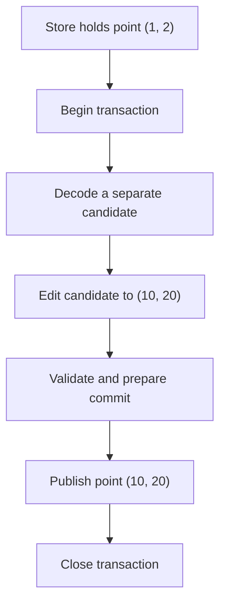
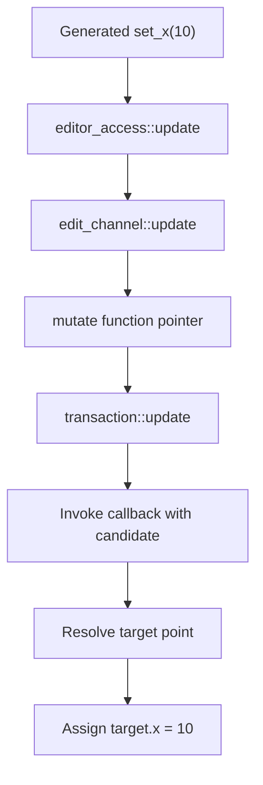
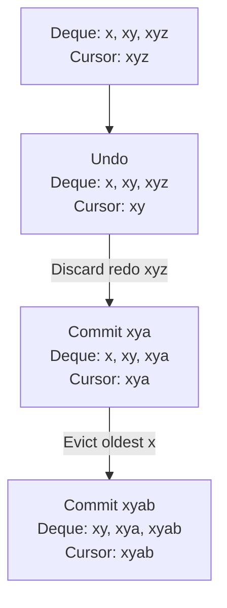

# How managed transactions work

This is a source walkthrough of the implemented C++ runtime in
[managed.hpp](../../include/rohit/managed.hpp), using only the generated
[point schema](../../example/managed/plain_point/point.serializer) and
[point program](../../example/managed/plain_point/main.cpp). It describes the
default direct-storage representation, where the generated point contains
x, y, and persistent_id. The point example has no attached journal; its commit
path below publishes directly after preparing history. With a journal attached,
the runtime first flushes the already serialized candidate snapshot with compact
framing; it preallocates the new history entry without copying retained snapshots. See [journal publication and uncertain outcomes](../managed/journal.md#durable-decisions-and-files).

For public API usage, see the [C++ runtime guide](../managed/cpp_runtime.md).
The wider [managed design documents](../managed/README.md) also contain proposals;
this walkthrough explains the code that exists today.
For the details of channels, resolvers, and collection editors, continue with
[how managed editors work](managed_editors.md).

## Start with two point objects

The store holds the **committed point**. A transaction creates a separate
**candidate point** for editing. Candidate means "the value we might publish."

For the point example:

| Moment | Committed point | Candidate point |
| --- | --- | --- |
| Construct store | (1, 2) | None |
| Begin transaction | (1, 2) | (1, 2) |
| Call set_x(10) | (1, 2) | (10, 2) |
| Call set_y(20) | (1, 2) | (10, 20) |
| Commit successfully | (10, 20) | Ownership transferred to the store |
| Or revert instead | (1, 2) | Discarded |

The store does not have to reverse each assignment when an edit fails. It can
discard the candidate because the committed point was never modified.

These diagrams run from top to bottom with short labels to fit narrow viewers.



This diagram shows the successful path. Revert and failure discard the candidate
instead of proceeding to publication.

## A nested class is a type, not an automatically created object

The declaration `class transaction` inside `model_store` defines a nested C++
type. It does **not** mean that constructing a store automatically constructs
a transaction, or that a transaction is a data member of the store.

For a generated point, these are different types:

```cpp
using point_store = rohit::managed::model_store<point>;
using point_transaction = point_store::transaction;
using point_edit = point_store::transaction_edit;
```

There is no inheritance between them. A transaction does not contain another
complete store. Its `model_store* store_` is a non-owning pointer to the store
that created it.

The nested transaction type can access the store's private members, but it
still needs a particular store object. For example,
`store_->writer_active_ = false` changes that object's state. C++ does not
supply an implicit outer-object pointer to a nested-class instance.

Conversely, `friend class model_store;` inside the transaction lets the store
call its private constructor and failure handler.

## The four objects to distinguish

| Object | Created and kept by | Purpose |
| --- | --- | --- |
| `model_store<point>` | Your application | Keeps the committed model, encoded snapshot, IDs, and history. |
| `model_store<point>::transaction` | Caller of begin_transaction, or a local variable inside execute_transaction | Owns one candidate and completes or cancels the edit. |
| `model_store<point>::transaction_edit` | execute_transaction | Borrows the transaction and exposes editing operations to your callback. |
| `transaction_outcome` | Caller for manual transactions; execute_transaction for callback transactions | Records completion status and any exception; tree outcomes additionally carry a revision ID. |

The transaction has a pointer to the outcome as well as to the store. Both must
outlive a manually held transaction. Neither pointer owns its target.

The generated point editor is another small handle obtained through
`root()`. It selects data within the candidate; it does not own the store
or commit the transaction.

## What the store keeps

The template declaration is:

```cpp
template <typename Root,
          history_mode Mode = history_mode::linear,
          history_labels Labels = history_labels::disabled,
          typename Traits = model_traits<Root>>
class model_store;
```

`Root` is your generated model type, here `point`. `Mode` selects one history
representation at compile time: disabled, linear, or tree. `Labels` optionally
adds action names; by default their storage and named overloads are absent.
`Traits` is the generated binding
that tells the generic runtime how to work with this model.

In the default point output, the generated specialization
`model_traits<point>` declares `storage_type = point`. It also supplies identity
visitation, validation, and editor construction. You do not write this binding
by hand. In the optional separate-values representation, storage is a different
generated type; this walkthrough does not use that option.

The important store fields in managed.hpp are:

| Field | Meaning |
| --- | --- |
| `current_` | Shared pointer to the immutable committed point. |
| `snapshot_` | Encoded bytes of that same committed state. |
| `history_` | A template-specialized slot: linear deque/cursor/byte count, tree revision map, or empty disabled storage. |
| `identities_` | Index of the current managed IDs and their type keys. |
| `allocated_id_` | Highest object ID allocated in this store. |
| `history_.current_revision` | Tree only: currently selected revision ID. |
| `history_.revision_high_water` | Tree only: highest revision ID allocated. |
| `writer_active_` | Whether this store already has an active transaction. |
| `callback_active_` | Whether validation is running; not whether your outer edit lambda is running. |
| `thread_` | Thread on which the store was created. |

Constructing `store{point{1, 2}}` uses the generated traits to adopt the point,
assign its ID, validate it, and encode it. The store then creates its immutable
current value and initial linear history entry. The point's persistent ID starts
at 1; the linear history cursor starts at index 0. Linear entries have no revision IDs.

The decoded `current_` makes reads convenient. The encoded `snapshot_` is the
source used to construct a transaction candidate. Retained history holds encoded
snapshots, not mutable pointers into that candidate.

## Read the point example in execution order

The central part of the example is:

```cpp
const auto outcome = store.execute_transaction([](auto& transaction) {
  auto editor = transaction.root();
  editor.set_x(10);
  editor.set_y(20);
});
outcome.throw_if_failed();
```

### 1. execute_transaction creates the real transaction

Inside the shared `model_store::execute_transaction_impl`, these statements start
the successful path:

```cpp
outcome_type outcome;
auto scope = transaction{*this, outcome, std::move(label)};
transaction_edit edit{scope};
std::invoke(std::forward<Callable>(callback), edit);
```

`label` is empty metadata by default; the enabled specialization owns a string.
This is an excerpt: the actual method surrounds the operations with exception
handling and scopes that complete the transaction before returning the outcome.

`scope` is the owning `transaction` object. `edit` is a borrowed wrapper around
it. `std::invoke(..., edit)` calls your lambda with that wrapper as its argument.

**The parameter named transaction in your lambda is actually a
transaction_edit reference.** Variable names do not determine C++ types.
The `auto&` parameter lets the compiler infer this type.

The wrapper supplies `root()`, `update()`, `create_id()`, and `revert()`.
It does not supply `commit()`: execute_transaction controls completion.

### 2. begin_transaction creates an isolated candidate

`begin_transaction` returns a transaction constructed with references to the
store and the outcome. The transaction constructor:

1. Requires the store to be on its owning thread with no active writer or validation.
2. Rejects starting during exception unwinding.
3. Decodes the store's snapshot into a fresh, uniquely owned candidate.
4. Resets the outcome to pending and marks the store's writer active.

The candidate is constructed by this actual expression:

```cpp
candidate_ = std::make_unique<storage_type>(
    detail::decode<storage_type>(store.snapshot_, store.options_.decode));
```

For this point schema, `storage_type` is `point`. The new point starts at
(1, 2). This is a serialization round trip, not a reference to current_ and
not merely a point copy constructor call. The writer flag is set only after
candidate construction succeeds.

The transaction fields that support this work are:

| Field | Meaning |
| --- | --- |
| `store_` | Borrowed pointer to the store; null after closure or move-from. |
| `outcome_` | Borrowed pointer to the completion result. |
| `candidate_` | Unique ownership of the mutable candidate. |
| `label_storage<Labels>` base | Empty by default; contains a string only with `history_labels::enabled`. |
| `allocation_base_` | Object-ID high-water mark when editing began. |
| `exceptions_` | Uncaught-exception count used by the destructor. |
| `editing_` | Whether a candidate update callback is currently executing. |
| `channel_` | Shared editor connection, allocated only if root() is used. |

### 3. root returns a generated editor

`transaction_edit::root()` forwards to `owner_.root()`, where `owner_` is the
real transaction.

`transaction::root()` creates an edit_channel on its first call, assigns the
transaction pointer and forwarding function pointers, then uses
`Traits::make_editor(...)` to construct the generated point editor.

All editors from that transaction share the same channel. There is no
separate channel for x, y, history, or each call to root.

For the root point, resolving the editor's target simply returns the candidate
root. The more general resolver machinery also handles children and collection
elements without retaining stale element pointers.

### 4. set_x calls back into the candidate

The generated setter contains the real assignment:

```cpp
access_.update([&](auto& target) { target.x = ::std::move(value); });
```

Here `value` is the setter's integer argument, 10. `target` will be the
candidate point supplied by the runtime. Moving an integer has no special
ownership effect; the generator uses the same pattern for other field types.

The following diagram follows set_x after the outer transaction lambda has
already started:



These functions are in
[managed_editor.hpp](../../include/rohit/managed_editor.hpp) and
[managed.hpp](../../include/rohit/managed.hpp). The setter is emitted by
[cpp_managed_writer.hpp](../../src/cpp_managed_writer.hpp).

`transaction::update` checks that the transaction is active, on the right
thread, and not already executing another candidate callback. It sets editing_,
then reaches the actual callback invocation:

```cpp
std::invoke(std::forward<Callable>(callback), *candidate_);
```

The callback at this level is a forwarding wrapper. Through the channel's
invoke adapter it reaches the editor_access lambda, which resolves the point
and calls the original setter assignment lambda:

```cpp
std::forward<Callable>(callback)(payload(resolve_(root)));
```

There are therefore two main callback meanings to keep separate:

| Callback | Argument |
| --- | --- |
| The lambda passed by main to execute_transaction | Borrowed transaction_edit. |
| The assignment lambda created by a generated setter | The selected candidate payload, here the point. |

The intervening wrappers pass the candidate root and resolve its target. There
is no subscriber, message queue, or background worker. Each setter finishes
synchronously before the next statement in your outer lambda runs.

After set_x, the candidate is (10, 2); after set_y, it is (10, 20). The store
still exposes (1, 2). The setters have not committed anything.

### 5. Returning from the lambda triggers completion

The lambda returns, and execute_transaction leaves the scope holding its local
`scope` variable. C++ destroys that transaction object.

On healthy normal scope exit, `~transaction()` calls `commit()`. This is why
the callback example has no explicit commit call. It is deterministic C++ object
destruction, not garbage collection.

Commit finishes before execute_transaction returns its outcome. Calling
`outcome.throw_if_failed()` checks that completed result.

## What commit does

Read `transaction::commit()` in this order:

1. **Check state.** Require an active transaction and no candidate callback in progress.
2. **Validate.** Run generated and application validation; inspect identities.
   The root ID must stay the same, and IDs cannot be illegally reused or retyped.
3. **Encode.** Serialize the candidate and enforce snapshot budgets.
4. **Detect no change.** If the bytes match snapshot_, close with no_change.
   Keep the existing selected state and redo history.
5. **Prepare publication.** Transfer candidate ownership into a local immutable
   shared pointer. Only tree mode allocates a revision ID. Linear mode prepares one entry
   and calculates redo removal and oldest-state eviction. Tree mode copies its map,
   adds the new snapshot record, and checks its budget.
6. **Publish.** Linear mode first appends the prepared entry. If deque allocation
   fails, existing history is unchanged. After successful insertion, nonthrowing
   swaps/pops remove redo and evict oldest states. Tree mode swaps its prepared map.
   Both modes then swap the current pointer, snapshot bytes, and identity index,
   and update the outcome (plus revision counters in tree mode). No throwing work follows the
   history publication.
7. **Close.** Invalidate editor access and release the store's writer flag.

The local shared pointer in step 5 is not yet the published store value.
If preparation throws, the prepared data is discarded; current_ remains unchanged.

In linear history mode, a changed commit after undo removes the redo suffix.
Tree mode preserves alternative branches. Disabling history does not remove
candidate isolation or the transaction checks.

"Atomic publication" here means that these supported, single-thread-confined
operations do not expose a half-published result. It does not mean atomic CPU
instructions, lock-free access, a database transaction, or durable disk saving.

## Why an earlier read still shows the old point

The example retains `before = store.read()` before editing.

`read()` returns a `shared_ptr<const storage_type>`: shared ownership of one
particular immutable snapshot object. Commit changes which object current_
points to; it does not overwrite the old object.

After commit, a fresh read sees (10, 20), while before still sees (1, 2).
The old object stays alive until its last shared owner releases it. The
transaction does not keep all old decoded points alive; retained history is
primarily encoded bytes.

## Revert, failures, and closure

`close(status, error)` is the common cleanup operation:

- Write the outcome's status and error.
- Set channel_->owner to null if a channel exists.
- Release candidate_.
- Clear the store's writer_active_ flag.
- Set the transaction's store_ pointer to null.

After commit, candidate ownership has already moved elsewhere, so releasing
candidate_ does not destroy the newly published point.

| Completion path | Published model | Result |
| --- | --- | --- |
| Successful changed commit | New point | committed |
| Successful unchanged commit | Existing point | no_change |
| Explicit revert before publication | Existing point | reverted |
| Exception unwinds a manually scoped transaction | Existing point | reverted; the original exception continues |
| Mutation or commit failure before durable writes | Existing point | failed with a recorded error |
| Uncertain journal write, when attached | Existing point; disk may differ | indeterminate; recover before writing |

A mutation exception marks the transaction failed even if application code later
catches that exception. Earlier candidate edits cannot silently commit afterward.
A callback exception caught by execute_transaction is also recorded as failure.

There is a subtle lifetime safeguard in `fail()`: if a candidate callback or
validation is still borrowing data, it records failure first and defers cleanup.
Otherwise, destroying candidate_ immediately could leave the currently executing
callback referring to freed data. The outer operation observes the failure and
performs cleanup after the borrowed operation unwinds.

The destructor is noexcept. On normal scope exit it catches commit errors and
records them; manual callers must inspect their outcome after destruction.
In the callback form, execute_transaction returns the result after this cleanup.
Intentional revert is not an error, so throw_if_failed does not throw for it.

The rollback boundary is the managed model. Writes to application variables or
external systems are not undone. Allocated object IDs are also intentionally
consumed even if an edit is canceled; they are not recycled.

## How the three transaction forms relate

| Form | Who owns the transaction object? | What completes it? |
| --- | --- | --- |
| begin_transaction with explicit commit | Your local variable | Your commit() call |
| begin_transaction without explicit commit | Your local variable | Destructor on healthy normal scope exit |
| execute_transaction | A local variable inside that function | Its destructor after your callback returns |

The same transaction implementation underlies all three forms.

A completed transaction's destructor sees a null store_ and does nothing.
Deleting or dropping a healthy active guard therefore is not cancellation:
its destructor attempts to commit. Call revert for intentional cancellation.

Stores are not copyable or movable. Transactions are not copyable, but can be
move-constructed while active and outside an update callback. The move transfers
candidate ownership and updates the shared channel's owner pointer. The old
guard has a null store_ and no longer completes the action. Existing editors
continue to refer to the moved transaction through that shared channel.

Stores and guards stay on their owning thread; destroying an active guard on
another thread terminates. The pointers and flags are not synchronization tools.

## Why access, channel, and transaction are separate

| Layer | Reason it exists in this implementation |
| --- | --- |
| Generated editor | Gives the schema typed getters and setters. |
| editor_access | Resolves which payload within the candidate the operation targets. |
| edit_channel | Shares an invalidatable lifetime connection and hides the concrete transaction type behind function pointers. |
| transaction | Owns the candidate, enforces operation boundaries, and handles completion and failure. |
| model_store | Retains committed state and history across many transactions. |

The channel's owner pointer is borrowed. Sharing the channel does not keep the
transaction alive. Instead, closure nulls that pointer so escaped editors reject
later use safely. Transaction moves can retarget all editors by updating it once.

The low-level `transaction.update(callback)` path can invoke a callback on the
candidate without constructing an editor channel. See the
[real callback example](../../example/managed/callback/main.cpp). It is a trusted
escape hatch: do not retain mutable aliases or rewrite persistent IDs. Generated
editors are the recommended application interface.

This exact layering is a design choice, not a C++ requirement. Simplifying it
would still need to preserve lifetime checks, failure behavior, and target
resolution. The current implementation decodes the whole root at begin, encodes
it at commit. Linear mode appends one deque entry without copying retained history;
tree mode still copies the revision map when preparing a changed commit.
Function-pointer forwarding also introduces indirect
calls. The implementation is not a minimal-cost way to assign two integers;
it implements the broader transaction and history guarantees.

## How the linear history deque works

`detail::history_storage<Mode, Labels>` is specialized at compile time. Linear stores
contain only linear storage; tree stores contain only tree storage. Disabled stores
have an empty slot. There is no runtime variant or pair of history pointers.
`if constexpr` compiles only the selected history operations. `reset_history()`
clears the selected history without changing its type.

`detail::linear_history<Labels>` owns three things: `entries` (a standard
`std::deque<history_entry<Labels>>`), `cursor` (an index into it), and `bytes` (the sum of
retained snapshot sizes, plus labels if enabled). Each entry owns an encoded
snapshot. The default empty label base adds no string storage; enabling labels
adds a string to each entry and transaction. There are no revision IDs, parent fields, revision counters, or lookup
index. `linear_history` coordinates history behavior around `std::deque`; it does
not implement a custom deque. Tree mode uses separate revision records with IDs
and explicit parents because a revision can have several children.

For a limit of three states, the sequence below shows both kinds of removal:



`append()` computes which states will survive without changing the deque. It first
pushes the new entry at the back, where deque insertion can allocate and fail
without changing retained entries. When redo exists, it swaps the new entry into
the first redo position, then pops the remaining suffix. Finally it pops the
oldest entries and updates the cursor and byte count. These final operations are
nonthrowing; they need no copy of the retained prefix. Temporarily, both the new
entry and states awaiting removal coexist, so retention budgets are not peak
memory limits.

`undo()` and `redo()` change the cursor only after decoding and validating the
selected snapshot succeeds. Linear history has no `checkout(number)` or
`redo_children()` API. Its transaction outcome has no revision field.
`save()` writes entries in deque order plus the cursor index; no parent
links or revision numbers are emitted. `load()` validates the cursor, every entry,
and retention limits before replacing history. It does not prune incoming data.
Default label-free saves use version 3 and omit label fields. Opt-in labeled
linear/tree stores preserve versions 2/1. Loads must match both history mode and
label policy; incompatible saves require explicit migration. Tree stores keep
their revision APIs. See [optional labels](../managed/cpp_runtime.md#optional-labels)
for the public API. Label storage is selected with templates and `if constexpr`,
not a runtime flag or an always-present empty string.

`max_revisions = 100` retains at most 100 states, including the current state.
At the newest state this gives up to 99 undo steps. The byte limit may evict more.
One state is enough to continue editing with no undo; zero is valid only for a
store specialized with `history_mode::disabled`. A single oversized entry fails and leaves redo intact.

## Source reading order

Use these symbols as landmarks; line numbers can change as the code evolves.

1. [Point main.cpp](../../example/managed/plain_point/main.cpp): the application.
2. [managed.hpp](../../include/rohit/managed.hpp): model_store constructor and read.
3. Same file: execute_transaction, then begin_transaction.
4. Same file: transaction constructor and transaction_edit::root.
5. Same file: transaction::root and transaction::update.
6. [managed_editor.hpp](../../include/rohit/managed_editor.hpp): editor_access::update
   and edit_channel::update.
7. [Setter generator](../../src/cpp_managed_writer.hpp): emitted set_x assignment.
8. managed.hpp: ~transaction, commit, fail, and close.

The [runtime tests](../../test/managed_store_test.cpp) cover completion, failure,
cancellation, no-op commits, history, and identity behavior. The
[generated editor tests](../../test/managed_generated_test.cpp) cover real schema
editors, lifetime invalidation, moves, and collection changes.

This walkthrough was checked against the current source and generated point
output. It adds documentation only; it does not introduce a different runtime
or implement collaboration or authorization. With a journal attached, the runtime
now preallocates the new history entry and flushes the existing snapshot bytes
before nonthrowing publication; see [journal boundaries](../managed/journal.md#durable-decisions-and-files).
Unjournaled transactions retain the deque publication path described above.
