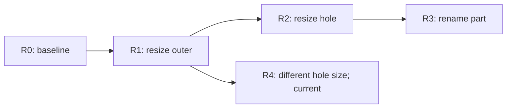

# Proposed managed-state data structures

Current C++ representation: managed schema classes carry `persistent_id` directly
by default. Separate ID-free values/storage wrappers in the illustrations below
require `[managed] separate_values = true`; see the [runtime contract](cpp_runtime.md).
New documents get a namespace automatically. Root and managed descendants allocate
IDs `1, 2, 3...` within that document only; saved IDs/counters survive reload,
and undo/deletion never renumber survivors. Explicit member boundaries still apply.

Status: broader managed-state design. The [C++ interface](cpp_runtime.md)
implements generated storage and editors with whole-root snapshot history. Its
template-selected linear mode contains a deque/cursor with oldest-state eviction;
linear entries contain snapshots, with parameterless undo/redo. Labels are absent
by default and can be enabled with the `history_labels::enabled` template argument. Only
the tree specialization contains a revision map with IDs, explicit parents, and
revision-addressed navigation. Disabled history has
an empty slot. These are exclusive compile-time choices, not runtime alternatives. See the [implementation walkthrough](../internals/managed_transactions.md#how-the-linear-history-deque-works).
The records and walkthrough here illustrate future logical records, not its production
envelope or automatic companion output. The walkthrough uses a generatable ordinary
data schema; see the [design index](README.md) and [bindings](language_bindings.md).

The [revised capability contract](capabilities.md) requires a generated
`persistent_id` on every managed storage object (`uint32` by default, centrally
configurable). The four optional features are history, collaboration, authorization,
and journaling. [Recovery records](journal.md) add a
base snapshot and monotonic journal independently of the history cursor.

## Three decisions, not one feature switch

| Decision | Example | Meaning |
| --- | --- | --- |
| Store capability | `model_store<design, supported_mechanism::history>` | Which optional mechanisms the store implementation contains and can activate. |
| Schema participation | `managed(history)` or `exclude(history)` | Which entities/values participate when a mechanism is active. |
| Runtime policy | `history_mode::tree` | Which available mechanisms run and how revisions are retained. |

The `support` parameter can select optional state in C++; it must not change entity
IDs, reinterpret field IDs, bypass authorization, or turn ordinary payloads into
managed objects automatically. [Feature profiles](managed_state.md#feature-selection-with-one-keyword)
remain pinned and versioned. History encoding is another policy: a tree can contain
snapshots, and a linear history can contain deltas.

For a concrete mapping of these records to C++ classes, start with the
[C++ class walkthrough](#c-class-walkthrough). It uses the cylinder-with-a-hole
example and explains which classes own data and which only borrow access.

## Object and version identities

Use distinct typed identifiers even where the first profile encodes them as a
document UUID plus a monotonically allocated integer:

| Identifier | Identifies | Lifetime |
| --- | --- | --- |
| `entity_id` | One logical root/entity | Stable through edit, move, reload, and undo restoration. |
| `revision_id` | One accepted undoable action or initial baseline | Immutable while retained; never reused. |
| `entity_version_ref` | One immutable stored version of one entity | May be shared by several revisions; its contents never change. |
| `blob_ref` | Immutable encoded storage | May be shared by equal bytes without merging entity identities. |
| `transaction_id` / `operation_id` | A pending action / externally deduplicated request | Separate from revision identity; some actions create no revision. |
| `field_id` | A schema member relative to its containing type | Addresses a slot; does not identify a child across replacement or moves. |

The generated managed root and every managed child carry `persistent_id`, even
when their ordinary schema has no ID member. Its scalar defaults to `uint32`;
external references also carry document scope. ID width does not determine
revision/operation counter widths or file-offset widths.
Allocator high-water marks live outside undoable state. Aborted insertions consume
numbers rather than recycling them. Native addresses, object references, resource
pointers, and language RTTI values are not persistent identifiers. A type key must
resolve through the saved schema/type catalog, not native compiler metadata.

## The store and its owned state

```text
model_store
  core                         always present
  history_state                only if history is supported
  collaboration_state          only if collaboration is supported
  authorization_state          only if authorization is supported/required
  journal_state                only if journal is supported
  storage/transport/effect adapters separately selected integrations

managed_core
  document_id
  schema_catalog + pinned_feature_profile
  entity_id_allocator + transaction_id_allocator
  published_state
  state_generation + save_generation
  active_writer_slot
  authorization/validation configuration
  observer_registry
  allocation_resources + resource_budgets

published_state
  root_entity_id
  managed_payload_storage      generated records carry persistent_id
  live_registry: entity_id -> {type_key, locator}
  ownership_index: child_id -> owner_location
  excluded_state_overlay
```

`model_store` is the sole owning coordinator. The application owns the store;
transaction guards own unpublished candidates; editor handles only borrow access.
Resources control allocation/deallocation without deciding whether an entity is
live or recoverable. [Custom allocation](history.md#ownership-and-custom-allocation)
specifies state/history/scratch resources and their lifetime requirements.

There must be one authoritative live payload for each entity. The initial backend
keeps generated managed storage records with a persistent-ID field per managed
instance. A derived registry maps those IDs to typed locators; it is an index,
not a substitute for the ID field or another owning copy of every payload.
A later normalized backend can own entity payloads in tables and represent
containment through links. Do not maintain both as independently writable models.
A detached ordinary root can be materialized explicitly through `clone_value()`,
which removes generated managed metadata and preserves ordinary application data.

The reverse ownership index is derived from authoritative containment links and
must agree with them. An entity has one owning location in the supported tree;
non-owning application references are separate edges and do not extend ownership.
Structural edits rebuild/update affected locators and invalidate borrowed handles
according to the transaction lifetime contract. A persistent ID does not promise
a stable native address.

`state_generation` detects publication/cache invalidation, including navigation.
`save_generation` distinguishes persistent changes from history revisions. A
transaction changing only `exclude(history)` data can advance save generation
without adding a revision or deleting a redo branch. A complete no-op does neither.

## Descriptors and generated editors

```text
type_descriptor
  stable_type_key + schema_version
  fields: field_id -> field_descriptor
  plain_codec / history_projection / restoration adapters
  clone / construct / destroy adapters
  equality or conservative-change policy

field_descriptor
  field_id + value_type
  ordinary | managed ownership policy
  optional_feature_participation + persistence policy
  collection addressing + reference validation policy

tracked_editor
  borrowed_transaction_context
  entity_id
  typed_locator / relative_field_path
```

Descriptors preserve wire field IDs and define which plain fields belong to their
nearest entity. They also distinguish ordinary integers from declared references.
Generated root/entity editors validate the expected type and route writes into
one active transaction. They contain no independent undo stack. C++ may specialize
these adapters statically; other languages can use generated descriptor objects.
None of these descriptor pointers or executable callbacks belong in saved data.

## Transaction candidates and change coalescing

```text
transaction_state
  transaction_id
  base_state_generation + optional base_revision_id
  bound_access_context + policy_version
  private_candidate
  touched_entities: entity_id -> pending_entity_change
  changed_ownership_links
  excluded_state_changes
  cache_invalidations
  completion_outcome

pending_entity_change
  first_before_state             absent for newly created entity
  final_candidate_state          absent for deleted entity
  attempted_paths + actual_changed_paths
  lifecycle: insert | update | remove | unchanged
```

Capture the first original value once, then preserve the final candidate value.
Multiple x/y setters or changes to a parent and children still produce one user
transaction. Insert-then-delete can coalesce away; update-then-delete retains the
original before-state. Keep attempted access separate from final differences so
reverting a forbidden edit cannot bypass operation authorization.

Commit prepares complete change records, validates policy/domain invariants,
reserves memory, and publishes state plus history cursor atomically. Completion
must use the same path whether explicit or through successful RAII scope exit.
Revert, exceptional exit, or failed preparation publishes nothing. The
[outcome contract](history.md#scoped-completion-and-raii) reports automatic-completion
failure without throwing from a destructor. Transactions cannot overlap on one
store initially; helpers join the existing context.

Candidates can initially clone the root. A later implementation may copy only
touched immutable blocks. Record-size improvements alone do not make candidate
construction, validation, or publication proportional to changed data.

## History records: identity plus recoverable state

A changed-entity snapshot backend can use the following logical records:

```text
entity_version
  entity_id
  stable_type_key + payload_schema_version
  ordinary_history_fields: blob_ref
  managed_history_links: list<owned_link>

owned_link
  slot: typed_field_path          may include a collection key
  child_entity_id

entity_change
  entity_id + stable_type_key
  operation: insert | update | remove
  before: optional<entity_version_ref>
  after: optional<entity_version_ref>
  changed_paths: exact_paths | conservative_invalidation

transaction_change_set
  changes: list<entity_change>
  structural_metadata_if_not_encoded_in_owner_versions
```

Entity snapshots contain all that entity's history-participating ordinary fields,
including embedded values. Independently managed child payloads are stored through
their own versions. An owner's version holds the child identities and collection
structure, not a second independently restored child payload. Collection order
must be recorded too when it is semantically significant. Persist each structural
fact once, either in the owner version or explicitly tagged structural records.

A stored owner version links to child *entities*, not necessarily to particular
child versions. The selected revision's reconstructed entity-version table supplies
those versions. Thus an unchanged difference record can be reused when only its
hole cylinder changes. Looking up a version in isolation does not reconstruct an
entire revision's descendant values.

| Change | Before | After | Other required information |
| --- | --- | --- | --- |
| Insert | Absent | New entity version | Owner membership/link and any created descendants. |
| Update | Original version | Final version | Changed ordinary data and affected ownership structure. |
| Delete | Original version | Absent | Owner membership/link removal and owned descendant deletions. |
| Move | Entity payload may be unchanged | Same payload can be reused | Changes to old/new owners and ordering; entity ID is preserved. |
| Replace a managed child with a new entity | Old child's version | New child's separate version | Delete/insert records plus the parent's changed identity link. |

Versions and blobs can be reused by reference; an ID and an entire deep object
need not be copied into every record. The record must nevertheless resolve all
before/after states and identities without executing application callbacks.
[Compact nested records](history.md#compact-records-without-losing-identity) can use
field paths against a retained identity table rather than repeat full child IDs.
A child replacement still needs the new binding; a field number alone is insufficient.

## Snapshots, differences, and checkpoints

Propose a tagged history payload, so encoding is explicit and versioned:

| Encoding | Stored data | Undo/redo |
| --- | --- | --- |
| Whole-root snapshot | A history-projected managed root with recoverable ID fields/bindings | Restore parent/selected root snapshot. |
| Changed-entity snapshots | A transaction change set with before/after version references | Restore all before/after versions and structure atomically. |
| Reversible delta | Typed operations with old/new values or equivalent invertible data, plus exact base/result identities | Apply inverse/forward operations to the validated base. |

Start with whole-root snapshots for correctness, then changed-entity snapshots for
bounded storage. Field-level differences are an optional optimization. Prefer a
complete small entity when path/delta metadata or replay overhead would cost more.
Never assume every type, collection, move, or schema migration has a safe delta.
A delta must include enough prior information to undo a deletion or replacement.

```text
checkpoint
  revision_id
  root_entity_id
  entity_versions: entity_id -> entity_version_ref
  identity/ownership information required by its encoding
  schema/profile/format versions
```

Whole-root encodings use an equivalent managed root snapshot with ID fields instead
of a duplicated normalized table. A checkpoint bounds reconstruction distance;
it is not an extra user action. Ordinary persistence includes `exclude(history)`
data, whereas checkpoints/history records omit that projection and all transient
fields. The current excluded-state overlay is applied after history reconstruction
and retained for any owner that can return through undo.

Each revision names its encoding and required bases. If encodings change between
revisions, adapters must reconstruct the same logical state and reject unsupported
formats. Checkpoint creation and pruning preserve all retained revision bases.
A storage backend may pack several logical records together, but cannot apply an
entity twice or weaken per-entity authorization and notifications.

## A revision graph with a runtime retention policy

```text
history_state
  mode: disabled | linear | tree
  revision_id_allocator
  optional current_revision_id    absent until a baseline exists
  revisions: revision_id -> revision_record
  children_index: revision_id -> list<revision_id>
  checkpoints
  version_store + blob_store
  retention_roots + reader_pins + budget_accounting

revision_record
  revision_id
  ordered_parent_ids
  optional transaction_id + action_label
  schema/profile/record_format versions
  payload_kind + payload_reference
  optional checkpoint_reference
```

Initially, the baseline has no parent and every later revision has one. Parent
links are canonical; child indexes can be reconstructed. The format can reserve
multiple ordered parents for future merges, but initial readers must reject those
records until merge semantics are implemented. See [merging](managed_state.md#branch-merging).
Timestamps and author labels, if added, are metadata, not conflict-resolution rules.

We do not need a separate mandatory difference stack. A linear history may use
an ordered revision vector plus a cursor; undo/redo stacks are a derived navigation
view. A shared revision table with a mode-dependent retention policy also supports
both linear and tree operation. Neither topology requires field-level deltas.

Consider `R0 -> R1 -> R2 -> R3`. Undo twice to R1, then commit another edit:



In **tree** mode, R2 and R3 remain available, and R4 is a new child of R1. Undo
from R4 returns to R1; redo at R1 must select R2 or R4 explicitly. Checking out R3
restores its label and dimensions using its own ancestry. In **linear** mode,
the active redo suffix R2/R3 is discarded by the new undoable edit; reclaim its
storage only when no other permitted retention root/pin requires it. In disabled
mode, no undo revisions are appended, although core identity and transactions remain.

Excluded-only changes and true no-ops do not discard redo futures. Switching tree
to linear requires an explicit retained path/pruning policy. Enabling recording
after unrecorded changes to undoable data starts a fresh baseline. Runtime mode
switches happen only at a committed boundary and require compiled history support.

Undo/redo prepares a private candidate, resolves version and structural changes,
applies the current excluded overlay, invalidates caches, revalidates authorization
and domain invariants, then publishes atomically. Apply structural/value changes
as one validated state transition; temporary ordering during replay must not expose
dangling live references. Navigation never creates another ordinary edit revision
or resends effects. Future collaborative selective undo is a new compensating
change, a different operation from moving the local history cursor.

## Worked records for the cylinder with a hole

Using [the graphics schema](managed_examples.md#graphics-a-cylinder-with-a-hole),
let D be the difference, O its outer cylinder, and H its hole cylinder. D's ordinary
fields and O/H identity links are version D0. O0/H0 hold the initial dimensions.
The design root has its own version containing the parts-map membership.

| Revision | Changed-entity records | Reconstructed part versions |
| --- | --- | --- |
| R0 | Initial checkpoint | D0, O0, H0 |
| R1 | Update O: O0 -> O1, diameter field 2 | D0, O1, H0 |
| R2 | Update H: H0 -> H1, diameter field 2 | D0, O1, H1 |
| R3 | Update D: D0 -> D1, label field 1 | D1, O1, H1 |
| R4, branched from R1 | Update H: H0 -> H2 | D0, O1, H2 |

R4's before-version is H0 because the edit began at R1, not H1 from the abandoned
future. Entity IDs D/O/H do not change. O/H versions include their ordinary point
positions; those points have field paths but no separate entity IDs. An action
changing D, O, and H together produces three logical entity changes inside one
revision, potentially one packed physical record.

## Where deleted entities are stored

Use the same retained version/blob store as ordinary history. A second mutable
repository of deleted live objects is neither necessary nor authoritative.
An optional deleted-entity index can accelerate queries, but must be keyed by
entity plus revision/version context rather than only by ID.

If R5 deletes D after R4, that one transaction records:

- The design root's before/after version with D's parts-map membership removed.
- Removal of D with before-version D0 and absent after-version.
- Removal of exclusively owned O and H with before-versions O1/H2 and absent
  after-versions; immutable records can be referenced rather than copied.

Current lookup of D/O/H then reports absent. R4 and its required recovery records
still resolve those objects; undo R5 restores their original IDs, payloads, links,
and membership together. The other branch still resolves D1/O1/H1 at R3. There
is no global deleted flag that can describe all branches at once.

The first whole-root backend already retains deleted payloads in older root
snapshots; changed-entity storage retains before-versions or equivalent replay
chains. A tombstone says what was deleted, but cannot reconstruct missing payload
bytes on its own. Release live objects/caches when no active candidate or reader
uses them; history can retain serialized data or immutable blocks instead.

Pruning reclaims a version/blob only after tracing every required live revision,
checkpoint/delta base, pin, candidate, excluded overlay, and recovery/replication
requirement. Optional block reference counts may accelerate this; they are not
persistent entity fields. Compact-ID dictionaries also participate in reachability.
Removing one branch must not reclaim payloads shared by another. Allocator
high-water marks never rewind when versions, tombstones, or branches are pruned.
See the full [retention contract](history.md#deleted-from-the-model-retained-in-history).

## Optional component data

| Component | Possible owned state | Boundary |
| --- | --- | --- |
| History | Revision graph, checkpoints, immutable versions, retention indexes | Optional undo storage; may be absent from the store type. |
| Collaboration | Replica/session identity, pending operations, acknowledgements, deduplication results, base tokens, presence, grant/lease tables, and stream cursors | Store-owned synchronization and optional lock state; no transport or identity provider. |
| Authorization | Bound context and policy/version provider | Selectable store engine; once active/required, every affected target passes its gate. |
| Journal | Appended/sidecar mode, base/journal generations, durable sequence, checkpoint and offset indexes | Recover durable unsaved changes; full Save retires only covered, unneeded records. |
| External effects | Durable intents, delivery status, compensation links | Adapter/workflow state outside undoable payloads. |

A collaboration-only configuration may need base versions and an operation log
without a user-visible undo history. It must own that synchronization data itself,
or declare and validate an explicit history dependency. Excluding history cannot
silently discard data required by a chosen synchronization algorithm. The same
principle applies to merge ancestry and distributed transactions.

The [collaboration record contract](collaboration.md#three-independent-record-streams)
adds logical change proposals/accepted batches, editing presence, lock grants,
leases, and sequenced lock updates. Runtime indexes map targets to grants and
leases to owned grants; ownership ancestors and descendant-lock counts accelerate
subtree checks. These are derived coordination indexes, not fields in every
generated entity. Lock deadlines use the authority's monotonic clock contract.

All concrete portable records must originate in `.serializer`, just like the
C++ walkthrough below. That schema currently covers model/history data only;
it does not contain collaboration records. Implemented snapshot collaboration uses
the separate [record schema](../../schemas/collaboration_records.serializer) and
[C++ wrapper](collaboration_runtime.md); the optimized indexes above remain proposals.
Presence/grants are not part of a document snapshot or undo revision. A recovered
document reacquires coordination rights; a durable authority log, if needed, has
its own recovery/fencing contract. See [replica failure handling](collaboration.md#replica-lock-caches-and-failure-handling).

## Saved envelope and validation

```text
managed_envelope
  format_version + schema_catalog_version
  document_id + identity_type/format + pinned_feature_profile
  required_reader_features + record_encoding_versions
  entity/revision/operation allocation metadata
  current_persistent_model + identity bindings
  current_excluded_state + retained_owner_overlays
  optional history section:
    mode + current_revision_id
    retained revisions + checkpoints + versions/blobs + decoding dependencies
  optional adapter sections with their own version contracts
```

The live persistent model and history projection may share physical blocks; their
logical inclusion rules remain distinct. Do not serialize native layouts, resource
addresses, mutexes, transaction guards, observers, or authenticated sessions.
Policy grants from an imported file are not trusted automatically. A current-model
export deliberately omits undo history; an import must not silently pretend it can
resume unavailable revisions. A reader unable to understand required history or
adapter features must reject resumable load or perform an explicitly requested
current-model import under a specified compatibility policy.

Validate counts, sizes, type keys, unique entity/revision IDs, ownership, links,
base availability, acyclic ancestry, encoding support, and the selected cursor
before publication. Define field numbers and the exact portable record schemas
in a later wire-format proposal; the walkthrough's illustrative field IDs do not
establish that production contract. Identical
logical files should have equivalent interpretation across supported backends,
without requiring identical in-memory layouts.

## C++ class walkthrough

Every C++ data class declared in this walkthrough comes from
[walkthrough.serializer](walkthrough.serializer). The excerpts below were taken
from actual C++ output with `coding_standard = serializer` and `naming = profile`.
Codec member functions and enum conversion/validation helpers are omitted for
readability; class declarations, access sections, qualified types, defaults, and
`serializer_reuses_storage` are preserved. There are no handwritten replacement
structs or invented owning-class getters/setters in these excerpts.

The schema demonstrates the **managed-storage backend with changed-entity snapshots**
using syntax supported today. It does not implement managed behavior. The future
`managed`, `exclude(...)`, and `transient` annotations remain in the
[domain proposal](managed_examples.md#graphics-a-cylinder-with-a-hole), not in this
compilable subset. Record field IDs here are draft examples, not a finalized or
released history wire contract. The complete persistence envelope and policy
validation remain future work.

The source is the authority for every class below. For example:

```text
serializer version 1;

class point stable_ids {
  public double x (1);
  public double y (2);
  public double z (3);
}

class cylinder stable_ids {
  public double height (1);
  public double diameter (2);
  public point position (3);
}
```

Generate the header with the current compiler and a configured clang-format 19+
executable (create the output directory first):

```powershell
serializer --input docs/managed/walkthrough.serializer --output out/managed-walkthrough/walkthrough.hpp --cpp.coding_standard serializer --cpp.naming profile
```

Local verification used the repository's existing compiler executable and an
explicit `--cpp.clang_format` path. Generated headers stay in `out/`; edit the
schema and regenerate instead of maintaining a second hand-authored header.
Generation produced 29 classes and three enums. The complete generated header,
including its codecs, passed an MSVC C++20 syntax check with `/W4 /WX /Zs`, and
every class/enum excerpt below was checked against that output. This verifies
data generation and C++ syntax, not managed transactions or history behavior.
A separate literal-`uint64` lowering also passed generation and the same syntax
check; central ID configuration and runtime width migration are still proposals.

### Ordinary application classes

```cpp
class point {

public:
  double x{};
  double y{};
  double z{};

public:
  static constexpr bool serializer_reuses_storage = true;

  // Codec functions omitted from this documentation excerpt.
};

class cylinder {

public:
  double height{};
  double diameter{};
  ::point position{};

public:
  static constexpr bool serializer_reuses_storage = true;

  // Codec functions omitted from this documentation excerpt.
};

class difference {

public:
  ::std::string label{};
  ::cylinder outer{};
  ::cylinder hole{};

public:
  static constexpr bool serializer_reuses_storage = true;

  // Codec functions omitted from this documentation excerpt.
};

class design {

public:
  ::std::map<::std::uint64_t, ::difference> parts{};

public:
  static constexpr bool serializer_reuses_storage = true;

  // Codec functions omitted from this documentation excerpt.
};
```

These are ordinary generated owning classes. `public` schema members become
public data members, with value initialization and the emitted fully qualified
types. `stable_ids` controls codec field identifiers; it does not add an entity-ID
member. The `parts` map key is an application key, not automatically an entity ID.

The proposed managed generator will additionally emit schema metadata and tracked
companions. In that future managed context, differences and their cylinders get
identities while their ordinary points do not. Generated managed storage records
below illustrate their mandatory `uint32 persistent_id`; ordinary domain classes
above remain unchanged. The compilable schema omits the
transient volume cache because `transient` is not implemented; it must not silently
serialize cache fields as ordinary persistent fields to imitate that feature.

### Managed storage records with mandatory IDs

These explicit schema classes illustrate a lowered representation. Each managed
instance carries its own `persistent_id`, including the root. The actual C++
generator now accepts bare `managed` and central ID settings, using its own
`managed_<type>_data` and `managed_<type>_storage` companions; see the
[implemented interface](cpp_runtime.md). Metadata field numbers belong to the
wrapper, not the ordinary payload.

```cpp
class managed_cylinder_record {

public:
  ::std::uint32_t persistent_id{};
  ::cylinder value{};

public:
  static constexpr bool serializer_reuses_storage = true;

  // Codec functions omitted from this documentation excerpt.
};

class managed_difference_record {

public:
  ::std::uint32_t persistent_id{};
  ::std::string label{};
  ::managed_cylinder_record outer{};
  ::managed_cylinder_record hole{};

public:
  static constexpr bool serializer_reuses_storage = true;

  // Codec functions omitted from this documentation excerpt.
};

class managed_design_record {

public:
  ::std::uint32_t persistent_id{};
  ::std::map<::std::uint64_t, ::managed_difference_record> parts{};

public:
  static constexpr bool serializer_reuses_storage = true;

  // Codec functions omitted from this documentation excerpt.
};
```

The store assigns nonzero IDs and prevents application edits to those fields.
Ordinary generated classes expose data members; the future managed runtime must
encapsulate these records behind tracked editors. Outer and hole are managed
records here, whereas `outer.value.position` is an ordinary value. Document
scope is stored once in the envelope and combined with each scalar for external
references. `clone_value()` removes these wrappers and returns an ordinary design.
The default schema fixes `uint32` explicitly; the proposed central configuration
would select this lowering or a consistent `uint64` lowering during generation.

### Identity and reference classes

```cpp
class document_id {

public:
  ::std::uint64_t high{};
  ::std::uint64_t low{};

public:
  static constexpr bool serializer_reuses_storage = true;

  // Codec functions omitted from this documentation excerpt.
};

class entity_id {

public:
  ::document_id document{};
  ::std::uint32_t number{};

public:
  static constexpr bool serializer_reuses_storage = true;

  // Codec functions omitted from this documentation excerpt.
};

class entity_version_ref {

public:
  ::std::uint64_t number{};

public:
  static constexpr bool serializer_reuses_storage = true;

  // Codec functions omitted from this documentation excerpt.
};

class blob_ref {

public:
  ::std::uint64_t number{};

public:
  static constexpr bool serializer_reuses_storage = true;

  // Codec functions omitted from this documentation excerpt.
};

class revision_id {

public:
  ::std::uint64_t number{};

public:
  static constexpr bool serializer_reuses_storage = true;

  // Codec functions omitted from this documentation excerpt.
};

class transaction_id {

public:
  ::std::uint64_t number{};

public:
  static constexpr bool serializer_reuses_storage = true;

  // Codec functions omitted from this documentation excerpt.
};

class checkpoint_ref {

public:
  ::std::uint64_t number{};

public:
  static constexpr bool serializer_reuses_storage = true;

  // Codec functions omitted from this documentation excerpt.
};
```

`document_id` illustrates a 128-bit document namespace represented by two schema
integers. `entity_id` combines that namespace with the configured entity number, `uint32`
in this default-profile example. The wrapper metadata field and this reference
must agree. Other reference/counter widths remain independently defined. The distinct
revision/version/blob/transaction/checkpoint classes refer to records within the
containing document; adapters validate the document scope before resolving them.
Native addresses are never persistent IDs. Allocation high-water marks must not
rewind on undo or pruning.

The generator does not add comparison or hashing operators to these wrappers.
The data schema therefore uses arrays of records for identity tables. Runtime
indexes can use extracted numeric keys within a validated document, or explicitly
provided key/comparison adapters. A generated wrapper does not already work as a
native `std::map` key without such support.

### Paths, schema versions, and published model data

```cpp
enum class path_step_kind {
  field,
  map_key,
  array_element,
};

class path_step {

public:
  ::path_step_kind kind{};
  ::std::uint32_t field_id{};
  ::std::uint64_t key_type{};
  ::std::vector<::std::uint8_t> key_bytes{};
  ::std::uint64_t element_index{};

public:
  static constexpr bool serializer_reuses_storage = true;

  // Codec functions omitted from this documentation excerpt.
};

class field_path {

public:
  ::std::vector<::path_step> steps{};

public:
  static constexpr bool serializer_reuses_storage = true;

  // Codec functions omitted from this documentation excerpt.
};

class record_versions {

public:
  ::std::uint32_t schema_catalog_version{};
  ::std::string feature_profile{};
  ::std::uint32_t feature_profile_version{};
  ::std::uint32_t record_format_version{};

public:
  static constexpr bool serializer_reuses_storage = true;

  // Codec functions omitted from this documentation excerpt.
};
```

`path_step_kind` selects which step fields apply: a schema field ID, a map key with
its type/encoded bytes, or an array index. Unused fields have default values; the
future reader validates the tag, path types, key encoding, bounds, and canonical
inactive fields. These checks are managed-runtime rules, not rules that the
current generated codecs infer from this example schema.

```cpp
class live_entry {

public:
  ::entity_id entity{};
  ::std::uint64_t type_key{};
  ::field_path location{};

public:
  static constexpr bool serializer_reuses_storage = true;

  // Codec functions omitted from this documentation excerpt.
};

class design_state {

public:
  ::entity_id root_id{};
  ::managed_design_record value{};
  ::std::vector<::live_entry> identity_bindings{};

public:
  static constexpr bool serializer_reuses_storage = true;

  // Codec functions omitted from this documentation excerpt.
};
```

`design_state` is the concrete schema-defined data part of
`published_state<design>` from the logical design. Its `value` is a generated
`managed_design_record`; its parts and operands are ID-bearing managed records.
`identity_bindings` is a derived ID-to-path index over those fields, validated
against them on load. It does not own another copy of each cylinder.
Root identity agrees with `value.persistent_id` and the root binding, whose path
is empty. Structural edits
rebuild or validate affected bindings against the new tree.

There is no schema `template<typename Root>` here. A different root type uses its
own generated state record, while the runtime store is generic over those generated
types. The runtime derives its fast live registry and ownership index from the
value tree, identity bindings, and schema metadata. Descriptors, allocation
resources, policy callbacks, observers, locks, and borrowed handles are runtime
state outside the serializable class. This example has no excluded-value fields;
the full design still requires its separately defined excluded-state overlay.

### Immutable versions and transaction change records

```cpp
class owned_link {

public:
  ::field_path slot{};
  ::entity_id child{};

public:
  static constexpr bool serializer_reuses_storage = true;

  // Codec functions omitted from this documentation excerpt.
};

class entity_version {

public:
  ::entity_version_ref id{};
  ::entity_id entity{};
  ::std::uint64_t type_key{};
  ::std::uint32_t schema_version{};
  ::blob_ref ordinary_fields{};
  ::std::vector<::owned_link> managed_children{};

public:
  static constexpr bool serializer_reuses_storage = true;

  // Codec functions omitted from this documentation excerpt.
};

enum class change_kind {
  insert,
  update,
  remove,
};

class entity_change {

public:
  ::entity_id entity{};
  ::std::uint64_t type_key{};
  ::change_kind kind{};
  bool has_before{};
  ::entity_version_ref before{};
  bool has_after{};
  ::entity_version_ref after{};
  bool exact_paths{};
  ::std::vector<::field_path> changed_paths{};

public:
  static constexpr bool serializer_reuses_storage = true;

  // Codec functions omitted from this documentation excerpt.
};

class transaction_change_set {

public:
  ::std::vector<::entity_change> entities{};

public:
  static constexpr bool serializer_reuses_storage = true;

  // Codec functions omitted from this documentation excerpt.
};
```

`has_before` and `has_after` explicitly represent absence using supported schema
fields. The current grammar does not generate `std::optional<T>`. The paired value
field is still serialized when its flag is false, and must then contain its default
value; this is an illustrative representation, not a storage optimization.
Insert requires only after, update requires both, and remove requires only before.
`exact_paths` distinguishes exact path lists from conservative entity invalidation.

The runtime validates those invariants after decoding. Owner versions record
membership, identity links, and meaningful ordering once. Each cylinder version
contains its height, diameter, and ordinary point. The difference version contains
its label and child entity links; it does not duplicate the cylinders' payloads.
Its history bytes must come from a generated projection, not ordinary deep
serialization of `difference`, which includes both cylinders.

```cpp
class blob_record {

public:
  ::blob_ref id{};
  ::std::vector<::std::uint8_t> bytes{};

public:
  static constexpr bool serializer_reuses_storage = true;

  // Codec functions omitted from this documentation excerpt.
};

class version_store_record {

public:
  ::std::vector<::entity_version> versions{};
  ::std::vector<::blob_record> blobs{};
  ::std::uint64_t next_version_number{1ULL};
  ::std::uint64_t next_blob_number{1ULL};

public:
  static constexpr bool serializer_reuses_storage = true;

  // Codec functions omitted from this documentation excerpt.
};
```

The logical `version_store` owns a generated `version_store_record` and runtime
lookup/retention indexes. `array uint8` becomes `::std::vector<::std::uint8_t>`;
it does not become an invented `std::byte` schema primitive. The generated data
fields are mutable, but the store exposes only immutable historical records and
controlled append/prune operations. Codec generation alone does not enforce that
immutability. Version/blob reference numbers are unique within their tables, and
record references must resolve before publication.

### Revisions, checkpoints, and history ownership

```cpp
class entity_version_binding {

public:
  ::entity_id entity{};
  ::entity_version_ref version{};

public:
  static constexpr bool serializer_reuses_storage = true;

  // Codec functions omitted from this documentation excerpt.
};

class checkpoint {

public:
  ::checkpoint_ref id{};
  ::revision_id revision{};
  ::entity_id root{};
  ::std::vector<::entity_version_binding> entities{};
  ::record_versions formats{};

public:
  static constexpr bool serializer_reuses_storage = true;

  // Codec functions omitted from this documentation excerpt.
};

class entity_snapshot_revision {

public:
  ::revision_id id{};
  ::std::vector<::revision_id> parents{};
  bool has_transaction{};
  ::transaction_id transaction{};
  ::std::string label{};
  ::record_versions formats{};
  ::transaction_change_set changes{};
  bool has_checkpoint{};
  ::checkpoint_ref checkpoint{};

public:
  static constexpr bool serializer_reuses_storage = true;

  // Codec functions omitted from this documentation excerpt.
};

enum class history_mode {
  disabled,
  linear,
  tree,
};

class history_record {

public:
  ::history_mode mode{};
  bool has_current{};
  ::revision_id current{};
  ::std::vector<::entity_snapshot_revision> revisions{};
  ::std::vector<::checkpoint> checkpoints{};
  ::version_store_record storage{};
  ::std::uint64_t next_revision_number{1ULL};
  ::std::uint64_t next_checkpoint_number{1ULL};

public:
  static constexpr bool serializer_reuses_storage = true;

  // Codec functions omitted from this documentation excerpt.
};
```

An `entity_snapshot_revision` stores a change list whose before/after references
resolve into the version store. A baseline has no parent or transaction and names
a checkpoint. Initially every later revision has one parent; additional parents
require future merge support. Presence flags follow the same default-value rule
as before/after references. All tables validate ID uniqueness and referential
integrity; checkpoints map each retained entity to its version for that revision.

The logical `history_state` owns the generated `history_record` plus derived child
indexes, retention roots, reader pins, and budgets. Those runtime details are not
fields of this saved record. At R1, both R2 and R4 can name R1 in `parents`; the
runtime reconstructs the child index and preserves both futures in tree mode.
Linear mode prunes its active redo suffix according to the retention contract.
History storage exists once per store, not inside every generated cylinder.

This source demonstrates entity snapshots only. A future root-snapshot/delta
backend needs its own supported schema encoding and decoding rules; the current
schema must not pretend to produce an arbitrary `std::variant` of nontrivial
payloads. The existing raw-union restrictions still apply. A record envelope must
also supply the document namespace, schema catalog, feature profile, and other
validation/retention dependencies before this becomes a resumable file format.

### Runtime ownership around generated data

All C++ class declarations above are generated from the accompanying schema.
Runtime behavior uses these records through the separate
[capability-template design](language_bindings.md#c-a-capability-template-is-appropriate):

| Runtime type or component | Generated data it owns or accesses | Generation boundary |
| --- | --- | --- |
| `model_store<Root, support>` / `managed` | The generated root/state record and enabled component records | Runtime template; arbitrary schema templates are not supported today. |
| `managed_core<design>` | Current ID-bearing `design_state` plus non-undoable allocation state | Runtime coordinator adds configured policies, resources, observers, and derived indexes. |
| `version_store` | `version_store_record` | Runtime methods enforce immutability, allocation, lookup, and pruning. |
| `history_state` | `history_record` | Runtime methods implement branch navigation and retention. |
| `authorization_state` | Future generated policy/configuration records | Application-supplied context and active enforcement remain runtime behavior. |
| `journal_state` | Broader proposed generated records; the current C++ journal sink and file adapter use a full base with framed snapshots/control records | Native-file adapter implements durable append, full Save, and recovery; delta records and background checkpoints remain proposals. See the [journal guide](journal.md). |
| `transaction<design>` | A private candidate `design_state` and pending changes | Runtime RAII guard; context pointers, outcome references, and cleanup are not serialized fields. |
| `tracked_cylinder` | A transaction's generated `cylinder`, resolved by entity ID | Illustrative name; implemented C++ uses `cylinder_editor<Access>` and separate generated storage. |

Native ownership templates and context pointers are not presented as generated
data fields. Generating the runtime helpers themselves would require a separate
managed-code generation feature; they are not outputs of today's data schema.
Their logical ownership and lifetime remain governed by the earlier sections and
the [RAII contract](history.md#scoped-completion-and-raii).

For `managed<design, supported_mechanism::history>`, the runtime owns the current
generated state and one history engine. Two setters on one cylinder coalesce into
one `entity_change`; changing both cylinders produces two changes inside one
revision. A transaction owns its private candidate, and generated editors only
borrow access. Commit validates and publishes state plus history atomically;
revert or failed completion publishes neither.

Deleting a difference removes its live values and identity bindings. The new
revision records the parent's membership change and the removed entities' before
references. The generated version/blob records retain the bytes needed to restore
the original IDs and links; no second collection of live deleted cylinders is
required. Custom allocation and retention remain runtime responsibilities, and
generating ordinary `std::vector`/`std::map` fields does not by itself propagate a
custom allocator into them.

## Initial implementation and acceptance cases

The first useful implementation needs core identity and descriptors, isolated
transactions, runtime disabled/linear/tree history, a simple snapshot backend,
resource cleanup, and a versioned save/load contract. Compiled feature slots can
start with history alone. Collaboration, merging, optimized deltas, and normalized
payload storage remain separate increments.

Future verification should cover:

- A store without history support has no history containers and rejects undo/tree
  activation; a supported-but-disabled store keeps the agreed resumption policy.
- Tree-mode undo-twice/edit preserves R2/R3; linear mode removes the active redo
  suffix; selection among redo children is explicit.
- Whole-root, entity-snapshot, and supported delta encodings restore equivalent
  IDs, values, structure, and excluded overlays without duplicate application.
- R4 uses H0 as its base, deletion at R5 restores D0/O1/H2, and pruning one branch
  preserves versions needed by another or by a reader pin.
- Disabled mechanisms do not bypass policy or remove managed identity. Unsupported
  capability combinations fail instead of silently allocating hidden dependencies.
- Failed reconstruction, missing delta bases, corrupt links, resource exhaustion,
  and incompatible schema/profile versions leave current state unchanged.
- Each backend validates the same record fixtures, exact large IDs, and atomic
  notification batches. Native memory footprint and allocation behavior are measured
  separately from wire compatibility.

These are future acceptance requirements. The walkthrough verifies ordinary data
class generation, not the complete managed runtime behavior. The implemented
snapshot backend has its own [versioned record schema](../../schemas/managed_records.serializer)
and tests described in the runtime guide. Optimized history formats and performance
results remain outstanding.
