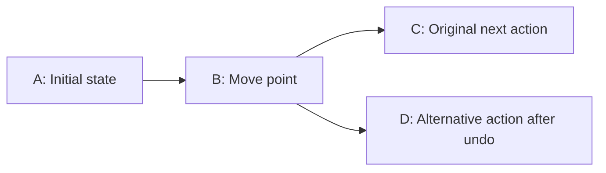

# Object identity and transactional history proposal

Current C++ representation: managed schema classes carry `persistent_id` directly
by default. Separate ID-free values/storage wrappers in the illustrations below
require `[managed] separate_values = true`; see the [runtime contract](cpp_runtime.md).
New documents get a namespace automatically. Root and managed descendants allocate
IDs `1, 2, 3...` within that document only; saved IDs/counters survive reload,
and undo/deletion never renumber survivors. Explicit member boundaries still apply.

Status: broader design contract. The [C++ interface](cpp_runtime.md) implements
bare `managed` declarations, generated storage/conversions/editors, central ID type
configuration, all three transaction forms, linear/tree snapshots, and memory
save/load. `exclude(...)`, `transient`, capability selectors, notifications, custom
allocation, and optimized entity/delta storage remain proposals. Use the runtime
guide for exact generated names and currently available APIs.

See the [design index](README.md), [concrete data structures](data_structures.md),
and [C++/other-language bindings](language_bindings.md) for the store template,
optional component storage, revision records, and deleted-object examples.
`model_store<Root>` below uses a proposed pinned default capability set; the fuller
C++ form is `model_store<Root, support>`, also expressible as a `managed` alias.

The companion [managed-state proposal](managed_state.md) develops authorization,
merging, collaboration, distributed transactions, and external-effect boundaries.
Both proposals use `managed` / `model_store` for the broader capability, with
history as an optional feature. See its feature-selection and root-inference rules.
The [application examples](managed_examples.md) cover a cylinder with a hole,
accounting, a wordpad-style editor, and other domains. Graphics is an example,
not a dependency or a restriction on the model.

The schema and behavior contracts are language independent and intended for all
supported output languages. C++ examples illustrate one possible API; an initial
C++ implementation would not establish support in other backends. Each backend
needs its own generated accessors, transaction runtime, and verification. Tracked
mutable binary views need a separate design. Current integration is documented in the
[usage guide](../usage.md) and [integration skill](../../.agents/skills/serializer-integration/SKILL.md).

## Revised managed identity and capabilities

Every managed storage instance now carries a mandatory `persistent_id`, defaulting
to `uint32` under central generation configuration. Separate normal value classes
are ID-free only when explicitly requested; a map key or sidecar alone is no longer the managed identity mechanism.
See [capabilities and configuration](capabilities.md) for the shared contract and
the four features: history, collaboration, authorization, journaling.
See [incremental recovery](journal.md) for durable undo/navigation
and base-file/journal handling, which are separate from user-visible history.

## Goals and boundaries

- Support ordinary linear undo/redo and branching history through runtime configuration.
- Keep a top-level collection, such as an `accounting` object, as the application's root.
- Identify logical objects consistently across edits, history branches, and saved sessions.
- Group changes to several fields or objects into one atomic undo step.
- Preserve existing codecs, generated classes, schema syntax, and wire formats for
  applications that do not opt into history.
- Allow an initial snapshot implementation to evolve toward changed-object records
  without changing the application's transaction boundaries.

The history module would depend on Serializer; the serialization core would not
depend on the history module. Existing callers would acquire no history metadata,
setter hooks, registry lookups, or extra serialization work. Applications using the
module would pay for identity management, staging, and retained history explicitly.

Branch merging, collaborative editing, distributed transactions, and reversal of
external effects such as file writes or network requests remain future features.
Their [design considerations and authorization boundaries](managed_state.md)
should inform the initial transaction and identity interfaces. A data collection
hierarchy and a history tree describe different things: one organizes current
objects; the other organizes alternative revisions. Merge ancestry can later
extend the revision tree into a graph.

## Root collection and ownership

A proposed `model_store<accounting>` would coordinate these responsibilities:

| Component | Responsibility |
| --- | --- |
| `accounting` | Own current application data, including one or more typed collections. |
| Object registry | Allocate IDs, resolve references, and validate membership and uniqueness. |
| Transaction | Stage edits and validate their combined result before publication. |
| History manager | Retain revisions, select branches, and perform undo/redo. |
| Serializer codecs | Encode/decode snapshots and history records. |

Composition avoids requiring every generated type to inherit a history-aware base
class. A generated managed storage record carries its persistent-ID field and
exposes identity directly by default. Opt-in separated storage wraps existing
values and keeps the ordinary payload schema unchanged.
History data lives outside the application root, so a root snapshot does not
recursively contain its own history.

Only independently addressable entities require object IDs. An embedded point can
remain part of its owning shape; changing that point then changes the shape's
snapshot. A separately shared point needs its own ID and references from its users.
Independently registered children have identity links in the logical parent record,
so one transaction does not restore overlapping copies of the same entity. A
physical record may encode those links through a shared identity table and relative
field IDs instead of repeating each full persistent ID; see
[compact records](#compact-records-without-losing-identity).
For changed-object history, a root/owner record covers its ordinary fields and
collection membership metadata, while managed entity records cover their payloads.
A whole-root checkpoint can include the entire collection; the initial snapshot
implementation does not also replay duplicate per-entity snapshots for that revision.

The store exposes committed objects for reading and provides scoped access to
transaction candidates for writing. Callers must not retain mutable references,
pointers, iterators, or mutable views obtained during an edit callback. After a
commit or history navigation, callers resolve IDs again rather than relying on
object addresses or container positions remaining unchanged.

## Ownership and custom allocation

The store controls managed-object lifetime. Application-supplied allocators provide
storage without taking over that lifetime. Logical containment and physical storage
ownership are separate: a difference owns its two cylinders logically, while the
store coordinates their creation, publication, deletion, and historical versions.

| Component | Lifetime responsibility |
| --- | --- |
| Application | Own the store, detached ordinary values, and any borrowed allocation resources. |
| Model store | Own committed managed state, identity metadata, and retained history. |
| Transaction | Own its private candidate; commit transfers the required storage into committed state, while revert discards it. |
| Managed parent | Define containment and lifecycle relationships; it need not allocate each child separately. |
| Allocation resource | Supply and reclaim storage when requested by the owning runtime component. |
| Editor handle or entity ID | Locate an entity without owning its memory or extending its lifetime. |

Applications request deletion through a transaction; they do not directly free
managed objects or retain mutable aliases into store-owned state. Removing a live
entity and reclaiming its historical payloads are separate decisions. See
[deleted objects](#deleted-from-the-model-retained-in-history).

### Runtime allocation resources

Propose runtime configuration with standard defaults, not another schema keyword.
In C++, use `std::pmr::memory_resource` or an adapter to it for allocation with a
byte count and alignment. Its public allocation/deallocation operations and custom
resource requirements are described in the C++ working draft's
[interface](https://eel.is/c++draft/mem.res.public) and
[resource contract](https://eel.is/c++draft/mem.res.private).

```cpp
// Proposed API: application-provided resources outlive all allocations using them.
model_options options{
  .state_resource = &object_pool,
  .history_resource = &history_pool,
  .scratch_resource = &temporary_pool
};

model_store<design> store{design{}, options};
```

These API names are illustrative and unimplemented. All three resources may use
the same provider; separating them is optional:

| Resource | Intended allocations |
| --- | --- |
| State | Store nodes, identity metadata, and payload storage supporting allocator propagation. |
| History | Revision records, encoded snapshots/deltas, and retained immutable payload blocks. |
| Scratch | Temporary encoding, comparison, and validation buffers with bounded operation lifetimes. |

Committed candidate data must already have a suitable allocation lifetime, be
copied into state storage before publication, or transfer ownership of its entire
allocation region. It must never depend on scratch storage reset at transaction
exit. A transaction arena is safe only when every allocation follows this rule.

Track allocation provenance: each block returns to its matching resource with
the correct size and alignment. Any later change of defaults affects new
allocations only. Allocation failure discards the private candidate without
partial publication. Cleanup and deallocation must not throw or depend on new
allocations to report failure. Returning memory to a pool need not immediately
release its reserved capacity to the operating system.

### Construction, destruction, and resource lifetime

Generated code or an explicit type adapter constructs, clones, and destroys
payloads; the resource supplies and releases their storage. RAII guards destroy
successfully constructed subobjects after partial failure and release storage
exactly once. An allocator alone cannot define application-object clone/restore
semantics. Default insertion copies or safely transfers a detached value into
store-owned state; it does not adopt arbitrary raw pointers. A future explicit
ownership-transfer API would need a unique owner, a matching non-throwing cleanup
operation, and defined clone/restore behavior without external mutable aliases.

Borrowed resources must outlive every allocation using them, including candidates,
retained history, and reader pins. Initially, pins and transactions must close
before store destruction. Pins surviving the store would need an owning storage/
resource token rather than a dangling resource pointer. Workers must finish or
transfer ownership safely before shutdown. Resource thread-safety must match all
threads that allocate or reclaim storage; writer-only pools cannot automatically
be shared with compression workers.

Detached `clone_value()` results use their normal allocation policy or a separately
supplied output resource that outlives the clone. They must not borrow a store's
internal arena. Never serialize allocator pointers, callbacks, or memory reference
counts. Loading selects resources again; persistent entity ID allocation remains
independent of allocating memory addresses.

### Scope across generated languages

A store resource does not automatically redirect allocations inside existing
ordinary `std::string`, `std::vector`, or application objects. Initial hooks can
cover runtime metadata and history buffers. Full payload control requires
allocator-aware generated storage or construction/clone/destruction adapters,
including propagation through nested containers and decoding. Keep existing
ordinary layouts, APIs, and allocator choices unless the application explicitly
selects another representation. Document allocations outside the hook's scope.

Native backends can expose appropriate allocator or allocation-callback interfaces.
Garbage-collected backends generally keep ordinary object allocation under their
runtime and expose buffer pools or storage providers where supported. Report actual
support per backend. The common contract is controlled ownership, deterministic
release of explicit resources, and atomic failure behavior, not an identical
`free()` operation in every language.

## Managed members and inferred generation support

Use `managed` for identity and controlled access; reserve `history` for the optional
revision feature. A class that directly declares a managed member already needs
generated support, so repeating a class marker is unnecessary. The store is created
explicitly at runtime and owns the history data; ordinary instances remain plain.

| Proposed annotation | Meaning |
| --- | --- |
| `managed` on a member | In the tracked parent representation, give that occurrence independent identity; on a supported collection, apply this to its entries. Include the selected profile's optional features. |
| `managed(history)` on a member | Give it independent identity and history participation, with mandatory managed foundations and store authorization still applying. |
| `managed(all except history)` on a member | Retain identity and the other selected features; save its current state without restoring it through undo. |
| No member annotation | Use the ordinary value representation; a tracked owner records and restores its history-participating fields. |
| Bare `managed` on a class | Declare managed capability; required for a managed target/root without managed members of its own. It does not create a store or change ordinary instances. |

The same `managed` spelling applies to a singleton class member and a
supported collection of class values. On a collection it identifies each entry,
not the container itself. The owning object records collection structure changes.
No singular/plural keyword distinction is needed.

Creating `model_store<project>` selects an eligible type's instance as a root.
Managed members require targets with declared capability or capability inferred
from their own managed members. An incoming managed reference does not grant it.
Generation support never promotes an unmarked occurrence into an identified entity.
All field IDs retain their existing schema meaning.

A managed target can be a leaf class containing only scalar/value members, but
that class must declare `managed` explicitly. Otherwise a managed member using
that target is a schema error. See
[managed leaf types](managed_state.md#managed-leaf-types-require-declared-capability).

A class containing only an ordinary `project` member does not itself gain managed
generation support merely because `project` declares managed tasks. That member
uses the plain project and plain task representations. See the
[plain-containment example](managed_state.md#plain-containment-does-not-propagate-managed-support)
for the distinction between type eligibility, member representation, and edits
recorded through an owning entity.

Unannotated members use plain values, including when their owner is tracked.
Only explicitly marked entity edges propagate the tracked representation.
A separate value annotation is unnecessary. Runtime `history_mode::disabled`
controls recording for a store and is a separate decision; it does not strip
identities from managed objects or change the plain payload's wire format. Bare
`managed` refers to a pinned feature profile, not automatically activated services.
See [feature selection](managed_state.md#feature-selection-with-one-keyword) for
the proposed grammar, exclusions, dependencies, and language-independent behavior.

## Saving state independently of history

Serialization, history participation, and independent entity identity are separate
decisions. A field can need persistence without belonging to the user's undo stack.
Use `exclude(history)` for that case, and `transient` for runtime-only data that can be
discarded and rebuilt. These are proposed schema modifiers, not host-language
keywords or currently supported Serializer syntax.

`exclude(...)` accepts a list of optional features, for example
`exclude(history, collaboration)`. This document develops its history behavior;
see [ordinary value exclusions](managed_state.md#excluding-features-from-ordinary-values)
for naming, multi-feature semantics, and synchronization boundaries.

| Member policy | Saved by ordinary codecs | Restored by undo/redo | Independent entity ID in a tracked parent |
| --- | --- | --- | --- |
| No annotation | Yes | Yes, through its owner, except explicitly excluded descendants | No |
| `managed` | Yes | Yes, with entity lifecycle and ownership | Yes, for the object or each supported collection entry |
| `managed(all except history)` | Yes | No; preserve current values, identities, and membership | Yes |
| `exclude(history)` | Yes | No; preserve the latest committed value | No |
| `transient` | No | No; invalidate/recompute when dependencies change | No |

The bare `managed` row assumes an active profile including history. An explicit
`managed(history)` has that history behavior too. `managed(all except history)`
retains independent identity; `exclude(history)` keeps an ordinary value representation.
Use `all except history` rather than symbolic `!history` or `~history` inside the
feature selector. `exclude(history)` remains the explicit value-field exclusion, and
`transient` expresses a separate exclusion from persistence as well as history.

Apply each exclusion to the declared member subtree: `exclude(history)` excludes history;
`transient` excludes both history and persistence. These exclusions compose, so a
transient descendant of an `exclude(history)` member is still omitted from persistence. Nested
`managed` annotations within that occurrence remain dormant, just as they do
under an ordinary untracked occurrence. Reject combinations of `managed(...)`,
`exclude(...)`, and `transient` on the same member. Excluding a child value does not
make its owning entity immortal: if undo removes the owner, the child is no longer
visible either. Its behavior on restoration is specified below.

### Saved state that does not belong in undo

Selection, viewport position, expanded panels, and editor preferences can be saved
without making navigation or preference changes into undo steps. For example:

```text
class project stable_ids {
  public managed map(uint64) task tasks (1);
  public exclude(history) uint64 selected_task_id (2);
  public exclude(history) double scroll_offset (3);
  public transient uint64 cached_completed_count;
  public transient bool completed_count_valid;
}
```

The task definition is given in the project example below. Both plain and tracked
representations save `selected_task_id` and `scroll_offset`. Only the tracked
representation has an undo mechanism, and that mechanism excludes these fields.
The cache fields exist in memory in both representations and are omitted from all
persistent encodings. A saved selection is an application reference, not an
instruction for the generator to allocate an entity ID. The application must
validate it when the selected task disappears, including on history navigation.
Treat this selection as a soft reference: an unresolved ID can display no selection.
The application can explicitly clear it in a later transaction. A field excluded
from history must not be the only source of an invariant that requires its value
to rewind with an undoable field.

An alternative with the current serializer is to keep a separate ordinary
`session_state` alongside the document and put only document edits into an
application-managed undo system. A recovery envelope can save both. Use this
composition when UI state is per window or per user rather than part of a shared
document. The proposed modifier is useful when the two kinds of state naturally
belong in one model; it does not require all UI state to be embedded there.

### History projection and current saved state

Ignoring a setter notification is insufficient: a later whole-object undo snapshot
would otherwise overwrite excluded fields. The runtime needs two projections:

- **Persistence projection:** all serialized fields, including `exclude(history)`, plus
  identity and optional history metadata in the recovery envelope.
- **History projection:** only undoable values, entity identities, and ownership.
  Exclude both `exclude(history)` and `transient` from snapshots, deltas, equality used
  to detect history no-ops, and history checkpoints.

Ordinary codecs retain the persistence projection. History must use generated
projection descriptors or dedicated record schemas; it cannot blindly replay an
ordinary full serialization over the live object. For an edit from title A to B,
followed by a scroll from 10 to 50, undo restores title A and keeps scroll 50.
Reloading the saved session restores both values as last saved. A tree checkout
also keeps the latest excluded state; `exclude(history)` is not branch-local state.

Stage `exclude(history)` changes in the same transaction candidate as other writes.
Abort discards both kinds; commit publishes them atomically. A transaction that
changes only `exclude(history)` fields creates no revision and preserves redo branches,
but it is still a persistent-state change and must notify observers and autosave.
Distinguish a history no-op from a persistence no-op. Maintain a save generation
separate from the history revision ID: excluded changes and history navigation
can make the document need saving. An asynchronous save acknowledges only the
captured generation, not newer edits made while it was writing.

One implementation can keep excluded state in a current-state overlay addressed
by document ID, owner entity ID, and stable schema field path. Navigation restores
the history projection and then attaches the latest overlay. If an owner is
deleted, retain its excluded state while any retained revision can restore that
owner; undo/redo can then reattach the latest value without recording its edits.
The history envelope must persist this retained overlay too. Discard unreachable
entries when history is pruned and no live state needs them. Plain current-root
saves do not preserve this hidden state or a resumable undo graph.

For the first overlay implementation, support fields under the root or an
identified owner reached through fixed member paths. An `exclude(history)` collection
can be excluded as a whole. Excluded fields inside a history-owned variable
collection require stable entry addressing; a list index is not sufficient.
Reject unsupported paths until their lifecycle binding is defined. Do not silently
attach one item's saved state to a different item after insertion or reordering.
Newly inserted or duplicated entities receive copies of supplied persistent
excluded values under their new IDs; explicit replacement may update them.
History navigation never restores an older excluded value for the same ID.

References to object snapshots and restoration elsewhere in this document mean
the history projection when undo/redo is involved. Whole-root storage still needs
these exclusion rules; a backend must reject unsupported policies rather than
silently capturing excluded fields.

### Temporary calculation caches

Use `transient` for recomputable values, not authoritative document state. It has
no wire ID or wire name and consumes no implicit field slot. This is a proposed
extension to `stable_ids`: explicit IDs remain required for serialized fields and
parents, including `exclude(history)` fields. Reject explicit wire metadata on transient
members. Adding a transient member must not renumber existing serialized fields.

Generated runtime storage initializes transient fields to their declared defaults;
codecs omit them on output and do not accept them as serialized input fields.
Fresh decoding, insertion, duplication, replacement, and `clone_value()` initialize
them to defaults. Value cloning copies persistent data, including `exclude(history)`,
and starts with fresh caches. Native object-copy behavior can differ; applications
using ordinary public fields remain responsible for their own cache validity.

Invalidate caches when their dependencies change, during candidate editing as
well as after undo, redo, checkout, or load. Field names do not reveal dependencies:
use application-declared dependencies or a conservative mutation epoch. A history
revision ID alone is insufficient because several candidate writes occur before
commit. Private candidate caches must not leak into committed objects on abort.
Cache-only writes create no history revision or persistent dirty state and must
not discard redo. They still obey the store's synchronization and access rules.

Changing an existing serialized field to `transient` is a schema migration, not
just a performance annotation: reserve retired IDs/names and handle saved data
compatibility. Changing a field's history policy also requires a decision for
already-retained history records.

### Android restoration example

Android activity recreation and system-initiated process death can require saved
UI state even when the user has made no undoable edit. Small values such as a
selection ID or scroll position fit saved-state mechanisms; larger document data
belongs in local persistence. `ViewModel` alone does not survive process death.
Restore the data needed to reconstruct the application, rather than serializing
every live runtime object. See the official
[Android state-saving guidance](https://developer.android.com/topic/libraries/architecture/saving-states).

For this proposal, save the document's current persistent fields and identities,
the latest `exclude(history)` state, and optionally the retained undo graph and overlay.
Use Android saved-state APIs for small restoration keys and application storage
for a substantial document/history envelope. Reload persistent state, restore the
optional history cursor, and invalidate transient caches. Storage scheduling and
platform lifecycle integration belong to the application; committing a history
transaction does not itself persist data. Android's informal phrase "transient UI
state" can describe state worth saving; it does not imply our schema's `transient`
modifier, which explicitly excludes serialization.

## Contract across generated languages

The modifiers and feature selectors belong to the `.serializer` language and must
keep the same meaning across C++, Java, JavaScript/TypeScript, Go, C#, Rust, Python, Swift, Kotlin,
and C. Do not derive their behavior from a native language's similarly named
modifier or a reflection library's default. Serializer-generated metadata and
codecs define inclusion, identity, and restoration consistently.

Keep identity participation, persistence inclusion, and history inclusion as
separate properties in the compiler's intermediate representation. The supported
combinations are those in the policy table above; runtime history mode is another
independent property. Existing schemas retain their current wire contract.

| Concern | Contract shared by all backends |
| --- | --- |
| Plain construction | Ordinary values, no store or implicit object IDs; persistence exclusions still apply. |
| Managed construction | Store-owned identities; only marked entity edges activate tracked children. |
| Mutation | All managed persistent writes use controlled access or isolated callbacks; direct aliases cannot bypass transaction capture. |
| Transaction boundary | Explicit commit or successful scoped completion; failure, exceptional exit, or cancellation leaves both undoable and excluded committed state unchanged. |
| Snapshot and restore | The same persistence/history projections, defaults, overlay lifetime, and cache invalidation rules. |
| IDs and wire formats | Stable encoded identities and field numbers; use each backend's lossless integer representation, never a lossy numeric conversion. |
| Notifications | Publish a complete state transition before notifying; excluded-only changes can notify without a new revision. |

Generated API spelling and cleanup mechanisms can be idiomatic. C++ can use RAII,
Rust ownership and drop guards, Python context managers, and other backends a
scoped callback, `try/finally`, or explicit completion API. These are possible API
designs, not implemented bindings. Every binding must distinguish successful exit
from failure and publish a visible completion result. A Java/C# disposal method,
Go deferred call, or JavaScript `finally` block alone does not identify success:
use a wrapper that captures the body outcome or an explicit success flag. A normal
error return needs explicit cancellation; it is not an exception. C needs explicit
finish/revert and release paths. Rust error returns also need a result-aware wrapper
or explicit cancellation; panic detection alone is insufficient.

Garbage collection or finalizers must not be relied upon to close a transaction.
Use deterministic scoped cleanup and reject conflicting operations until the
active transaction closes. Async bindings must await a scoped completion API;
never start an unobserved asynchronous commit from a finalizer. See
[RAII and completion failures](#scoped-completion-and-raii).

Platform restoration (Android, desktop, web, or server restart) changes where and
when data is saved, not which fields undo restores. Specify a portable versioned
envelope before claiming cross-language history-file interoperability. Test
writer/reader pairs, exact IDs including large `uint64` values, excluded fields,
cache defaults, and equivalent undo/redo behavior for each supported backend.
Do not advertise support merely because a backend can parse the new modifiers.

## Proposed schema opt-in and generated code

The C++ compiler now infers containing-class eligibility from managed members.
Mark an owning collection with `managed` when its entries need independent IDs;
leaf types must declare `managed` themselves. Identity belongs to an occurrence,
not every instance of its reusable type. This basic syntax is accepted today;
the broader generation options and APIs later in this section remain proposals.

```text
serializer version 1;

class point stable_ids managed {
  public double x (1);
  public double y (2);
}

class point_document stable_ids {
  public managed map(uint64) point points (1);
  public point origin (2);
}
```

| Declaration | Proposed meaning |
| --- | --- |
| `point_document` containing a managed member | Infer companion/descriptor generation; explicit store construction selects the root instance. |
| `managed` on `points` | Treat this collection's entries as independently identified objects and generate its managed collection editor. |
| `points` map key | Application collection key; an explicit ID-key adapter may bind it to the managed record ID, but the key alone is not identity. |
| `managed` on `point` | Declare capability for this leaf type while keeping ordinary point instances reusable as coordinates and embedded values. |
| `origin` member | Track its value through the root's history without allocating it a separate object ID. |
| `stable_ids` | Keep field numbers explicit for locating collections and nested members; it still does not allocate object IDs. |

For this collection example, `managed` applies to `map(uint64)` entries whose
values have managed capability. `uint64` describes application keys, independently
of the configured `uint32` default persistent object ID. Direct managed children
use the same generated ID-bearing storage rule. All managed entities in a document
share a collision-free allocation domain, including its root.

At the C++ API boundary, insertion returns a typed identifier such as
`entity_id<point>`, combining document scope and the record's persistent number.
Generated collection editors distinguish application-key lookup from entity-ID
lookup; they may maintain a derived index between them. Examples using an
ID-keyed collection need an explicit binding adapter and equality validation.
No payload field named `id`, `taskid`, or matching map key implicitly enables this
binding. Validate document, membership, and payload type before resolving an ID.

Other container/key types and nested managed collections need explicit binding
rules before being supported. Reject unsupported uses of a modifier rather than
guessing identity or ownership. By default, nested class members, including the
very same `point` type, are ordinary values. Their nearest tracked owner captures
changes through a scoped value-edit boundary. Marking a member makes it an
independent entity only in the tracked parent representation. Shared entities
are referenced by IDs rather than owned at several locations.

Require explicit serialized field and parent IDs on the root and types reached by
generated editors; transient fields have no wire IDs. Adding these annotations
must preserve previously emitted field numbers and names. Inferred or explicitly
requested companion generation does not create a global store or begin recording
on every standalone instance of the root type.

Generate two layers:

- **Payload layer:** existing owning root and `point` classes, with their
  normal codecs and unchanged payload layout. A standalone value remains usable
  without history. No history pointer or hidden ID field is inserted into it.
- **Managed companion:** an additional generated header, for example
  `point_document_managed.hpp`, containing `tracked_point_document`, `tracked_point`,
  collection editors, and a `model_traits<point_document>` specialization. Traits describe
  collection field IDs, payload types, configured persistent-ID fields, and
  snapshot/restore adapters. Managed storage records include the mandatory ID;
  temporary tracked editors borrow access to those records.

Generate tracked companions only after checking root and target eligibility.
Classes with managed members infer capability; leaf entity types declare the
class marker explicitly. All ordinary payload classes remain available. A
`tracked_point` bound to a managed entry tracks that point's ID. The unmarked
`origin` remains an ordinary
point, edited through a root callback that captures the root before changing it.

The traits bind an object number to a typed collection lookup; they do not use a
memory address, RTTI name, or compiler-generated type hash as persistent identity.
Persistent records identify the application schema version and collection/type
mapping so the correct decoder can be selected after a reload.

The optional library would expose a generic `model_store<Root>`, transaction
support, typed edit handles, revision storage, and change subscriptions. A future
CMake target such as `Serializer::serializer_model` could provide that runtime;
it is a proposed target, not an existing build dependency. Only the companion
header and opting-in consumers would depend on it.

Runtime options select linear or tree history, independently of the schema
annotation. Several stores can use the same root type, each with its own state,
allocator, active transaction, and history. A requested backend without history
generation support must diagnose that limitation rather than silently promise it.

## Creating normal and tracked objects: project tasks

A project with tasks and checklist items illustrates identity and construction
more directly than geometric parameters. The project is the history root. Each
managed task and explicitly marked checklist entry is independently identified;
task details remain a value owned by the task.

The following is a separate proposed schema example:

```text
serializer version 1;

class task_details stable_ids {
  public string description (1);
  public uint32 priority (2);
}

class checklist_item stable_ids managed {
  public string label (1);
  public bool completed (2);
}

class task stable_ids {
  public string title (1);
  public task_details details (2);
  public managed map(uint64) checklist_item checklist (3);
}

class project stable_ids {
  public managed map(uint64) task tasks (1);
}
```

Ordinary construction uses only ordinary generated classes:

```cpp
// A detached task template has no store, allocated entity ID, or transaction.
task draft{};
draft.title = "Prepare release";
draft.details.description = "Review documentation and examples";
draft.details.priority = 2;
```

`draft.checklist` is an ordinary map containing ordinary `checklist_item` values.
The annotation does not change that type, contact a history store, or allocate
identities when `draft` is constructed. Integer keys explicitly present in this
payload are plain map data until a managed import interprets them under a declared
identity policy.

Managed construction uses a transaction factory:

```cpp
// Proposed APIs: one project store owns all entity identities and revisions.
model_store<project> project_store{
  project{}, history_options{.mode = history_mode::tree}};

transaction_outcome transaction_result;
auto transaction = project_store.begin_transaction("Create release task", transaction_result);
const auto task_id = transaction.root().tasks().insert(draft);
{
  tracked_task editor = transaction.root().tasks().edit(task_id);
  editor.set_title("Prepare version 2 release");
  editor.edit_details([](task_details& details) {
    details.priority = 1;
  });

  checklist_item item{};
  item.label = "Review usage guide";
  const auto item_id = editor.checklist().insert(item);
  tracked_checklist_item check = editor.checklist().edit(item_id);
  check.set_completed(true);
}
const auto created_revision = transaction.commit();

project_store.undo();
project_store.redo(created_revision);
```

The task and checklist item are created as one user action. Undo removes both;
redo restores their recorded IDs and values. The task details have no independent
ID, and all edits to them belong to the task. A later transaction can edit the
task or checklist item through their retained IDs without creating new entities.
Nested managed collections are implemented in the C++ interface. This example
uses broader proposed typed-ID and insertion conveniences; the current API uses
`insert(key, plain_value)` for maps, `append(plain_value)` for arrays, and scalar
document-scoped IDs. See [the exact interface](cpp_runtime.md).

`insert(draft)` copies the supplied value into private transaction state and
returns `entity_id<task>`. `edit(task_id)` returns a scoped `tracked_task` facade
over that candidate. The history-aware object is created by the store; the facade
does not create another copy or another identity. Do not provide an unbound public
default constructor for `tracked_task`: it requires an owning store, an identity,
and a valid context. Retain the ID across transactions and obtain a fresh facade
when editing again.

The corresponding cylinder operations are ordinary `cylinder value{};` versus
`transaction.root().cylinders().insert(value)` followed by `.edit(cylinder_id)`.
If position is marked as an entity, managed insertion allocates its child identity;
ordinary cylinder construction always makes an ordinary point.

Export committed geometry or other values explicitly:

```cpp
// Proposed API: obtain a deep, independent ordinary value for normal code.
task detached = project_store.clone_value(task_id);
```

Changes to `draft` or `detached` do not modify the managed task. Inserting a
detached value creates a new entity; replacing at an existing ID preserves that
identity under the replacement policy. Explicit payload data, including integer
map keys, is preserved by value cloning. Those keys must not be mistaken for a
complete transferable entity identity without the document and ownership metadata.

Inserting a nonempty detached entity subtree needs generated import rules: assign
new entity IDs and remap declared internal references. Preserve application map
keys; rewrite a key only when an explicit ID-key binding requires it. Unmarked
maps keep their keys as ordinary data. Unsupported reference mappings must fail
rather than infer identity from
arbitrary integers. The empty-template example above avoids that reconciliation
by inserting its checklist entries directly through the managed factory.

## Graphics example: cylinder with a hole

Use a difference operation owning an outer cylinder and a hole cylinder as the
main geometry example. The difference and its operands are independently managed;
positions usually remain ordinary cylinder-owned values. The
[complete schema and grouped edit](managed_examples.md#graphics-a-cylinder-with-a-hole)
show that resizing both operands is one action, while changing only the cutter
addresses that cutter's identity. This is a generic object system: the same
contracts apply to [accounting](managed_examples.md#accounting-accounts-and-draft-journal-entries)
and [wordpad](managed_examples.md#wordpad-paragraphs-formatting-and-selection).

The smaller comparisons below isolate one operand's representation and position
policy. They explain an optional identity boundary, not a requirement that every
coordinate have an ID.

### Cylinder representations and member identity policy

Generate parallel APIs from one schema: the ordinary owning value keeps its
existing name, and the history-aware companion uses the `tracked_` prefix.
For example, generate `cylinder` and `tracked_cylinder`, and `point` and
`tracked_point`. This is composition, not inheritance from the payload class.
The tracked class is a facade over store-owned candidate state and metadata; it
does not require two permanent copies of every live payload. Undo snapshots and
private transaction candidates have their own explicit storage costs.

Using the previously declared point type, a cylinder-focused root could be:

```text
class cylinder stable_ids {
  public double height (1);
  public double diameter (2);
  public managed point position (3);
}

class cylinder_collection stable_ids {
  public managed map(uint64) cylinder cylinders (1);
}
```

This example uses the two-dimensional point from the earlier schema to focus on
identity. A production coordinate model can include a third coordinate and
orientation as ordinary schema fields; those do not change the identity policy.
The point-only examples elsewhere use `point_document`, a separate root type.

Managed members imply capability for their declaring types and require eligible
targets. The leaf point declares `managed` explicitly. The collection owns identified
cylinders and each cylinder owns an identified point. An ordinary `cylinder`,
including one created outside any store, still contains an ordinary `point`.
The schema author chooses these identity boundaries. Serializer validates and
implements the declared policy; it does not infer identity from the point type.

| Member declaration in the proposed schema | Access from the tracked parent | Separate persistent ID? | History owner |
| --- | --- | --- | --- |
| `public double height (1);` | Scalar getter/setter | No | Cylinder |
| `public double diameter (2);` | Scalar getter/setter | No | Cylinder |
| `public point position (3);` | Plain `point` read access and scoped edit callback by default | No | Cylinder |
| `public managed point position (3);` | `tracked_point` bound to its own entity record | Yes | Point, within the same root transaction |

The two `position` declarations are alternatives, not simultaneous fields.
On a supported collection, `managed` selects independent identity for
each entry. Scalars keep field IDs but do not become separate entities. These
annotations govern only the tracked representation; the plain `cylinder` always
has an ordinary point-valued `position`, including when the annotation is present.

An unmarked class member is a boundary to an entirely plain value subtree.
Annotations declared inside its type remain valid metadata but are inactive in
that occurrence. The same type can use those annotations when reached through a
marked entity edge elsewhere. Do not reject nested annotations merely because
one parent uses the type as a plain value, and do not promote those nested members
through the plain boundary. This rule also applies to ordinary collections.

Mark position when it needs an independent lifecycle or referenceable identity.
Leave it unmarked when the cylinder ID plus its member path is sufficient.
Sharing still requires explicit reference/ownership rules; the annotation alone
does not create shared ownership. Plain membership means that the owner captures
the value's changes, not that those changes are excluded from history.

Neither plain child access nor deep conversion may expose a lasting mutable alias
to committed state. A proposed edit of the marked cylinder above would be:

```cpp
// Group changes to the cylinder and its identified point into one undo step.
auto transaction_result = store.execute_transaction(
  "Resize and move cylinder", [cylinder_id](auto& transaction) {
    auto editor = transaction.root().cylinders().edit(cylinder_id);
    editor.set_height(120);
    editor.set_diameter(40);
    auto position = editor.position();
    position.set_x(10);
    position.set_y(20);
  });
transaction_result.throw_if_failed();
```

The cylinder and point contribute separate logical object changes to one revision. The
point does not acquire its own history manager, undo stack, or transaction.
The [callback transaction](#callback-based-transaction-execution) receives its
edit context as an argument and captures the target ID by value. It commits only
after the callback returns successfully; no explicit `commit()` is needed.
If `position` is unmarked instead, its API is a scoped plain-value edit:

```cpp
// Alternative unmarked position: the cylinder captures the complete point value.
editor.edit_position([](point& position) {
  position.x = 10;
  position.y = 20;
});
```

That version records one changed cylinder, without a point ID or point record.

Independent singleton child identity requires additional store metadata. A
snapshot implementation retains ID-bearing managed children and their owner links.
A derived index maps owner/member slots to those IDs. A changed-object
implementation must preserve
that ownership link and record the child payload once, rather than embedding a
second independently restorable copy in the parent record. The ordinary cylinder
codec still encodes a point value; identity is in the explicit history envelope.
Replacing a child's coordinates preserves its ID, while replacing the child as
an entity is a separate operation with a new ID. Undo restores the original link
and IDs. Changes to these ownership policies require history-format migration.

Nested entity identity is an extension beyond the initial managed root-map
profile. It needs allocation, deletion, restoration, and persistence tests before
being enabled. A limited first implementation should reject `managed`
on singleton child members while retaining support for managed root maps, rather
than claim nested identity support through setter generation alone.

### Snapshot ownership for embedded and managed points

An unmarked point is still serialized and participates in its managed cylinder's
history. It has no independent entity ID or change record. The cylinder owns its
history, including changes to only one nested coordinate. The following is a
separate schema example with an ordinary point member:

```text
serializer version 1;

class point stable_ids {
  public uint32 x (1);
  public uint32 y (2);
}

class cylinder stable_ids managed {
  public double height (1);
  public double diameter (2);
  public point position (3);
}

class cylinder_collection stable_ids {
  public managed map(uint64) cylinder cylinders (1);
}
```

Here cylinder declares class-level capability because its members are all ordinary
values. The managed `cylinders` collection therefore has an eligible payload type.
Point needs no capability marker for this ordinary use. Explicit coordinate field
IDs are required by `stable_ids`; they are schema identifiers, not object IDs.

Assume history is enabled, an edit through the transaction API changes only
`position.x`, and the backend stores changed-entity snapshots rather than whole-root checkpoints or field deltas:

| Position declaration | Entity recorded | Complete before/after payload retained |
| --- | --- | --- |
| `public point position (3);` | Cylinder | Height, diameter, and the complete position, including both x and y. |
| `public managed point position (3);` | Point | Both x and y; no cylinder payload record is needed when its fields and ownership link are unchanged. |

For the second row, the point class must also declare `managed`, because it is a
leaf managed target. Cylinder can retain its explicit marker, though its managed
position would now imply capability. Both rows still group all edits in one
transaction into one undo step.

In the first row, the original cylinder snapshot is captured once and its final
snapshot once; changing x alone does not mean saving only x. In the second row,
the normalized cylinder history record refers to the point by identity and does
not duplicate its mutable payload. The point edit therefore needs only the point
record plus revision metadata. If the same transaction changes height, replaces
the point identity, moves/deletes it, or changes other persistent owner data, the
affected cylinder/ownership records must also be retained.

This distinction concerns the ownership of history records, not ordinary save
completeness. Saving a complete cylinder or document still includes the point's
persistent data in either representation. `exclude(history)` explicitly removes
a value from undo; `transient` removes it from normal persistence as well. Plain
membership alone does neither. Complete history snapshots always mean the history
projection, respecting those exclusions and independently managed child boundaries.

Snapshot versus delta is a separate storage decision from entity ownership and
the linear/tree history policy. A later backend can choose a full entity snapshot
when a diff's metadata, comparison work, or replay cost outweighs its savings,
and use a delta when useful. This choice can be per entity/record; persist its
encoding and any required base reference so replay does not guess. In either case
the same entity owns the record: cylinder for the embedded point, point for the
managed point. Measure costs rather than assuming a one-field edit always favors
a delta.

The initial whole-root snapshot backend and periodic whole-root checkpoints can
save the entire collection state, including unchanged cylinders. Thus "only the
point is saved" describes the changed-object record for an isolated point edit,
not a promise about every checkpoint, save operation, or physical byte written.

### How the generator selects normal and tracked members

Resolve representation from the current occurrence, not from a global flag on
its payload type:

```text
child_is_entity = parent_is_tracked && member_is_managed
```

| Parent representation | Member annotation | Effective child |
| --- | --- | --- |
| Plain `cylinder` | None | Plain `point`, without ID |
| Plain `cylinder` | `managed` | Plain `point`, without ID |
| `tracked_cylinder` | None | Plain `point`, restored through the cylinder |
| `tracked_cylinder` | `managed` | `tracked_point`, with its own persistent ID |

Use two generation passes over the same parsed schema:

1. **Ordinary pass:** emit the existing owning classes and codecs. Every class
   member uses its ordinary type, and collections hold ordinary values. Preserve
   managed annotations in compiler metadata, but do not emit object IDs, context,
   or allocation calls into this representation. Serialize `exclude(history)` normally;
   emit opted-in transient storage but omit it from codecs and wire numbering.
2. **Tracked companion pass:** start at a requested root. Emit managed storage
   with a configured persistent-ID field for the root and each managed child,
   then emit scalar accessors,
   plain-value read/scoped-edit access for unmarked members, and entity accessors
   plus ownership descriptors for marked members. Follow only marked edges when
   determining which child companions must be generated. A companion generated
   for one usage must not change unmarked usages of the same payload type. Emit
   separate projection metadata for excluded fields and controlled cache access.

The parser stores explicit class capability markers and member identity,
persistence, and feature selectors. A semantic pass determines eligibility from
each type's own class marker or managed members, then validates every managed
target. Incoming uses never grant target capability or change ordinary occurrences.
It resolves selectors against the pinned profile and validates
dependencies and enclosing exclusions. The current representation and member
policy determine the generated access type. Do not
reuse the existing C++ `storage_mode` values for this purpose: owning objects and
binary views already have a separate public contract. Separate companion types
preserve existing normal class names, layouts, and call sites without adding a
runtime branch to every ordinary field access.

Construct ordinary objects directly, such as `cylinder ordinary{};`. Construct a
managed entity through its transaction and owning collection, for example
`transaction.root().cylinders().insert(ordinary)`. That factory consults the
generated descriptors, allocates a cylinder ID, and recursively allocates IDs
only for active marked children. In this example it also allocates a point ID.
With an unmarked position it copies a plain point and allocates no child ID.
An unmarked cylinder inside a tracked root remains plain all the way down, even
if the cylinder schema marks position. To activate both identities, both the
root-to-cylinder and cylinder-to-point edges must be marked.

The factory prepares the payload, ownership links, and identities inside one
transaction. A failure publishes none of them; consumed IDs still are not reused.
Restore from a saved history envelope reinstates recorded IDs instead of calling
the new-entity allocation path. `clone_value()` walks the inverse projection and
returns ordinary values at every level, with history metadata omitted, persistent
excluded values copied, and transient caches initialized to defaults.

In a normalized history backend, the cylinder's record can store a child ID and
expose `tracked_point` through a generated accessor; it need not physically embed
a second tracked object with another manager pointer. A snapshot backend can use
a tree of generated managed storage records carrying their IDs, with a derived
lookup index. Both implementations
must expose the same representation and transaction semantics. Normal codecs
continue to serialize normal geometry, while history save/load handles explicit
identity metadata and ownership links.

Existing value-only callbacks remain useful, but their edit boundary must match
identity ownership. `transaction.update(point_id, callback)` can supply a plain
point candidate. A parent callback exposing a whole ordinary cylinder with active
entity descendants needs generated reconciliation that preserves child IDs and
records every affected child. Until that exists, restrict whole-value updates to
value-owned subtrees and require entity editors for parents with active entity
children. Capturing only the parent while a callback changes an identified child
would lose correct change records and notifications.

### Naming value conversion and entity duplication

Use method names that distinguish copying geometric values from creating another
identified design element:

| Proposed operation | Result and identity behavior |
| --- | --- |
| `tracked_cylinder::clone_value()` | Return a deep, detached `cylinder` containing the selected candidate's values without entity metadata or context; explicitly declared payload fields remain data. |
| `store.clone_value(cylinder_id)` | Return a deep, detached `cylinder` from the committed state. |
| `transaction.root().cylinders().insert(value)` | Create a managed cylinder from a plain value and allocate its identity. |
| `editor.replace_value(value)` | Replace the existing cylinder's payload while preserving its cylinder ID. |
| `transaction.root().cylinders().duplicate(cylinder_id)` | Create another cylinder with a new ID and new IDs for any independently identified owned descendants. |

`clone_value()` makes the cost and ownership clear. Do not use an ambiguous
`clone()` for both value extraction and entity duplication. Ordinary copies of a
tracked facade remain handles to the same entity; they are not deep clones.
Allocation or conversion failure must not modify committed state.

Deep value extraction recursively copies persistent strings, arrays, maps, and
nested values, including `exclude(history)` fields; transient fields start at defaults.
With independently identified owned children, it materializes their values and
drops separate identity metadata. Application-declared payload ID fields and
integer map keys remain ordinary data and are not silently stripped. A bare point
or cylinder has no generated ID field; a cloned explicitly keyed collection still
has its declared keys. Reimport as new entities must apply the allocation and
remapping rules rather than adopt those numbers as existing identities. The first conversion
contract covers uniquely owned acyclic value trees. Shared references, cycles,
or external entities require an explicit export policy before conversion support;
the generator must not guess which integer fields represent references.

For a cylinder with a value-owned position, `replace_value` can preserve its ID
and replace the complete geometric value in one transaction. With independently
identified children, matching existing singleton slots can retain their IDs;
changes to variable identified collections require explicit reconciliation by ID
or a replacement policy. A plain value does not encode enough information to
guess that policy from coordinate equality. Entity duplication remaps declared
internal references to the newly allocated descendants and needs an explicit
policy for external references. Restoring history, which preserves recorded IDs,
remains a separate internal operation.

Tracked facades keep the scoped context/lifetime rules described below. They do
not own a second history manager. For long-lived references across transactions,
retain `entity_id<cylinder>` and obtain a fresh facade when editing. Exporting a
plain cylinder and later inserting it creates another entity unless the caller
explicitly targets an existing ID through a replacement operation.

## Using one value type with and without identity

Use the same owning `point` class everywhere. Normal code can create it, pass it
by value or reference, and serialize only its `x` and `y` fields. The point contains
no ID, history pointer, transaction flag, or extra base class.

An identified occurrence is conceptually an object ID paired with a `point` value.
The managed representation has a generated persistent ID field even inside a map.
The document envelope supplies its namespace. A map key is separate application
data unless an explicit adapter binds it to that ID; such a binding does not
remove the managed field. Ordinary point values still contain only coordinates.

| Use of `point` | Identity and history behavior |
| --- | --- |
| Local variable or ordinary function parameter | Coordinates only; no history participation. |
| Standalone serialized point | Encode only the point schema's coordinate fields, using the selected codec's normal framing. |
| `origin` embedded in the history root | Coordinates only in the payload; edits participate in the root's revision. |
| Entry in the managed `points` collection | Managed storage carries the configured persistent ID; edits target that entity through a transaction. |
| Copied value read from a managed entry | Ordinary detached coordinates; the ID is not implicitly copied into the value. |

For example, an existing value-only operation can be reused in either context:

```cpp
// Translate coordinates without depending on identity or the history library.
void translate(point& value, double dx, double dy) {
  value.x += dx;
  value.y += dy;
}

// Ordinary use needs only the existing generated point type.
point local{};
translate(local, 1, 2);

// Proposed history API: copy the coordinates into a newly identified entry.
transaction_outcome creation_result;
auto creation = store.begin_transaction("Add point", creation_result);
const auto point_id = creation.root().points().insert(local);
creation.commit();

// The same value-only operation edits a private candidate in one undo step.
transaction_outcome transaction_result;
auto transaction = store.begin_transaction("Translate point", transaction_result);
transaction.update(point_id, [](point& candidate) {
  translate(candidate, 3, 4);
});
transaction.commit();
```

The explicit update boundary captures the owning entity before passing its
candidate to the existing function. That function need not accept an edit handle
or history manager, but it must not retain the supplied reference or mutate other
objects outside the transaction. Generated setter handles remain another editing
option when callers want scoped setters and nested or collection navigation.

Insertion of an lvalue copies its value; it does not attach history to the original
variable. Subsequent changes to `local` do not change the managed entry. Two
insertions of identical coordinates allocate two distinct IDs. Value equality
does not imply entity identity.

Reading a managed entry for an ordinary algorithm can borrow its `const point&`
while the relevant committed state remains valid, or copy a detached `point`.
To retain the association with the managed entity, keep its typed `entity_id<point>`
separately. Replacing the value at that ID through a transaction preserves identity;
inserting the detached value again creates a new identity. A detached value alone
cannot recover its original entity ID, especially when several entities have
identical coordinates.

Serialize a plain `point` for a value-only message, and serialize the managed
collection or history envelope when identity must survive transmission or saving.
Do not make the point's codec conditionally include an ID based on ambient history
state. Its wire contract is the same in both contexts; identity is explicit outer
data. Persistence of an ID and retention of undo records are also independent:
disabling history recording does not strip IDs from an already managed collection.

## Proposed editing API and context lifetime

With the optional generated editors, ordinary application use could look like:

```cpp
// Proposed API: create an independently owned document with branching history.
model_store<point_document> store{
  point_document{}, history_options{.mode = history_mode::tree}};

// Insert one entity; the managed collection allocates its persistent ID.
transaction_outcome creation_result;
auto creation = store.begin_transaction("Add point", creation_result);
const auto point_id = creation.root().points().insert(point{});
creation.commit();

// Both setters contribute to one transaction and one undo step.
transaction_outcome transaction_result;
auto transaction = store.begin_transaction("Move point", transaction_result);
{
  auto editor = transaction.root().points().edit(point_id);
  editor.set_x(10);
  editor.set_y(20);
}
const auto moved_revision = transaction.commit();

store.undo();
store.redo(moved_revision);
```

The creation and move are two explicit actions. Undoing the move preserves the
point's existence and ID while restoring both coordinates. The generated typed
collection editor knows that its keys address `point` values, so the caller does
not have to identify the payload class on each setter call.

Application helpers receive an edit handle when they need to join an existing
transaction. For example, this proposed helper receives no separate history
manager argument:

```cpp
// Change both coordinates through the caller's existing transaction.
void move_point(tracked_point editor, double x, double y) {
  editor.set_x(x);
  editor.set_y(y);
}
```

An edit handle carries a non-owning transaction context, its owning object ID,
and a typed locator or member path. It is a temporary capability to edit that
transaction's candidate, not an owning pointer to the history manager. Copies
passed to helpers retain the same transaction context.

The context is bound once when the handle is obtained. A setter uses it internally
to locate the candidate and report a write; the caller need not pass it again.
The plain serialized object carries no context. There is no global or thread-local
"current history" whose meaning changes when another document is opened.

Handles and references must remain within the transaction's lifetime. Operations
after commit or abort are rejected while the transaction context is still alive;
using a non-owning handle after its context is destroyed is invalid. This design
does not claim that a raw dangling context pointer can be safely validated.
Supporting handles that escape that lifetime would require a separate lifetime
token or other ownership mechanism and its associated cost.

The store exposes committed data only through read access. Writing a standalone
payload object outside the store is untracked. There is no way to observe all
arbitrary C++ field writes automatically while also keeping those objects and
their direct mutable aliases unchanged.

## Identifying and routing a write

Capture the changed object instance, not just its class. There can be thousands
of points, and a notification saying only "point changed" cannot select the
correct before-image or UI element.

For `editor.set_x(10)`, the generated editor would perform this logical sequence:

1. Check that its transaction is active and that its ID still belongs to the
   expected managed collection in the candidate.
2. Resolve the owning entity. On its first write, prepare its before-image and
   candidate storage before modifying any value. With initial whole-root staging,
   these can already be represented by the retained root and its private clone.
3. Register the owner ID in the transaction's touched-object set.
4. Assign the candidate's `x` field. Optional detail can identify field ID `1`
   within the generated point descriptor.
5. At commit, validate and retain the final object state once, alongside any other
   changed objects. Failed writes abort under the transaction's failure contract.

`set_y` follows the same route but finds the point already touched. It does not
capture another original point or append another history revision. Whole-object
tracking does not require a field-by-field diff; field paths are optional detail.

A scoped edit of a nested plain value captures its nearest tracked owner before
passing the ordinary value to the callback. For example, changing an unmarked
position inside an identified shape snapshots the shape. If position is marked
as an entity in the tracked shape, its accessor resolves the point's own ID and
captures that entity instead. Nested field IDs are scoped by their complete path
and declaring descriptor; a bare numeric field ID is not globally unique.

### Entity IDs and field paths

Use two levels of address: an entity ID resolves a managed object, and a field-ID
path resolves a member inside that object's value. The `(1)` and `(2)` declarations
on point coordinates do not allocate object IDs or independent registry entries.
They let generated descriptors identify those fields relative to the correct
owning type. A field can therefore be looked up through its owner and path even
though its field number alone cannot locate a unique value across the model.

The proposed language-independent address is:

```text
change_address = {
  entity_id,
  field_path: [field(field_id), ...]
}
```

For the cylinder/point example, where position is cylinder field 3 and x is point
field 1, use these canonical addresses:

| Change | Entity resolved in the registry | Relative field path |
| --- | --- | --- |
| Change x on an independently managed point | Point ID | `[field(1)]` |
| Change x on a point owned as an ordinary cylinder value | Cylinder ID | `[field(3), field(1)]` |
| Change cylinder height | Cylinder ID | `[field(1)]` |
| Replace the cylinder's position value or its managed ownership link | Cylinder ID | `[field(3)]` |

`field(3)` selects position using the cylinder descriptor; the next `field(1)`
selects x using the point descriptor. No point object ID is required for the
embedded case. Names can be shown to users, but persistent paths use stable
schema IDs. The point's field 1 and the cylinder's field 1 remain distinct because
their declaring types and preceding path differ.

Normalize an address at each managed entity boundary. A high-level edit expressed
as cylinder.position.x resolves to the point's own ID when position is managed;
its canonical change record is then point ID plus `[field(1)]`. An edit to which
point the cylinder owns is a different change, addressed to cylinder field 3.
Do not let alternate navigation paths bypass the target's permission checks or
create duplicate history records for the same independently managed payload.

Treat `entity_id` as document namespace plus the managed record's configured
persistent scalar ID (`uint32` by default, centrally selectable as `uint64`).
Map keys and schema field numbers are separate. Neither a field named `taskid`
nor a collection's numeric key implicitly supplies identity. Persist the identity
format and allocation metadata so these addresses survive reload. Collaboration
requires coordinated allocation or disjoint reserved ranges within that namespace.

Resolution always occurs against a specific store/transaction/revision context:
the same entity can have different values on different history branches, or be
absent in the selected revision. The registry selects its type descriptor, then
each path segment is validated before access. Reject missing entities, wrong
expected types, invalid paths, and stale base revisions according to the operation's
contract. Stable field IDs survive compatible member renames; schema changes that
alter a path's meaning require migration. An ordinary position's path identifies
the owning slot, not a separate logical point that survives moving or replacement.

Field paths describe change locations independently of storage encoding. Editing
embedded x can report cylinder ID plus `[field(3), field(1)]` while retaining full
cylinder before/after snapshots. Editing height in the same transaction adds
`[field(1)]` to that entity's path set without another cylinder snapshot pair.
With a managed point, its own snapshot or delta is retained instead. Whole-root
checkpoints keep their broader storage scope without changing these addresses.

Generated setters know the field path they attempt to edit. Arbitrary callbacks
over ordinary values do not automatically reveal exact changed leaves: compute a
descriptor-based comparison, or report an entity/subtree-level invalidation.
An empty path addresses the whole entity, not proof that every field changed.
Distinguish touched paths from final changed paths when writes are reverted or
coalesced; do not label an over-approximation as an exact diff. Precise paths can
help notifications and future deltas but are not required for object snapshots.

For collections, use typed segments such as `field(3)`, `map_key(key)`, or
`index(index)` rather than an ambiguous list of integers. An index-based address
is valid only relative to its specified base state; inserting an earlier item
can change its meaning. A durable reference to a particular collection entity
should use its managed ID. Inheritance also needs the declared parent-ID path
where applicable. Field-path details are proposed protocol data, not implemented
reflection or lookup APIs today.

Collection editors route insertion, erasure, and replacement through the same
context. They preserve membership and ordering changes as well as object values.
For custom application methods that need ordinary mutable fields, the explicit
`transaction.update(object_id, callback)` form captures a value-owned subtree
before handing the callback its candidate. Parents with active entity descendants
require the reconciliation or restricted editor access described above. Calling
`notify_changed` only after an uncontrolled mutation is insufficient: the original
value may already have been lost.

## Application change notifications

Internal write capture and public change notifications serve different purposes.
The setter informs the transaction before mutation. After a successful commit,
the store delivers one change batch to its subscribers, containing:

- The reason: user commit, undo, redo, or branch checkout.
- The previous and resulting revision IDs when history is enabled.
- Each affected object ID and its generated type/collection descriptor.
- Whether it was inserted, updated, or erased, with optional changed member paths.

Transactions that change only `exclude(history)` fields also publish a change batch,
with unchanged history revision IDs and the new save generation. Transient cache
updates are not persistent changes; any cache-specific observation is separate.

This lets the UI refresh a particular point, invalidate a dependent shape, or
update a collection after the entire state transition is visible. A class-level
refresh can be derived by grouping the changed objects by their descriptors.
Deletion events identify the removed entity without requiring a pointer to a
destroyed object. Undo swaps the effective insertion/deletion direction; checkout
must cover all objects changed by the transition, not only the target node's edit.

The proposed subscription form is `store.subscribe_changes(callback)`, returning
an RAII connection that disconnects when destroyed. Deliver callbacks after the
new state and history cursor have been published, outside the mutation step, on
the store's designated execution thread. Observers can read committed state but
must queue further edits instead of reentering commit or history navigation.
Notification failures are reported separately and cannot roll back an already
committed transaction or make its outcome ambiguous.

Aborted transactions send no committed-change event. Read-only previews during a
drag are a separate optional channel, explicitly marked provisional, and do not
publish revisions. In disabled mode, successful changes can still notify
subscribers even though they produce no history revision IDs. Root-owned value
changes identify the document root as their owner.

For collaboration, distinguish a local candidate or local publication from an
authoritatively accepted shared change; the adapter must expose acceptance status.
The [collaboration contract](collaboration.md) defines separate accepted-change,
editing-presence, and lock-update streams. Presence is temporary information and
does not prevent edits. Session-owned entity/subtree locks are validated by the
authority atomically with acceptance; undo, redo, and checkout obey current locks
and permissions on every affected scope. Lock/presence state is never rewound by
history or restored as editing rights from a saved document. RAII release can
enqueue a request, while explicit completion and lease expiry handle delivery.

## Setters detect writes; transactions define history entries

Do not make every `set_x` or `set_y` call immediately append a history entry.
A setter cannot know whether a field update completes the user's action. Moving
a point, for example, can require both coordinates to change together.

The first implementation should use explicit transaction operations around
ordinary generated owning objects. This works with today's public fields and
application methods without changing the generator:

```cpp
// Proposed API: move a point as one user action, using a private candidate.
transaction_outcome transaction_result;
auto transaction = store.begin_transaction("Move point", transaction_result);

transaction.update(point_id, [](auto& value) {
  value.x = 10;
});

transaction.update(point_id, [](auto& value) {
  value.y = 20;
});

transaction.commit();
```

Both callbacks edit the same transaction candidate. The second callback sees the
first callback's change. Ordinary readers of the store continue to see the
previous committed state until commit succeeds.

For an original point `(1, 2)`, the observable result is:

| Operation | Candidate point | Published history |
| --- | --- | --- |
| Begin transaction | `(1, 2)` | Unchanged |
| Change `x` | `(10, 2)` | Unchanged |
| Change `y` | `(10, 20)` | Unchanged |
| Commit | `(10, 20)` | One revision: `(1, 2)` to `(10, 20)` |
| Undo | Discarded; committed point becomes `(1, 2)` | Cursor moves to parent |
| Redo | Discarded; committed point becomes `(10, 20)` | Cursor moves to child |

The intermediate point `(10, 2)` is not a separately navigable revision. Two
different transactions would deliberately produce two history entries.

### Optional setter integration

An opt-in tracked adapter or future generation mode could eventually let callers
use `set_x` and `set_y` within the same transaction. Such setters would:

1. Require an active transaction bound to the correct store and candidate object.
2. Notify the transaction before the first write to that object.
3. Preserve its original value once, then mutate the candidate.
4. Leave creation of a history revision to the outer transaction's commit.

The transaction maintains the set of touched object IDs. A second setter call on
the same object does not replace the original before-image or create another
revision. Internal field deltas, if introduced later, retain the first old value
and final new value per field while remaining inside one transaction record.

Hooks on setters alone cannot observe direct public-field assignments, changes
through aliases, container mutation, nested mutable access, or replacement through
deserialization. A tracked facade must route all such writes through its edit
boundary. Existing mutable binary view setters alter borrowed storage, which can
also have other aliases; they cannot provide transaction isolation without private
buffer ownership or copying. See [view lifetime requirements](../views.md).

Do not modify all current setters or hand-edit generated output for the initial
implementation. A future generator option would need its own compatibility and
performance review. Serialization, loading, rollback, and history replay must use
an internal restoration path that does not record new user edits.

## Whole-object changes and change coalescing

The logical change unit is an identified object, and the undo unit is a committed
transaction. A transaction can contain several object changes while contributing
only one node to the history tree.

For an implementation storing changed-object records, the first edit preserves a
deep before-image of the object's serialized state. Later edits reuse the candidate.
Commit captures its final after-image. Editing both coordinates, an embedded
member, or an entire array therefore produces one before/after pair for that object.
Replacing the complete value through a proposed `replace(object_id, value)`
operation preserves the ID; duplicating an entity allocates a new ID.

The [cylinder/point comparison](#snapshot-ownership-for-embedded-and-managed-points)
shows which object owns a nested edit and separates that decision from selecting
a whole-entity snapshot, delta, or whole-root checkpoint.

Snapshots must own their data. Retaining a pointer to a mutable object is not a
snapshot. Undo restores only the history projection of persistent state; saved
`exclude(history)` values stay current and transient caches must be rebuilt as needed.

| Changes inside one transaction | Retained logical change |
| --- | --- |
| Update an object repeatedly | Original value and final value. |
| Insert, then update | One insertion with the final value. |
| Insert, then delete | No object change; allocated IDs remain consumed. |
| Update, then delete | One deletion with the original value. |
| Update, then restore the original value | No change if contract-defined equality confirms it. |
| Change several objects | Several object changes inside one history revision. |

Deletion records must preserve enough information to restore ownership, ordering,
and references as well as the deleted value. Final-state validation checks dangling
references and duplicate IDs across the complete candidate. User-level insertion
does not reuse a deleted ID; undo restoration is an internal operation that may
restore that original identity.

Do not compare native object memory to detect no-ops: padding, pointers, and
containers make that invalid. Use explicit model equality or a documented stable
encoding for the supported types and protocol. Floating-point NaNs and signed
zero need an intentional equality policy. Without a trustworthy comparison,
retaining an extra revision is safer than discarding a real change.

## Transaction lifecycle and failure behavior

All three transaction forms remain supported; callback execution does not replace
manual or scoped completion:

| Form | Completion boundary |
| --- | --- |
| `begin_transaction(...)` with explicit `commit()` | The caller selects when to validate/publish; subsequent destruction only cleans up. |
| `begin_transaction(...)` without explicit `commit()` | Normal scope exit attempts commit if the guard remains active and healthy; revert/failure/exception prevents it. |
| `execute_transaction(label, callback)` | The wrapper completes once after successful callback return and returns the outcome; cancellation/failure prevents commit. |

These are three ways to drive the same transaction engine, not different history
formats or policies. The first two use the same guard: explicit commit is optional,
not a separate manual-only mode that silently discards an uncommitted action.

The initial design permits one active writer transaction per store. It is not a
general concurrent or multi-store transaction system. Publication and reading
require a defined synchronization policy; other threads must not access mutable
state without it.

An optional [authorization policy](managed_state.md#authorization-on-the-design-hierarchy)
must bind its access context to the transaction, cover every effective write,
and revalidate under current policy at publication. This includes `exclude(history)`
changes, bulk replacement, and history navigation. Denial aborts the complete
candidate; disabled history recording does not bypass permissions. Authentication
and invitations remain application responsibilities.

1. **Begin:** retain the current revision and create a private candidate. The first
   implementation can clone the whole serialized root; later implementations can
   copy only touched objects while preserving isolation.
2. **Edit:** change candidate values and membership. An update callback failure
   marks the transaction aborted, even if the caller catches the exception.
3. **Prepare:** validate the final candidate, build snapshots/change records, and
   prepare history links and all required allocations. No-op transactions create
   no revision and do not discard any redo branches. A history no-op may still
   publish changed `exclude(history)` fields and advance the save generation.
4. **Commit:** publish the candidate root and its new history cursor together using
   a prepared, non-throwing state transition. A partially updated root must never
   become visible with an old history cursor.
5. **Revert/abort:** discard the candidate on explicit cancellation, exceptional
   scope exit, failed editing, or failed preparation. Committed data and history
   remain unchanged. The ID allocator may still have advanced.

Normal scope exit attempts commit unless the transaction has already committed,
reverted, or failed. This revises the earlier abort-on-destruction proposal.
Application validation runs on the completed candidate, so temporary states such
as updating only one operand need not satisfy every object-level invariant.
Individual writes still enforce their own type and bounds requirements.

### Callback-based transaction execution

Prefer `execute_transaction(label, callback)` for an action that can finish in one
synchronous callback. It returns a `[[nodiscard]] transaction_outcome` by value,
after closing the transaction scope. It is a convenience wrapper over the same
candidate, validation, coalescing, and publication machinery as `begin_transaction`,
not a second transaction engine or an additional root clone.

The C++ callback takes a borrowed edit context, conceptually
`transaction_edit<Root>&`, and returns `void`. Using `auto& transaction` in a lambda
avoids exposing that spelling at call sites. Capture external IDs explicitly,
for example `[cylinder_id]`; an empty `[]` cannot access a surrounding local ID.
The edit context supplies `root()`, scoped `update(...)`, and `revert()`, but no
`commit()` or ownership transfer. This prevents an early callback commit followed
by a later exception from violating the all-or-nothing action boundary. The
wrapper alone owns and completes the underlying RAII guard.

| Callback execution | Outcome and publication |
| --- | --- |
| Returns normally with a healthy candidate | Prepare and commit once; return committed or no-change. |
| Calls `transaction.revert()` | Discard the candidate; return reverted, with no later automatic commit. |
| Throws, or a managed edit fails | Discard/poison the candidate; return failed with structured error information. |
| Final validation, permission, lock, allocation, or preparation fails before publication | Return failed; committed model/history remain unchanged. |
| Begin fails, including a nested writer on the same store | Do not invoke the callback; return failed. |

For the initial C++ convenience API, capture exceptions escaping the callback as
a failed outcome, optionally retaining an exception handle; callers can use
`throw_if_failed()` to raise the recorded failure after cleanup. Preserve at least
a fixed error code without allocating on a failure path. Exceptions evaluating
arguments or constructing a capture before entering `execute_transaction` remain
ordinary caller exceptions. The initial callback must return exactly `void`:
reject callbacks returning `bool`, a status, future, or coroutine task rather than
silently discarding their result and committing. Do not automatically retry the
callback after conflicts, because its application-side work may not be repeatable.

A bare `return;` inside the callback means successful completion of the edits
already made. Cancellation requires `transaction.revert(); return;`. A caught
application error also requires explicit revert when it invalidates the action;
a caught managed-edit failure leaves the transaction poisoned and cannot commit.
Editing after revert/failure is rejected. Callbacks, contexts, editors, references,
and mutable candidate views must not escape the synchronous scope. They cannot
suspend, be retained for later execution, or move work to another thread.

Use a templated forwarding callable in C++ so the wrapper need not allocate a
`std::function`, copy the callable, or introduce virtual dispatch. The callback is
invoked exactly once after a successful begin and never after a failed begin.
Callback locals are destroyed before final validation/publication. These are design
targets, not benchmark results. This adds no promise of allocation-free candidates
or history storage; the existing allocation rules still apply.

The returned outcome describes the configured completion boundary. For a local
store it contains completed transaction status. A collaboration adapter must
distinguish local completion from pending authoritative acceptance, and a journal
adapter must expose durability or an indeterminate I/O outcome separately. The
wrapper does not wait for a network response by default, and callback return does
not establish shared acceptance or durability. Any pending submission owns its
records independently after the edit scope closes; borrowed editors never escape.
Once publication has occurred, notification/delivery failure cannot turn the
operation into a claimed rollback. Follow the [collaboration](collaboration.md)
and [journal](journal.md) outcome contracts.

Keep `begin_transaction` for caller-controlled scopes and gestures spanning
multiple events. Both forms retain RAII cleanup, explicit cancellation, and the
same single-writer rule. Helpers join an action by accepting its edit context;
calling `execute_transaction` recursively on the same store does not create an
implicit savepoint. Other languages should expose equivalent callback completion
without relying on finalizers; see [language bindings](language_bindings.md).

### Scoped completion and RAII

Propose `begin_transaction(label, outcome)` returning a move-only RAII transaction.
The required `transaction_outcome` is caller-owned, initialized before the
transaction, and must outlive it. It records pending, committed, no-change,
reverted, or failed status, with an optional revision ID and structured error.
Explicit `commit()` returns the resulting revision token where applicable and
reports failures to its caller; it also fills the outcome. Destruction uses the
same validation and publication path but never throws. Earlier explicit-commit
examples remain valid; automatic completion removes the requirement to call
`commit()` merely to close a successful scope.

In C++, leaving scope destroys the guard; that destruction is what triggers
automatic completion. Its destructor cannot portably distinguish ordinary scope
exit from an explicit `delete` or owning-pointer reset. Do not treat deleting a
guard as cancellation. Prefer automatic storage; call `revert()` to cancel before
any normal destruction. A moved-from, committed, reverted, or failed guard never
commits on destruction. Exceptional stack unwinding reverts as specified below.

```cpp
// Proposed API: resize both operands and observe scope-completion failure.
transaction_outcome outcome;
{
  auto transaction = store.begin_transaction("Resize hollow cylinder", outcome);
  auto part = transaction.root().parts().edit(difference_id);
  part.outer().set_height(120);
  part.hole().set_height(120);
} // Attempt commit once on successful scope exit.
outcome.throw_if_failed();
```

| Exit condition | Required behavior |
| --- | --- |
| Normal scope exit with active, healthy candidate | Attempt prepare and commit; write the outcome. |
| `transaction.revert()` | Discard the whole pending action and close it; destructor cannot commit it. |
| Explicit `commit()` succeeds | Close once; later destruction only releases resources. |
| Validation, policy, allocation, or encoding failure | Discard candidate; mark failed and report the error; never retry implicitly. |
| Exception unwinds the transaction scope | Revert; do not commit a partially executed action. |
| Transaction is moved | Transfer sole cleanup responsibility; moved-from guard becomes inert. |

Keep `revert()` distinct from `store.undo()`: revert cancels an unpublished action;
undo navigates an already committed revision. `abort()` can be a documented alias
for revert rather than a second semantic operation. Reverting individual writes
or supporting savepoints would be a separate API. A canceled/reverted outcome is
observable even when it is not treated as a commit error.

For C++, implement the destructor as `noexcept`; record the uncaught-exception
count at construction and compare it at destruction on the same execution thread.
Reject starting a transaction during stack unwinding. Any exception escaping the
scope triggers rollback; a failed managed edit poisons the transaction even if the
caller catches that failure inside the scope. An application error handled entirely
inside the scope must call `revert()` if it
invalidates the action; the guard cannot infer that from arbitrary control flow.
The C++ working draft describes [stack unwinding](https://eel.is/c++draft/except.ctor)
and [`uncaught_exceptions`](https://eel.is/c++draft/uncaught.exceptions).

Prepare can still fail during normal destruction. Catch failures internally,
release private resources, and record at least a fixed error code without further
allocation in the already allocated outcome. Never silently present failed
completion as success. The application must inspect the outcome after the scope,
or use explicit `commit()` before returning success or launching a dependent
operation. In particular, return expressions are evaluated before local guards
are destroyed; a return computed inside the scope cannot report its later commit
result. Process termination/crash is not a guaranteed cleanup path or a durable
save. Do not perform file/network effects from the transaction destructor.

Use RAII for candidate storage, locks, buffers, pins, and observer connections as
well as the transaction guard. Candidate discard must not allocate or decode an
inverse record. Close the writer slot on every failure path. Keep editor handles
non-owning and scoped; disallow copying guards, cross-thread moves, and implicit
completion of an existing active guard through move assignment. Failed begin
must release everything acquired before it failed. The store and outcome must
outlive their guard. Other backends must provide the equivalent deterministic
contract described in the [language section](#contract-across-generated-languages).

RAII alone does not bound retained history. Use one explicit store owner for the
revision graph, IDs or non-owning links for parent/child relationships, and counted
immutable pins where needed. Avoid cycles of owning pointers between the store,
transactions, entities, and revisions. Pruning must release unreachable records;
externally pinned revisions count toward the budget rather than appearing as
unexplained leaks.

### Grouping and history navigation

Helper functions should receive the current transaction to join a larger action.
Opening a second transaction on the same store is rejected in the initial version.
Nested savepoints can be designed separately; they must not silently publish inner
commits that survive an outer rollback. Undo, redo, mode changes, and history saves
are rejected while a transaction is active.

For a drag operation, the application can keep one transaction open from press to
release, rendering a read-only candidate preview as it changes. Release commits
one revision; cancellation discards it. Other readers retain committed state.
Automatic grouping by elapsed time or merging already committed actions is a
separate convenience policy, not the transaction's correctness mechanism.

Undo, redo, and branch checkout also prepare and validate a candidate before
publication. Existing [fresh exact decoding](../usage.md#decode-one-exact-message-into-a-fresh-value)
helps prevent partial decode results from escaping, but does not make a later
assignment, history update, or disk write atomic. Those guarantees belong to the
new module.

## Linear and branching history at runtime

These policies apply when the store supports history. The
[revision-graph design](data_structures.md#a-revision-graph-with-a-runtime-retention-policy)
shows `R0 -> R1 -> R2 -> R3`, undo twice to R1, and a new R4 branch that preserves
R2/R3 in tree mode. Neither mode requires field-level differences: use root
snapshots, changed-entity snapshots, or supported reversible deltas independently.

| Proposed mode | Policy |
| --- | --- |
| `disabled` | Apply transactions without retaining undo records. |
| `linear` | Keep one active path; a new undoable commit after undo discards its redo path. |
| `tree` | Keep alternative futures; a new undoable commit after undo adds another child. |



Each committed revision has a revision ID, one parent except at the root, a label,
and either a snapshot or a change set. Child indexes can be reconstructed from
parent links. The manager retains a current revision cursor.

- Undo moves to the parent and restores its history projection, preserving the
  latest `exclude(history)` state and invalidating affected transient caches.
- Redo selects a child. If there is more than one, the caller supplies the child
  revision ID instead of relying on an ambiguous default.
- Checkout can restore a checkpoint and replay the path to a chosen revision.
- Replay uses stored values, not callbacks that might depend on the current clock,
  random generators, or external services.

Choose the mode at store creation or at a committed boundary. Changing from linear
to tree preserves surviving revisions but cannot recover discarded branches.
Changing from tree to linear needs an explicit retained path and pruning policy;
it must not silently delete alternatives. An edit made with history disabled
that changes undoable fields starts a new baseline before recording resumes, so
stale undo records cannot be applied to unrecorded state. Excluded-only changes
do not require a new history baseline.

Memory and disk budgets must account for all branches and checkpoints. Pruning
must preserve the current state and the checkpoints needed by retained revisions.
If capacity cannot be made available within policy, a recorded commit fails before
publication rather than silently losing its undo data. Keeping branches does not
provide branch merging or conflict resolution.

## Stable object identity across sessions

| Identifier | Meaning |
| --- | --- |
| Schema field ID | Identifies a member within its declaring schema type; combined with an entity ID and field path for value lookup. Enforced explicitly by `stable_ids`. |
| Object ID | Identifies one logical entity through edits, reloads, and history navigation. |
| Revision ID | Identifies one committed history node. |
| Document ID | Namespaces a saved document's entities and revision history. |

The existing [`stable_ids` contract](../../README.md#explicit-field-ids-with-stable_ids)
does not allocate object IDs. For one coordinated writer, a persisted document UUID
and a monotonic configured object number (`uint32` by default) provide a scoped
identity. Independent writers need an authority or disjoint durably reserved
ranges; duplicate-ID checks and explicit namespace/import rules are required when
combining independently edited copies. See [central ID policy](capabilities.md).
These object identities and the [relative field paths](#entity-ids-and-field-paths)
serve different purposes; assigning explicit schema IDs does not make every field
a separately managed entity.

Allocate an object ID once in the generated managed storage's `persistent_id`
field and persist it through the managed envelope; ordinary values stay ID-free in separate-values mode. Never derive it from a memory address, array position, display name,
mutable content, or schema field number. References use IDs and resolve through
the registry.

- Edits, moves, save/reload, and undo restoration preserve identity.
- Duplication allocates new IDs and remaps references within the duplicated group.
- An object inherited by two branches keeps its ID; its value depends on the revision.
- New objects on different branches receive different IDs.
- Deleted, aborted, and pruned objects' IDs are not reused by ordinary insertion.
- Counter allocation checks exhaustion and fails instead of wrapping.

The allocator's high-water mark is outside undoable state. Undoing to an older
snapshot must not rewind it. Save it with the document and ensure load validates it
against every retained revision's IDs, not just currently live objects. Revision
ID allocation follows the same non-reuse principle. Restoring an old file backup
or forking a file for independent editing requires an explicit allocation-namespace
policy if identities from the different copies might later meet.

## Compact records without losing identity

Persistent identity is a logical guarantee, not a requirement to repeat a UUID or
object number beside every payload. Optimize the history envelope independently
of the ordinary serializer payload and the entity ownership model.

For a difference D owning cylinders O and H, a transaction that changes D's label
and both operands may use one subtree record. A conceptual base identity table is:

```text
namespace: document_uuid
base_revision: R10
root_entity: D
identity_bindings:
  [field(2)] -> O
  [field(3)] -> H
changes:
  []         -> D's changed ordinary fields
  [field(2)] -> O's changed payload
  [field(3)] -> H's changed payload
```

This is an illustrative envelope, not new `.serializer` grammar. Store a document
namespace once and use compact local numbers or dictionary indexes. If retained
revision R10 already contains these bindings and ownership has not changed, the
transaction record can omit `identity_bindings` and encode children using only
stable field paths. Decode the paths against that exact base revision's identity
table, then recover canonical O/H identities before authorization, conflict
checking, or notifications. Do not resolve a historic path against today's tree.

The persistent child ID still exists in the checkpoint, identity dictionary, or
creation/ownership record. A field ID identifies a slot, not the entity that has
occupied it over time. Replacing H with H2 needs an explicit identity/link change;
moving H preserves H but changes its path. Insertions must introduce fresh IDs,
and deletion/undo must retain the old binding. Collection entries need an entity
number, a stable key binding, or another validated element locator: a collection's
field ID alone cannot distinguish its entries. Use explicit IDs whenever the
necessary base mapping is absent or ambiguous.

A decoder must reconstruct both before and after identity graphs exactly. Persist
the base revision and record-format version, validate paths/types/uniqueness, and
retain dependent dictionaries/checkpoints during pruning. Checkpoint compaction
must rewrite dependencies before discarding their bases. Exporting a standalone
revision must include the mappings needed to decode it. This is lossless ID
compression, not removal of identity from managed objects.

Packing parent and child changes together must not apply a child's payload twice.
Choose one authoritative payload encoding per entity per side of the transaction;
an optional index may point into that packed record. Permissions and logical
changed-entity notifications remain per entity, even when the bytes are grouped.
The same optimization applies to an entry with managed lines or a document with
managed paragraphs; it is not specific to geometry.

## Deleted from the model, retained in history

The [record-level deletion example](data_structures.md#where-deleted-entities-are-stored)
uses the same version/blob store as other history. An optional deleted-entity index
is a lookup aid, not a second mutable repository of deleted objects.

Deletion removes an entity from the current ownership tree and live registry; it
does not necessarily remove every stored version of that entity. For example,
deleting difference D removes its exclusively owned O and H operands from the
live design. A revision before deletion can still retain all three for undo.

| Operation | Expected behavior |
| --- | --- |
| Current-state lookup of deleted H | Return not present; do not expose an editable historical object. |
| Read H in an explicitly selected retained revision | Return that revision's immutable value if available and permitted. |
| Undo the deletion | Restore the required subtree, links, payloads, and original D/O/H identities atomically. |
| Create another hole | Allocate a new identity; neither equal values nor the old slot imply reuse. |
| Save current state only | Omit deleted history-only entities; do not promise resumable undo. |
| Save resumable history | Retain the snapshots/deltas and identity bindings needed to reconstruct the deleted entities. |

A tombstone can describe deletion and preserve references to recovery records;
it cannot recreate the object by itself without a retained payload or replay path.
A future collaboration adapter may require deletion evidence until its protocol
allows collection, independently of local undo pruning.

Do not keep a mutable live object or graphics resource allocated merely because
its ID appears in history. Serialized records, immutable shared payload blocks,
or other bounded recovery data are sufficient. Release live caches/resources with
RAII; rebuild them when restoring. References from surviving live objects follow
the declared policy: reject deletion, remove/update references in the same
transaction, or permit explicitly optional unresolved links. Owning cascades must
also pass descendant authorization.

An entity can be absent in one branch and present in another. Reclaim retained
payloads only when no live state, retained revision/checkpoint, active candidate,
explicit reader pin, or required recovery/replication record depends on them.
Retain the excluded-state overlay while undo can restore its owner. Physical
reclamation never rewinds the ID allocator or permits ordinary ID reuse. Account
for retention and temporary buffers in the storage budget; retained recovery data
is intentional retention, while unreachable unreleased allocations are leaks.

Reference counts are an optional internal technique, not required fields on every
managed object. The store can determine retention by reachability from live state,
retained revisions/checkpoints, candidates, and pins. Shared immutable blocks may
use reference counts for efficient reclamation; count stored versions or blocks,
not merely mentions of a logical entity ID. An ID reference does not itself keep
an object live. Rebuild counts from validated retained records on load rather than
persisting process-local counters. Owning cycles need another reclamation strategy;
ID-based revision links avoid making both parent and child links strong owners.

## Storage and performance priorities

Prefer correctness, compact bounded storage, and predictable editing latency over
aggressive micro-optimization. A few milliseconds for a complete ordinary user
action may be acceptable; this is a workload target to measure, not a guarantee
for every action, device, or document size. Avoid paying that cost once per scalar
setter: collect one action's first before-state and final after-state, then encode
or coalesce it once at the transaction boundary.

Start with a simple, bounded snapshot backend for correctness. Whole-root cloning
and snapshots grow with document size, so they are not the intended large-document
storage policy. Add changed-entity snapshots, immutable block sharing, compact ID
tables, deduplication, and periodic checkpoints before pursuing tiny setter-level
CPU savings. Choose a snapshot or delta according to total size and replay cost;
a delta can cost more than copying a small entity. Byte deduplication must never
merge the logical identities of two different objects with equal values.

| Workload | Why latency can become critical | Possible policy |
| --- | --- | --- |
| Ordinary property/dialog edit | Typically one committed action at a time | Spend a small measured budget once per action. |
| Pointer drag, freehand drawing, or animation editing | Candidate updates may arrive each frame or sample | Keep cheap previews and bounded candidate changes; commit a gesture or bounded chunk. |
| Large text edit, paste, or multi-object operation | Payload size and allocation spikes dominate | Share immutable blocks, group changes, and avoid whole-document copies. |
| Collaboration catch-up or automated batch processing | Many transactions arrive close together | Batch encoding where allowed, retain logical atomicity, and apply backpressure. |
| Simulation, audio callback, or other real-time processing | Allocation, locking, compression, or I/O may exceed a hard deadline | Keep general history work off the critical callback; use a bounded handoff with an explicit overflow policy. |

For illustration, a 60 Hz UI has about 16.7 ms per frame and a 120 Hz UI about
8.3 ms for *all* work; repeated multi-millisecond history work would consume much
of that budget. A setting dialog has a different latency profile from recording
every brush sample. Do not advertise hard real-time guarantees for the general
managed-state runtime.

Measure transaction preparation/commit, preview updates, undo/redo, and load/save
separately. Record median and tail latency, allocations, peak memory, retained
bytes, and replay distance on small and large models. Set application budgets and
keep ordinary codec paths unchanged. Moving compression/checkpoint construction
to a worker is useful only with immutable input, bounded queues, lifecycle cleanup,
and publication/durability rules; a background queue cannot silently drop required
undo or turn an acknowledged durable save into an eventual promise.

## Persistence and schema evolution

A separate versioned envelope should store the document ID, allocation metadata,
codec and application-schema versions, history mode, current revision, and retained
nodes with their required checkpoints or changes, plus current persistent state
and the retained `exclude(history)` overlay. History checkpoints exclude that overlay
and all transient fields. A managed current-state export retains the generated
ID fields and document scope but cannot resume omitted undo history. An ordinary
value export omits framework IDs entirely. In-memory records may
use efficient native representations; persistent history stores serializable data,
not function pointers, closures, or process addresses.

The first durable operation can save one coherent committed envelope through a
temporary file and platform-appropriate replacement. Atomic visibility and survival
of a crash or power loss are separate guarantees: durability requires the necessary
flush and filesystem handling before acknowledging a durable save. The current
[synchronous journal adapter](journal.md) implements framed snapshot commits and small control records,
integrity checks, and explicit recovery rules.
An in-memory transaction commit does not imply that it has been saved to disk.

Load and replay enforce bounded input, node counts, depth, and expanded storage;
validate unique revision IDs, parent existence, acyclic ancestry, the selected
cursor, object identities, and references before publishing state. Corrupt or
unsupported history must not partially replace the open document.

Existing native keyed readers reject unknown fields, while positional binary
requires matching field order and types. Adding an ID to an existing payload is
therefore not automatically compatible. An outer identity wrapper can preserve
the inner payload, but the containing file is still a new application format that
older applications cannot read without support.

History migration must address all retained snapshots and changes, not only the
current root. Retain a decoder/migration path for each supported application-schema
version or explicitly decline to resume incompatible history. Schema language
`version 1` and `stable_ids` do not identify the version of these saved messages.
See [schema evolution](../schema_evolution.md) and the [wire contract](../wire_format.md#schema-evolution).

## Implementation stages and required verification

The [C++ interface](cpp_runtime.md) implements schema-driven companions, typed
editors, and the snapshot runtime with a versioned memory save/load envelope.
It also implements [durable file publication and snapshot journals](journal.md).
Custom allocation, projections, delta/checkpoint optimization, and the broader
capability stages below remain outstanding. The existing acceptance list describes the complete design,
not a claim that all requirements have been implemented.

1. Add an optional C++ module with the root store, ID allocation, scoped
   transactions with observable completion, whole-root snapshots, and runtime
   linear/tree policies. Cloning and retaining full roots costs work and storage
   proportional to root size per transaction/revision; measure this honestly.
2. Implement the separate persistence/history projections, excluded-state overlay,
   and cache invalidation before accepting `exclude(history)` or `transient`. Add versioned
   save/load and coherent recovery of the selected revision and excluded state.
3. Add before/after records for touched objects and periodic checkpoints. Confirm
   that candidate construction, validation, and publication also avoid whole-root
   copying before claiming work proportional only to changed objects.
4. Implement the shared language-independent contract in each generated backend
   with explicit support status and interoperability checks. C++ examples do not
   require other backends to copy C++ lifetime or API conventions.
5. Consider field deltas, compression, tracked setters, and private-buffer views
   after measuring a need and specifying their contracts.
   Companion generation can first support root collections and owner-tracked child
   values; independent child identities require the additional ownership and
   conversion contracts above.

Preserve the [managed-state extension boundaries](managed_state.md#boundaries-to-preserve-in-the-first-implementation)
through these stages. Authorization hooks, complete change descriptions, and
versioned persistence should not depend on implementing collaboration or distributed
effects first. Those capabilities require separate implementations and verification.

Implementation acceptance should cover:

- Separate `x` and `y` edits in one transaction produce one undo step; separate
  transactions produce two. Undo never exposes a partially restored point.
- Multiple objects, embedded changes, replacement, insertion, deletion, ordering,
  and references are restored together.
- Callback, validation, allocation, encoding, and decoding failures leave the
  committed state and history consistent. Normal scope exit commits once; revert,
  exceptional exit, and failed edits prevent implicit publication. Destructor
  completion failures reach the outcome without throwing or leaking resources.
- Empty transactions and changes confirmed as reverted by the configured equality
  policy do not create nodes or destroy redo branches.
- Nested transaction rejection and helper reuse follow the stated contract.
- Explicit commit, automatic completion, no-op, early return, revert, exception,
  allocation failure, and moved guards close the writer slot exactly once. Test
  outcome lifetime, caught edit failures, and language-specific error-return paths.
- Grouped edits in the hollow-cylinder, ledger, and wordpad examples retain the
  same semantics regardless of packed or separate history records.
- Compact nested records reconstruct exact child IDs from their declared bases.
  Test replacement, moves, collections, standalone exports, corrupt mappings,
  pruning dependencies, and reload; field IDs never substitute for missing identity.
- Deleted entities disappear from live lookup but remain restorable with their IDs
  in retained revisions. Undo, branches, overlay state, reference policies, pins,
  and final reclamation neither lose required data nor leak unreachable storage.
- Exercise custom resources through insertion, cloning, failed construction,
  transaction completion/revert, decoding, undo, pruning, and store destruction.
  Check matching deallocation, alignment, exactly-once destruction, and unchanged
  committed state after allocation failure.
- Verify allocator propagation into supported nested payloads and document any
  allocations outside that support. Ordinary types retain their existing behavior.
- No committed payload or detached clone may outlive its backing resource. Cover
  scratch reset, arena transfer, pins, worker shutdown, and storage budgets.
- Optional block reference counts rebuild correctly after load. Deletion preserves
  retained versions; pruning releases the last unneeded version without owning cycles.
- Generated editors route repeated setters, nested value changes, and collection
  changes to the correct entity and store; passing a handle to a helper retains
  the transaction, and handles cannot edit after commit/abort while their context
  remains alive. No safe use of a handle after context destruction is promised.
- Address a managed point's x as point ID plus field 1, and an embedded point's x
  as cylinder ID plus fields 3/1. Resolve repeated field numbers through the right
  descriptors and namespace across reloads and selected revisions. Invalid paths,
  missing entities, and stale collection indexes cannot silently edit another value.
  Exact change paths, conservative invalidations, and stored snapshots remain distinct.
- Schema opt-in preserves ordinary payload codecs and rejects unsupported entity
  ownership shapes rather than assigning ambiguous identities.
- The same payload class works as a standalone value, embedded value, and managed
  entity. Plain serialization contains no implicit identity metadata; copied values
  are detached, replacement preserves IDs, and repeated insertion allocates new IDs.
- Value-only functions called through an update callback record the managed owner
  without requiring history parameters or a second payload class.
- Cylinder and point companions deep-copy values without history metadata or
  shared mutable storage. Unmarked children are ordinary values restored through
  their owner, and marked children acquire identity only in a tracked parent.
- In changed-entity snapshot mode, editing only an embedded position's x stores
  complete cylinder before/after payloads, including unchanged height, diameter,
  and y. With a managed position and unchanged ownership, only the point receives
  a changed-entity payload record; parent structural changes still require records.
  Switching snapshot/delta representation preserves those ownership boundaries,
  while whole-root checkpoints retain their separately documented scope.
- The same annotated cylinder has a normal point in its ordinary representation
  and an identified point in its tracked representation. An unmarked ancestor
  keeps all descendants plain without rejecting their inactive annotations.
- Generation for a type used along a marked path does not promote its ordinary
  occurrences. Whole-parent callbacks either reconcile active entity descendants
  correctly or are rejected; they never silently omit child changes.
- Normal task construction creates only ordinary children. Managed factories
  allocate the task and marked checklist entries in one transaction; undo/redo
  removes/restores them together. Deep copies are detached, and importing a
  nonempty copy allocates/remaps entity IDs without rewriting unmarked map keys.
- Where implemented, independently identified children retain their IDs across
  reload and undo; duplication allocates new owned descendant IDs, replacement
  follows explicit identity rules, and unsupported graph conversion fails clearly.
- Subscribers receive one committed batch with the correct IDs after commit,
  undo, redo, and checkout, and none after abort; observer failure does not undo
  publication or trigger reentrant mutation.
- Linear edits prune the intended future; tree edits preserve and select siblings.
- IDs survive save/load, delete/undo, and branch creation; aborted transactions and
  old snapshots never rewind the allocator or cause ID reuse.
- No-op comparison handles the documented floating-point and encoding policies.
- A class's own managed members infer capability without a redundant class marker;
  normal construction stays plain and explicit store construction selects an
  eligible root. Leaf managed targets/roots require a class marker; missing target
  capability is an error and incoming uses never supply it implicitly. Inference
  never promotes unmarked occurrences of a management-capable type.
- Positive and `all except` selectors use the same pinned profile across backends;
  unsupported features, contradictory dependencies, and invalid syntax are rejected.
  Runtime activation is separate, and selectors cannot bypass authorization.
- History-excluded managed subtrees retain current identities and membership across
  navigation; parent snapshots cannot restore them incidentally. Owner lifecycle,
  overlay persistence, pruning, and migration follow the documented exclusion rules.
- `exclude(history)` values round-trip through ordinary codecs and recovery saves but
  survive undo, redo, and branch checkout at their latest committed values.
  Excluded-only commits notify and dirty persistence without a revision or loss
  of redo; abort discards excluded writes along with undoable writes.
- Owner deletion/restoration, pruning, save/reload, and new entity duplication
  preserve the documented overlay lifetime; unsupported nested paths are rejected.
- Transient fields have no wire identifiers, consume no implicit field slots, and
  are absent from every codec and history record. Logical clones initialize them
  to defaults. Cache-only writes do not dirty persistence or create revisions.
- Cache validity is maintained during candidate edits and navigation; aborted
  candidates leak no caches. Existing schema field numbers remain unchanged.
- Cross-language fixtures preserve exact IDs, field policies, and recovery state;
  each backend verifies deterministic transaction cleanup and isolated mutation.
- Mode transitions, resource limits, pruning, corrupt histories, incompatible
  schemas, and interrupted saves follow explicit failure policies.
- Benchmarks compare disabled, snapshot, and changed-object operation as applicable;
  ordinary Serializer users retain their existing bytes and codec behavior.

This acceptance list describes the complete design. The implemented C++ subset
has compiled schema/editor examples and history tests described in the
[runtime guide](cpp_runtime.md). Broader examples and other-language APIs here
remain proposals; durable-file qualification and performance benchmarks are still
outstanding. Keep the usage guide and integration skill aligned with each implemented increment.

## Related public designs

These references describe related capabilities, not interchangeable implementations
of the complete proposal:

| Library or framework | Relevant distinction |
| --- | --- |
| [Boost.Serialization](https://www.boost.org/doc/libs/latest/libs/serialization/doc/special.html) | Archive object tracking preserves shared references; application identity and transactional history require additional design. |
| [Qt Undo Framework](https://doc.qt.io/qt-6/qundostack.html) | Commands, macros, and compression group undo actions; a new command after undo discards the linear redo future. |
| [Open CASCADE OCAF](https://occt3d.com/dev/doc/overview/html/occt_user_guides__ocaf.html) | Combines document ownership, persistent reference keys, transactions, undo/redo, and persistence. Its data hierarchy is distinct from a branching history tree. |
| [Automerge](https://automerge.org/automerge/automerge/struct.Automerge.html) | Supports document changes, historical forks, merging, and binary persistence through its own document model. |
