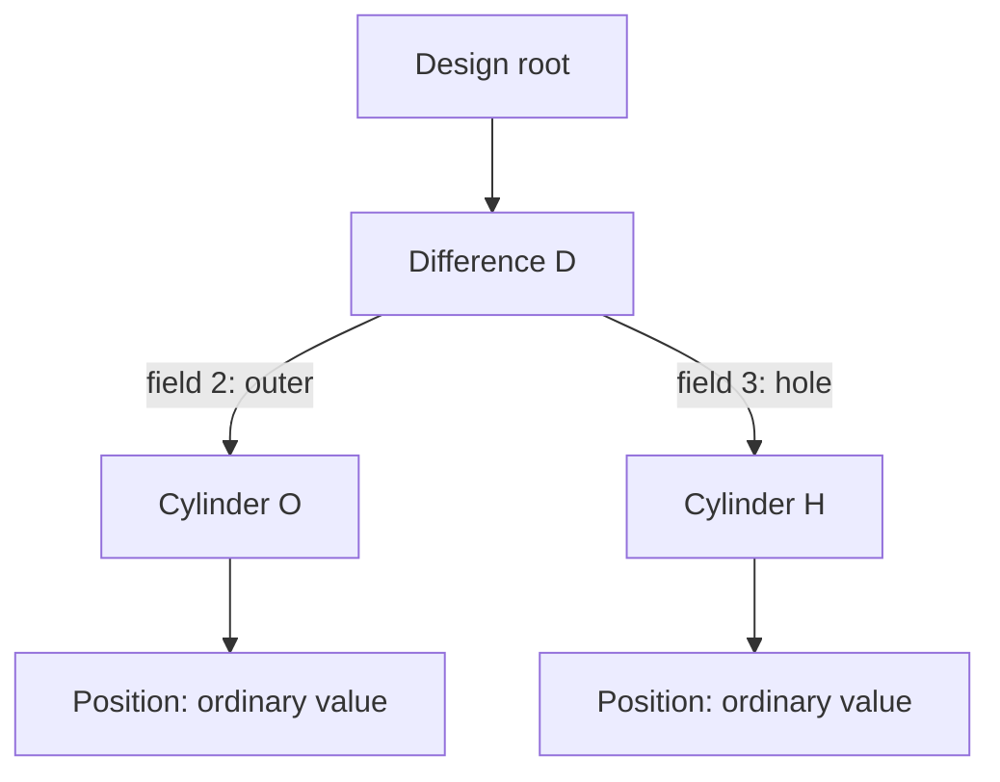

# Managed-state examples across application domains

Current C++ representation: managed schema classes carry `persistent_id` directly
by default. Separate ID-free values/storage wrappers in the illustrations below
require `[managed] separate_values = true`; see the [runtime contract](cpp_runtime.md).
New documents get a namespace automatically. Root and managed descendants allocate
IDs `1, 2, 3...` within that document only; saved IDs/counters survive reload,
and undo/deletion never renumber survivors. Explicit member boundaries still apply.

Status: broader design examples. Bare `managed` and the C++ transaction/editor
subset are implemented; selectors, `exclude(...)`, `transient`, and other advanced
APIs below remain proposals. Each schema block is an independent example. See the
[C++ interface](cpp_runtime.md) for exact supported syntax and generated names.

For a runnable implementation, see the separate
[C++ draft ledger example](../../example/managed/ledger/README.md). It uses the [C++ interface](cpp_runtime.md) with actual `managed` schema declarations
and generated editors. The hollow-cylinder and wordpad schemas alongside it are
also compiled and exercised in the managed tests.

Managed state is a general data-model facility. Graphics is one application;
accounting, text editing, project planning, and configuration editing need the
same identity, ownership, transaction, and retention contracts. The application
chooses entity boundaries and validates its own invariants. See the
[history proposal](history.md) and [managed-state proposal](managed_state.md).
The [data-structure walkthrough](data_structures.md#worked-records-for-the-cylinder-with-a-hole)
shows the actual proposed entity-version references and branches for the graphics
example. [Language bindings](language_bindings.md) explain how each backend can
represent these records; return to the [design index](README.md) for all proposals.

## Shared rules for every example

All examples use the [four-feature capability design](capabilities.md): history,
collaboration, authorization, and journaling. Every managed root and
entity carries a generated `persistent_id`, defaulting to centrally configured
`uint32`. Ordinary values are ID-free in the opt-in separate representation. `map(uint64)` in these schemas describes
an application key, not the ID type; generated managed storage has its own ID.

A graphics application can journal geometry edits and checkpoint during idle time;
an accounting application can combine recovery with separately retained audit
records; wordpad can combine undo, shared editing, paragraph permissions, and
journal recovery. Authorization does not require collaboration. Recovery persists saved
fields even when they are excluded from undo; see [journal storage modes](journal.md#appended-and-sidecar-storage-modes).
Stable IDs also support annotations, selective synchronization, and incremental
recalculation without making those extra capabilities new keywords.

Collaboration in every domain uses opaque sessions, not built-in user accounts.
Session A can lock a difference object's owned subtree, an accounting draft entry,
or a wordpad paragraph while session B edits a disjoint part. An ordinary embedded
value is covered by its managed owner's lock. Presence merely reports an editing
target; exclusive grants actually restrict managed edits. Coupled operations,
such as moving a paragraph or posting entries across accounts, validate every
affected scope and the application's invariants. The
[collaboration contract](collaboration.md) defines authoritative acceptance,
replica lock caches, expiry, and the application's transport responsibilities.

## Graphics: a cylinder with a hole

Represent a hollow cylinder as a difference operation with two cylinder operands:
`outer - hole`. The difference and each operand have their own persistent identity.
Positions are ordinary values owned by their cylinders. This example has exclusive
ownership; sharing an operand between operations would require explicit reference
and lifetime rules, not another owning copy of that operand.

```text
serializer version 1;

class point stable_ids {
  public double x (1);
  public double y (2);
  public double z (3);
}

class cylinder stable_ids managed {
  public double height (1);
  public double diameter (2);
  public point position (3);
}

class difference stable_ids {
  public string label (1);
  public managed cylinder outer (2);
  public managed cylinder hole (3);
  public transient double cached_volume;
  public transient bool volume_valid;
}

class design stable_ids {
  public managed map(uint64) difference parts (1);
}
```

`cylinder` declares managed capability because it has no managed members of its
own. `difference` and `design` infer capability from their members. `point` needs
no such capability because position remains an ordinary value. The geometry
example assumes cylinders aligned with the z axis; orientation and other shape
types would be additional application fields.

Normal construction of `difference` creates two ordinary cylinders containing
ordinary points. In `model_store<design>`, insertion into the managed `parts`
collection allocates IDs for the difference and both cylinders and stores them
in their generated managed representation; the design root also carries an ID. It does
not allocate identities for their positions or for the computed volume.



D, O, and H abbreviate persistent entity IDs, not actual wire values. For a
through-hole, application validation can require positive dimensions, coaxial
placement, a smaller hole diameter, and a cutter spanning the outer cylinder's
height. Validation uses the completed transaction so resizing both operands does
not expose an invalid intermediate shape. Rendering and volume caches are
invalidated rather than recorded as independent history entities.

```cpp
// Proposed API: resize both operands as one validated user action.
auto outcome = store.execute_transaction(
  "Resize hollow cylinder", [difference_id](auto& transaction) {
    auto part = transaction.root().parts().edit(difference_id);
    part.outer().set_height(120);
    part.outer().set_diameter(40);
    part.hole().set_height(120);
    part.hole().set_diameter(20);
  });
outcome.throw_if_failed();
```

The wrapper completes the transaction before returning its result. See
[callback execution](history.md#callback-based-transaction-execution) for rollback,
error reporting, and cancellation. For a gesture spanning multiple input events,
keep the caller-controlled [RAII transaction](history.md#scoped-completion-and-raii)
and call `transaction.revert()` if the gesture is canceled.

| User action | Logical history ownership |
| --- | --- |
| Change only hole diameter | H owns the change; D and O keep their identities and payloads. |
| Change outer height and hole height together | O and H contribute to one transaction/revision. |
| Change hole position.x | H plus fields 3/1; position has no independent ID. |
| Change the label and both operands | D, O, and H change atomically; one packed record may contain all three. |
| Replace the hole with a newly created cylinder | D's field-3 ownership link changes; preserve old/new identities for undo/redo. |
| Delete the difference | Remove D and its exclusively owned operands from the live design together; retained history can restore their IDs. |

The table describes logical ownership, not a required physical record count.
[Compact nested records](history.md#compact-records-without-losing-identity) can
pack the affected subtree and use relative field IDs after resolving its identity
mapping. A pure cache invalidation does not require another undoable D record.

## Accounting: accounts and draft journal entries

An accounting root can own separately identified accounts and journal entries.
A posting line can remain an ordinary entry-owned value when nobody needs to
reference or move that line independently. Integer amounts here represent minor
units in the ledger's chosen currency; application validation supplies the actual
accounting rules.

```text
serializer version 1;

class ledger_account stable_ids managed {
  public string code (1);
  public string name (2);
}

class posting stable_ids {
  public uint64 account_id (1);
  public int64 amount_minor (2);
}

class journal_entry stable_ids managed {
  public string memo (1);
  public array posting lines (2);
}

class accounting stable_ids {
  public string currency (1);
  public managed map(uint64) ledger_account accounts (2);
  public managed map(uint64) journal_entry entries (3);
  public exclude(history, collaboration) uint64 selected_entry_id (4);
}
```

`account_id` is an application reference to an account's document-local entity
number. An ordinary integer field is not automatically a checked reference;
application validation or a future explicit reference adapter must resolve its
type, document namespace, existence, and deletion policy. Likewise, the managed
map's key is bound to entity identity by the proposed store profile, not merely
by its `uint64` type.

Creating a draft entry with two balancing lines is one transaction. Checking that
the account references exist and the signed amounts sum to zero happens on its
final candidate. Editing an embedded line records the journal entry; changing an
account name records the account. One transaction may update both. Undo restores
the accepted action atomically, without exposing just one half of the entry.

Keep editable draft history separate from an application's posting/audit policy.
A system that treats posted entries as immutable should create a new correcting
entry instead of allowing ordinary undo to erase its audit record. This is an
application rule enforced through policy and validation, not behavior inferred
from class names. [External effects](managed_state.md#external-effects-files-and-network-requests)
such as submitting a payment are separate from changing draft model state.

## Wordpad: paragraphs, formatting, and selection

A wordpad-style editor can give paragraphs stable identity while storing text and
formatting as paragraph-owned values. Text characters and style properties do not
need individual persistent entity IDs for local editing history.

```text
serializer version 1;

class paragraph_style stable_ids {
  public bool bold (1);
  public uint32 font_size (2);
}

class paragraph stable_ids managed {
  public string text (1);
  public paragraph_style style (2);
}

class text_selection stable_ids {
  public uint64 paragraph_id (1);
  public uint32 offset (2);
}

class wordpad_document stable_ids {
  public managed map(uint64) paragraph paragraphs (1);
  public array uint64 paragraph_order (2);
  public exclude(history, collaboration) text_selection selection (3);
  public transient uint64 cached_word_count;
  public transient bool word_count_valid;
}
```

The application validates that `paragraph_order` contains each live paragraph ID
exactly once. It defines text offsets consistently across languages, for example
as Unicode scalar positions, rather than assuming native string indexes agree.
Selection is saved locally without creating undo steps or overwriting another
editor's cursor. Selection is a best-effort UI locator, not a required ownership
reference: it may refer to a paragraph absent in the selected revision. Resolve it
without exposing a historical object as live; clamp the displayed caret or show a
safe fallback when necessary. This derived display choice does not overwrite the
saved excluded value during undo. An explicit selection change can update that
value in a normal transaction. Applications requiring a strict live selection
invariant need a separately specified normalization policy.

| Editing action | Transaction and identity behavior |
| --- | --- |
| Type a word | An explicit typing group can produce one paragraph change and undo step. |
| Format several paragraphs | Each paragraph contributes to one atomic transaction. |
| Move a paragraph | Change document ordering while preserving the paragraph ID. |
| Split a paragraph | Preserve one paragraph ID, allocate a new one, and update both text and ordering together. |
| Delete a paragraph | Remove its membership/order and optionally update selection in the same action; retained history can restore the original ID. |
| Undo deletion | Restore paragraph and ordering; preserve the latest excluded selection and resolve its display against the restored document. |

Choose an explicit typing-group boundary such as a command, caret move, or flush;
do not keep an unbounded transaction open solely to save history bytes. Rich text
may need runs, styles, embedded objects, and more granular operations. A future
text collaboration adapter might use CRDT element identifiers; paragraph entity
IDs alone do not implement that algorithm.

## Other domains and a common contract

| Application | Independently identified entities | Usually owner-tracked values | Example atomic action |
| --- | --- | --- | --- |
| Project planning | Tasks and explicitly managed checklist items | Task details, dates, labels | Move a task and update its checklist. |
| Configuration editor | Services or deployment targets | Timeout, address, retry settings | Change an endpoint and its related credentials reference. |
| Inventory planning | Products and planned stock movements | Quantities, dimensions, notes | Change a proposed movement and its allocation together. |

The existing [project/task example](history.md#creating-normal-and-tracked-objects-project-tasks)
shows plain construction and managed factories. None of these applications needs
to inherit a graphics base class, use a geometry kernel, or name its root
`accounting`. Each chooses an eligible root for `model_store<Root>`.

Across domains, a plain member remains persisted and owner-tracked unless an
explicit exclusion changes that policy. A managed member adds independent
identity; it does not mandate a separate physical snapshot. Transactions establish
atomicity, stored projections establish undo behavior, and application validation
establishes domain correctness.

These examples are proposed acceptance cases, not compiled samples. Future backend
verification must cover grouped edits, detached plain copies, reference validation,
ID preservation through delete/undo/reload, compact-record decoding, and failed
scope completion for each supported representation.
